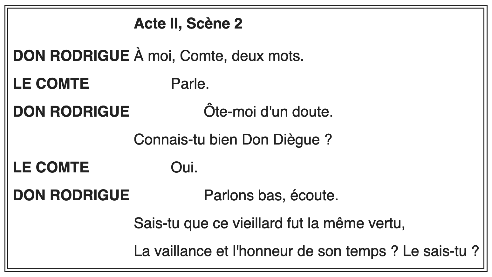
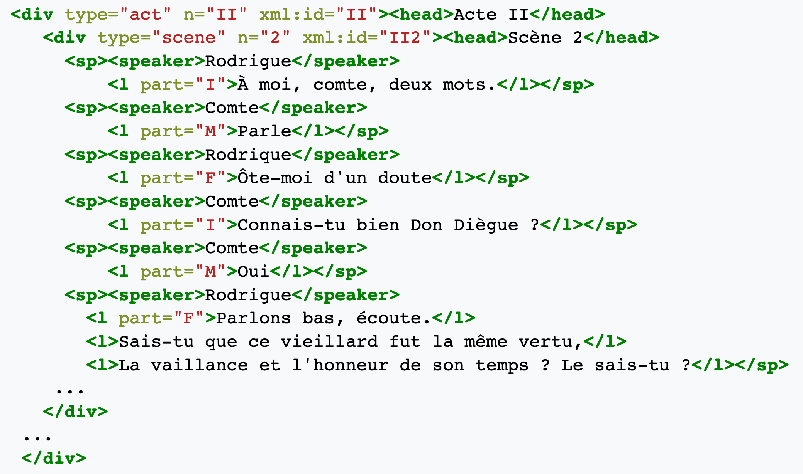
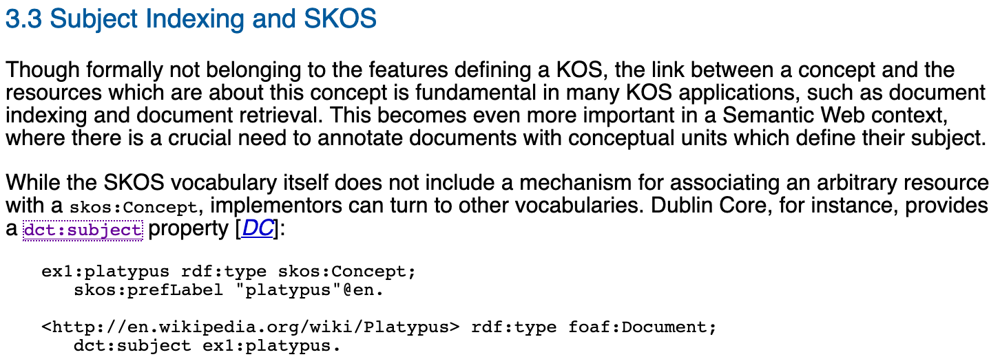
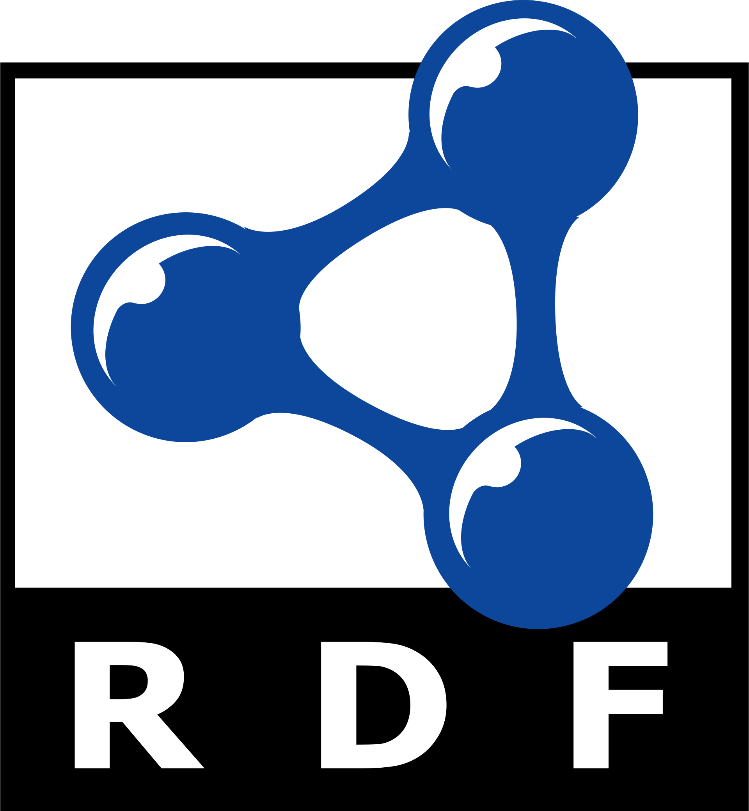
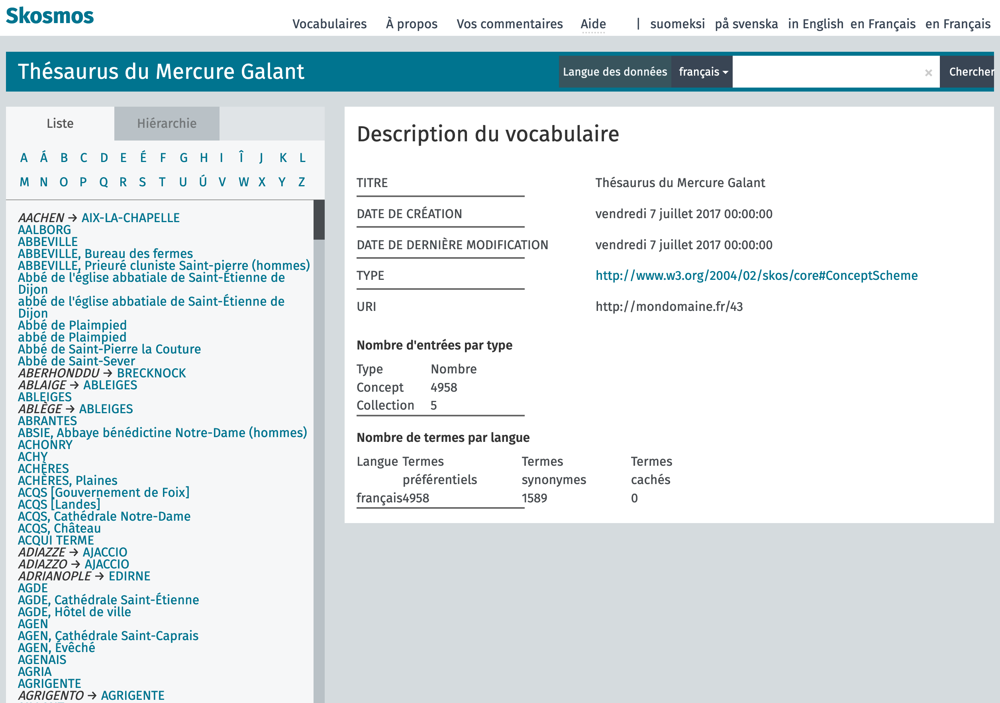

<!--∫ slide title -->

*Circulation des écrits littéraires de la Première Modernité & Humanités Numériques*

*4 & 5 juin 2019*



# Vers des thésaurus situés. Questions épistémologiques soulevées par la publication du thésaurus du Mercure



*Thomas Bottini*

*‹I›nstitut de ‹Re›cherche en ‹Mus›icologie*

*IReMus, UMR 8223 CNRS — Sorbonne Université — MC — BnF*

<!--∫ slide -->

# Une édition multimédia

- Actuellement hébergé sur le serveur de l'Obvil : [http://obvil.sorbonne-universite.site/corpus/mercure-galant/](http://obvil.sorbonne-universite.site/corpus/mercure-galant/)
∫🐌
- Corpus encodé en ‹TEI›.
∫🐌
- Transformation HTML via des feuilles XSLT.
∫🐌
- Moteur de recherche en texte intégral.
∫🐌
- À venir en 2019 : un serveur ‹IIIF› (*International Image Interoperability Framework*) pour exposer & manipuler les collections d'images.
∫🐌
- Musique encodée en ‹MEI›.
∫🐌
- Pourquoi recourir à la TEI…

<!--∫ slide -->

#

{height=12cm}

{height=2.5cm}

{height=12cm}

<!--∫ slide -->

# Au-delà de SKOS

- SKOS = *Simple Knowledge Organization System*.
- On peut souhaiter caractériser les termes au-delà de ce que permet la propriété `skos:definition` ; pour exemples :
  - Latitude + longitude (WGS84 — système géodésique mondial)
  ∫🐌
  - Les modalités non-triviales de rapport au corpus (indexation) ‹ne sont pas du ressort de SKOS› :

{width=100%}

<!--∫ slide -->

# SKOS & apparat critique ?

- Absence de notes critiques (*[documentary notes](https://www.w3.org/TR/skos-primer/#secdocumentation)* : `skos:note`, `skos:scopeNote`, `skos:example`, `skos:historyNote`, `skos:editorialNote`, `skos:changeNote`).
∫🐌
- Point de vue synchronique établissant la signification « absolue » d'un ensemble de termes.
∫🐌
- SKOS repose sur RDF…

<!--∫ slide -->

# RDF : établir des faits

- Graph de ‹triplets› *sujet—prédicat—objet*.
- Chaque terme est identifié par une URI dans un référentiel Web.

{width=4cm}

{width=60%}

<!--∫ slide -->

# RDF pour des usages scientifiques ?

- Une critique du Web Sémantique :
  - F. Rastier. « Sémantique du web vs. Semantic Web ? Le problème de la pertinence », *Syntaxe et sémantique*, vol. 9, no. 1, 2008.
  - les ontologies & thésaurus réduisent la langue à une ‹nomenclature statique› ;
  - non prise en compte de la ‹variabilité des points de vue› au profit d'un sens hypothétiquement partagé ;
  - développement du Web Sémantique aux États-Unis : arrière plan positiviste.
∫🐌
- ‹Enjeu : l'expression d'un savoir situé avec des triplets RDF.›
∫🐌
- Une approche intéressante : ‹particulariser un prédicat général pour pouvoir lui associer des propriétés contextuelles›.
  - Nguyen V, Bodenreider O, Sheth A. Don't Like RDF Reification? Making Statements about Statements Using Singleton Property. *Proc Int World Wide Web Conf*. 2014.

<!--∫ slide -->

# Insuffisance des outils de publication

{width=100%}

<!--∫ slide -->

# Vers des thésaurus situés

- Présenter les termes ‹en lien au corpus›, l'interprétation des termes et de leur portée se fait en contexte.
∫🐌
- Représenter les évolutions ‹diachroniques› du sens d'un terme.
  - ‹Exploitation de sources documentaires historiques :› Nancy Ide, David Woolner. « Historical Ontologies », *Words and Intelligence II*, Springer, 2007.
  - ‹Évolution de la signification d'un mot dans une langue :› F. Khan, F. Boschetti, F. Frontini. "Using lemon to Model Lexical Semantic Shift in Diachronic Lexical Resources", In *Proceedings of the 3rd Workshop on Linked Data in Linguistics (LDL-2014)*, 2014.
∫🐌
- Exprimer & comparer ‹les points de vue scientifiques via un modèle d'annotation sémantique› (exprimer un doute, une certitude, lier à une preuve, une réfutation, etc.).
∫🐌
- Lier à d'autres corpus : la plateforme de publication du thésaurus comme ‹lieu d'aggrégation des sources›.

<!--∫ slide -->

# Mise en œuvre

- L'indexation se complexifie : plus le modèle est expressif, plus sa mobilisation est coûteuse en compétences & en temps.
∫🐌
- Mais un tel modèle est la condition d'une approche coopérative & « scientifiquement contrôlée ».