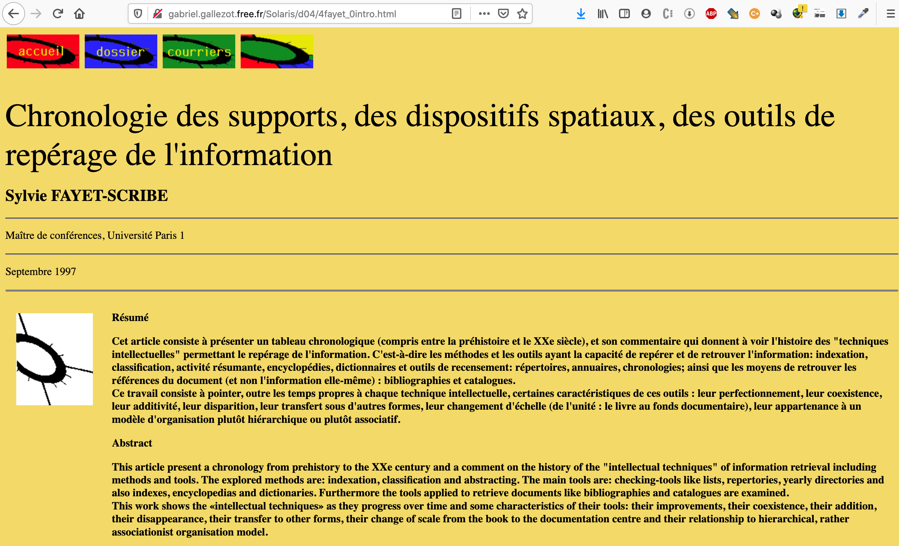
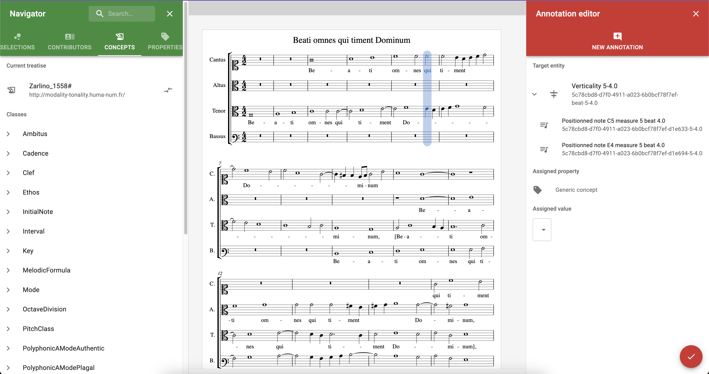
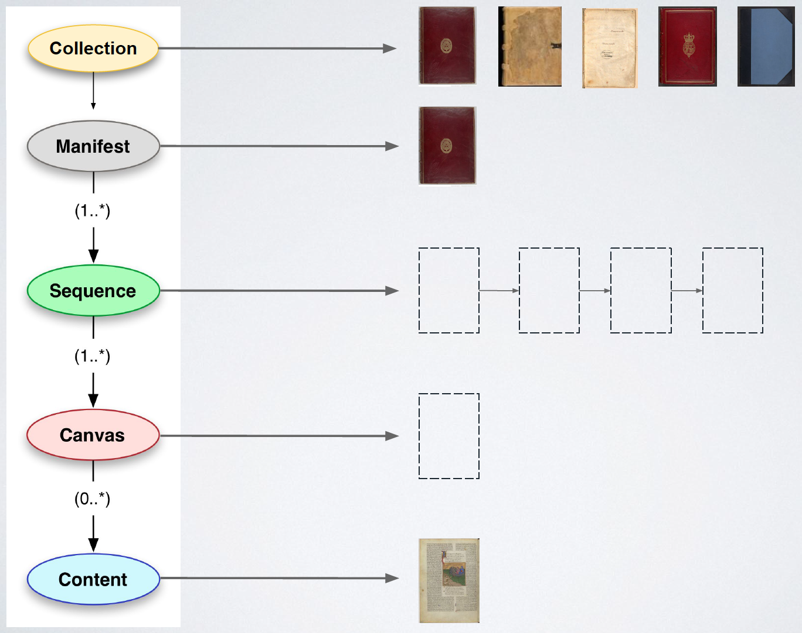

<!--∫ slide title -->

Outils numériques pour la musicologie, 6 février 2023

Adressage des sources et des données musicologiques
  
(images, données, musique notée, texte)
  
Une introduction au Web



Thomas Bottini

`thomas.bottini@cnrs.fr`

*‹I›nstitut de ‹Re›cherche en ‹Mus›icologie*

*IReMus, UMR 8223 CNRS — Sorbonne Université*

<!--∫ slide -->

# Adressage…

- De quoi est-il question ?
•••
  - Le premier vers de la deuxième strophe de « Tombeau » de Mallarmé
•••
  - *سورة الأعراف, verset 13*
•••
  - La troisième note de « J'ai du bon tabac »
•••
  - Le bonhomme qui tient une balance coincé dans une vielle à roue dans [*Le Jardin des délices*](https://fr.wikipedia.org/wiki/Le_Jardin_des_d%C3%A9lices#/media/Fichier:The_Garden_of_earthly_delights.jpg) de Bosch.
•••
- Pourquoi commencer par cette notion ?
•••
  - Le Web est le « milieu informationnel » dans laquelle la recherche se fait et met en visibilité ses productions en vue de les diffuser.
•••
  - Ceci est un cours de culture générale du Web, pour les usages scientifiques dans la contexte des humanités (où la source est centrale).

<!--∫ slide -->

# La lecture scolastique

*« Alors que le haut Moyen Âge ne connaissait que de modestes subdivisions du texte, reposant moins sur des signes spécifiques que sur des ornements (rehaussement des lettres initiales par la couleur, changements d'écriture, décorations diverses), on passe à un véritable système de techniques auxiliaires de la lecture et de la consultation du livre, destinées à identifier rapidement le passage que l'on recherche : rubrication, découpage en paragraphes, titres de chapitre, séparation du texte et du commentaire, sommaires, tables des concordances des termes, index et tables analytiques alphabétiques. »*
  
(Cavallo & Chartier, *Histoire de la lecture dans le monde occidental*)

<!--∫ slide -->

<a href="http://gabriel.gallezot.free.fr/Solaris/d04/4fayet_0intro.html">http://gabriel.gallezot.free.fr/Solaris/d04/4fayet_0intro.html</a>

Différentes techniques de spatialisation des signes produisent des savoirs scientifiques différents.

<!--∫ slide title -->

# Brève introduction au Web et à son histoire

<!--∫ slide -->

# Internet & le Web

- Internet : réseau matériel dénué de centre (genèse : 60's).
•••
- Web (1991) : couche applicative d'Internet, celle des « sites Web » (une des utilisations possibles d'Internet).
•••
- Protocole HTTP : le client (votre navigateur) émet une requête vers une URL, le serveur lui répond.
•••
- HTML : documents lisibles par des humains.

<!--∫ slide -->

# 1, 2, 3… les incarnations du Web

- **Web « 1.0 », dit « Web de documents »**
  - Un document par adresse (URL).
  - Les contenus sont statiques.
  - Le paradigme de la bibliothèque.
•••
- **Web 2.0, dit « Web social »**
  - Les contenus sont dynamiques : chaque URL pointe vers un serveur qui recompose une réponse en fonction de l'état d'une base de données.
  - Chaque client peut désormais envoyer des données.
•••
- **Web « 3.0 », dit « Web de données »**
  - Machines qui échangent des données structurées entre elles.

<!--∫ slide -->

# Le Web : un hypertexte dégradé

- Hypertexte ? [www.google.com/search?q=roue+à+livres+ramelli](https://www.google.com/search?q=roue+à+livres+ramelli)
•••
- Ted Nelson (inventeur de l'hypertexte) :

*« HTML is precisely what we were trying to PREVENT— ever-breaking links, links going outward only, quotes you can't follow to their origins, no version management, no rights management. »*

•••
- Un exercice d'imagination : et si les liens du Web étaient bidirectionnels ?
•••
- Pour le dire rapidement, l'hypertexte imaginé par Ted Nelson est ce qu'on essaye de construire quand on fait du Web pour la recherche en humanités…

<!--∫ slide title -->

# Adressabilité de la musique symbolique

<!--∫ slide -->

# Des documents MEI sur le Web ?

- Document vs Web : un sacré casse-tête. Un document n'est pas un graphe de liens hypertextes. Adressabilité interne vs adressabilité externe.
•••
- Visualiser des fichiers MEI dans le navigateur avec [Verovio](https://editor.verovio.org/).
•••
- Mais comment adresser une note, une verticalité ou un groupe de notes ?
•••
- Projet de recherche en cours à l'IReMus : TONALITIES. Rendre adressable et pouvoir annoter n'importe quoi dans une partition MEI en ligne.

<!--∫ slide c -->

<!--∫ slide title -->

# Adressabilité des images

<!--∫ slide -->

# Parlons images

Avez-vous déjà galéré :

- …pour extraire facilement des portions d'images trouvées dans des bibliothèques numériques (telles que Gallica), par exemple pour les insérer dans un rapport/mémoire ?
•••
- …pour générer facilement des versions *hi-def/lo-def* d'un même fragment d'image ?
•••
- …pour appliquer une légère rotation à une page de manuscrit qui a été scanné tordu ?
•••
- …plus généralement, pour récupérer des images à partir de Gallica ?

<!--∫ slide -->

Vous connaissez tous et toutes…

<!--∫ slide -->

Maintenant, allons voir derrière…

<!--∫ slide -->

# Contexte

- Depuis 2000, prolifération de bibliothèques numériques (manuscrits, imprimés, documents d'archives, cartes, partitions etc.)…
- … mais sans coordination technique (silos indépendants)
  - chaque site est étanche (impossible de comparer des sources dans la même interface) ;
  - chaque site est un *one-shot* (suicide économique) ;
  - pour l'utilisateur ou l'utilisatrice, chaque environnement diffère, alors que les fonctions de consultation pourraient être identiques.

<!--∫ slide -->

# Objectifs de IIIF

- *International Image Interoperability Framework* (prononcer « 3-I-F »).
- Créer un cadre technique commun grâce auquel les bibliothèques numériques peuvent délivrer des collections d'‹images haute résolution› de manière standardisée sur le Web pour les rendre ‹consultables›, ‹manipulables› et ‹annotables›.
- IIIF vise notamment des [*use cases* musicaux](https://iiif.io/api/presentation/usecases/).
- Aussi un standard pour agréger toutes les ‹ressources documentaires autour des images› (métadonnées, transcriptions, annotations, autres contenus liés…).
- [iiif.io](https://iiif.io/)

<!--∫ slide -->

# Qui est derrière IIIF ?

- Initié par Stanford + noyau (Bibliothèque nationale de France, British Library, National Library of Norway, Cornell University, Oxford University).
- [iiif.io/community](https://iiif.io/community/)
- Fonctionnent par groupes de travail :
  1. élaborer, publier et faire évoluer les spécifications IIIF (APIs) ;
  2. développer des outils qui implémentent ces spécifications (serveurs d’images, visualiseurs, outils d'annotation…) ;
  3. constituer et promouvoir une communauté d'intérêts et de développements autour des technologies IIIF.
- [github.com/IIIF/awesome-iiif](https://github.com/IIIF/awesome-iiif)

<!--∫ slide -->

# L'API Image

Spécifie une syntaxe d'URL pour identifier une image et en obtenir une variante technique paramétrée (des pixels).

[http://gallica.bnf.fr/iiif/ark:/12148/btv1b10025411c/f7/full/full/0/native.jpg](http://gallica.bnf.fr/iiif/ark:/12148/btv1b10025411c/f7/full/full/0/native.jpg)

| Modèle              | Exemple BnF                   |
| ------------------- | ----------------------------- |
| {scheme}://         | http://                       |
| {server}            | gallica.bnf.fr                |
| {/prefix}           | /iiif                         |
| /{identifier}       | /ark:/12148/btv1b10025411c/f7 |
| /{region}           | /full                         |
| /{size}             | /full                         |
| /{rotation}         | /0                            |
| /{quality}.{format} | /native.jpg                   |

[iiif.io/api/image/2.1/#image-information-request-uri-syntax](https://iiif.io/api/image/2.1/#image-information-request-uri-syntax)

<!--∫ slide -->

# Citer & partager

- Adressabilité des zones au sein d'une image.
  - [https://gallica.bnf.fr/iiif/ark:/12148/btv1b8446958b/f39/423,1322,1365,1135/,800/0/native.jpg](https://gallica.bnf.fr/iiif/ark:/12148/btv1b8446958b/f39/423,1322,1365,1135/,800/0/native.jpg)
  - => retour au contexte : [https://gallica.bnf.fr/iiif/ark:/12148/btv1b8446958b/f39/full/full/0/native.jpg](https://gallica.bnf.fr/iiif/ark:/12148/btv1b8446958b/f39/full/full/0/native.jpg)
- [Cropping tool](https://bl.ocks.org/mejackreed/6936585f435b60aa9451ae2bc1c199f2)

<!--∫ slide -->

# L'API Image (exemples)

- [http://gallica.bnf.fr/iiif/ark:/12148/btv1b8451103b/f9/full/,800/0/native.jpg](http://gallica.bnf.fr/iiif/ark:/12148/btv1b8451103b/f9/full/,800/0/native.jpg) => image entière, hauteur de 800 pixels, sans rotation, format JPG
- [https://gallica.bnf.fr/iiif/ark:/12148/btv1b9010251k/f9/full/full/358/default.jpg] => une cantate redressée
- [http://gallica.bnf.fr/iiif/ark:/12148/btv1b8451103b/f9/1200,1300,620,580/pct:90/325/grey.png](http://gallica.bnf.fr/iiif/ark:/12148/btv1b8451103b/f9/1200,1300,620,580/pct:90/325/grey.png) => région d'image, à 90% de sa taille, rotation de 325°, niveau de gris, format PNG
- [https://tomcrane.github.io/the-long-iiif/image-api.html](https://tomcrane.github.io/the-long-iiif/image-api.html) => tester l'API Image
- [https://gallica.bnf.fr/ark:/12148/btv1b10025411c/f5.item.r=frescobaldi.zoom](https://gallica.bnf.fr/ark:/12148/btv1b10025411c/f5.item.r=frescobaldi.zoom) => Outil Gallica
- [http://www.e-codices.unifr.ch/loris/sbb/sbb-C0005-2/sbb-C0005-2_0000_002r.jp2/info.json](http://www.e-codices.unifr.ch/loris/sbb/sbb-C0005-2/sbb-C0005-2_0000_002r.jp2/info.json) => Requête d'informations sur l'image

<!--∫ slide title -->

# Adressabilité des données culturelles sur le Web

<!--∫ slide -->

# Le Web sémantique : un projet insensé

- Constatation : le Web, c'est le bazar ; notamment du fait de l'homonymie : mais de quoi parle t-on au juste quand on tape « Doors » sur Google ?
•••
- On ne peut jamais préciser le sens de ce sur quoi portent nos requêtes, qui sont exprimées en texte.
•••
- Pour désambiguïser le recours à un terme, il faudrait pouvoir l'identifier (et non pas seulement s'appuyer sur sa dénomination en langage naturel), c'est-à-dire, pouvoir s'y référer selon une URL (car on est sur le Web).
•••
- Le projet du Web sémantique est en premier lieu de donner une URL à chaque chose.
•••
- Préciser le sens de chaque chose à l'échelle du Web est parfaitement idiot (cela fait abstraction de la culture, les humains ne sont pas des ordinateurs).

<!--∫ slide -->

# Un peu plus précisément…

- Le Web sémantique est basé sur les mêmes principes que les Web « 1.0 » (de documents) & « 2.0 » (social) :
  - même structure informationnelle (l'hypertexte)
  - même protocole (HTTP)
  - même mécanisme d'identification (les URL)
•••
- …mais au bout d'une URL, on ne trouve pas de l'HTML destiné à être lu par un humain, mais des données au format RDF.
•••
- Le Web sémantique est inscrit dans le paradigme du Web « de données ».

<!--∫ slide -->

# Resource Description Framework

- Représente toute information sous forme d'un triplet sujet-prédicat-objet.
- *« Jean-Sébastien Bach est né à Eisenach » :*

***SUJET :***

[http://data.doremus.org/artist/269cec9d-5025-3a8a-b2ef-4f7acb088f2b](http://data.doremus.org/artist/269cec9d-5025-3a8a-b2ef-4f7acb088f2b)

 

***PRÉDICAT :***

[http://dbpedia.org/property/birthPlace](http://dbpedia.org/property/birthPlace)

 

***OBJET :***

[http://data.doremus.org/describe/?url=http://dbpedia.org/resource/Eisenach](http://data.doremus.org/describe/?url=http%3A%2F%2Fdbpedia.org%2Fresource%2FEisenach)

<!--∫ slide -->

<!--∫ slide -->

# Connectés entre eux, les triplets forment un graph

- Les données représentées dans les graph RDF peuvent être utilisées pour construire des sites Web destinés aux humains.
- [overture.doremus.org/artist/269cec9d-5025-3a8a-b2ef-4f7acb088f2b](http://overture.doremus.org/artist/269cec9d-5025-3a8a-b2ef-4f7acb088f2b)
- [data.doremus.org/artist/269cec9d-5025-3a8a-b2ef-4f7acb088f2b](http://data.doremus.org/artist/269cec9d-5025-3a8a-b2ef-4f7acb088f2b)

<!--∫ slide -->

# OK, mais à quoi ça sert ?

- À s'assurer que les données culturelles, patrimoniales & artistiques existent encore dans 10, 20… 50 ans, ou plutôt qu'elles sont encore ‹compréhensibles›.
•••
- Exercice : quelle différence avec un fichier Excel personnel ?
•••
- Le Web sémantique intéresse surtout les ‹musées›, les ‹bibliothèques›, les ‹unités de recherche qui travaillent sur la culture & le patrimoine›, et pas les compagnies privées qui raisonnent à court terme.
•••
- L'esprit : réutiliser les données & propriétés existantes, assurer un lien au reste du monde informationnel.
•••
- Exemple : l'ontologie ‹DOREMUS› (Philharmonie, Radio France, BnF).

<!--∫ slide -->

# DOREMUS

- [www.doremus.org](https://www.doremus.org/)
- [overture.doremus.org](http://overture.doremus.org/)
- [http://data.doremus.org/sparql](http://data.doremus.org/sparql)
- [Exemples de requêtes](https://data.doremus.org/queries.html)
- [Exemples de requêtes](https://github.com/DOREMUS-ANR/knowledge-base/tree/master/query-examples)

<!--∫ slide title -->

# Retour sur IIIF

<!--∫ slide -->

# L'API Présentation

- Délivrer de manière standardisée des informations de ‹présentation et de structure interne (logique ou matérielle) d'un objet numérique› (comme par exemple une collection organisée d'images) en vue de sa « présentation » à l'utilisateur/utilisatrice.
•••
- Sous forme d'une suite de ‹canevas›, réceptacle abstrait représentant une page « virtuelle » permettant d'‹articuler les sources› graphiques principales à des ressources complémentaires : métadonnées (contexte, provenance…), sources complémentaires plus ou moins finement articulées, transcriptions, traductions, annotations…
•••
- Ces informations sont embarquées dans un fichier « manifeste IIIF ».
•••
- Les fichiers manifestes, publiés sur le Web, sont destinés à être lus par des ‹visionneuses IIIF›.

<!--∫ slide -->

<!--∫ slide -->

<!--∫ slide -->

<!--∫ slide -->

# Avantage des canevas

- Une même page a été ‹numérisée plusieurs fois› au fil du temps ou sous différentes conditions de lumière (numérisation du microfilm noir et blanc puis numérisation en couleur à partir du document original ; images multi-spectrales produites pour l’étude scientifique d’un palimpseste par exemple).
•••
- Une ‹page mutilée› dont les enluminures ont été découpées à un moment donné de l’histoire du document, puis numérisées séparément du manuscrit d’origine (dans ce cas on a l’image de la page mutilée associée au canevas, et l’image de détail associée à une zone de ce canevas, de façon à repositionner l’enluminure à son emplacement originel).
•••
- Une page est ‹reconstituée à partir de plusieurs fragments› (plusieurs images associées à différentes zones du canevas).
•••
- Des ‹pages sont manquantes› (lacunes identifiées dans un manuscrit), mais on disposerait d'une transcription du texte.

<!--∫ slide -->

<!--∫ slide -->

<!--∫ slide -->

<!--∫ slide -->

# Exemples de visionneuses IIIF

- [Mirador](https://projectmirador.org/)
- [Comparaison d’un témoin manuscrit (BnF) et d’un exemplaire incunable (BSG) dans Mirador Démo Biblissima (IIIF Conference 2017 - The Vatican)](https://portail.biblissima.fr/en/mirador?key=Vg5KDD1GMmFkADxkN2OE&version=1)
- [Transcription et étiquetage textuel (projet de crowdsourcing) (The Welsh Book of Remembrance - National Library of Wales) => recherche plein texte](https://training.iiif.io/iiif-online-workshop/day-four/annotations-stores.html)
- [Transcription et traduction, mise en relation texte/image (The Life of the Buddha - Yale University)](http://lotb.iath.virginia.edu/mirador_viewer/mirador?manifest=1&room_id=1)
- [Parcours commenté au sein d'une image](https://canvas-panel.digirati.com/#/examples/fullpage?manifest=https://raw.githubusercontent.com/digirati-co-uk/canvas-panel/master/tests/ocean-liners.json)

<!--∫ slide -->

<!--∫ slide -->

