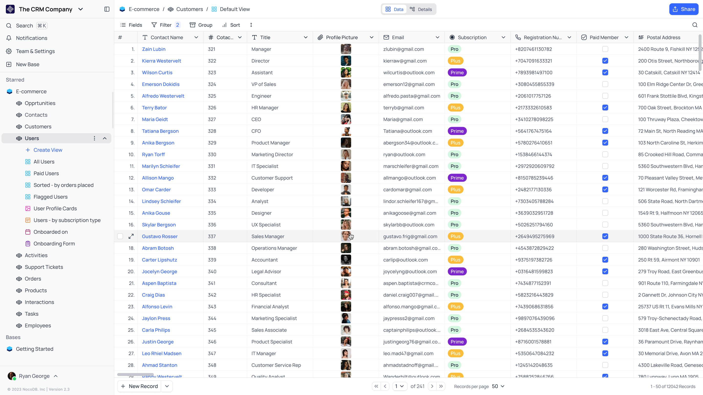
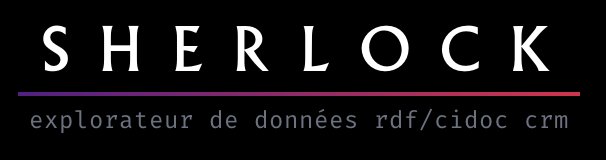
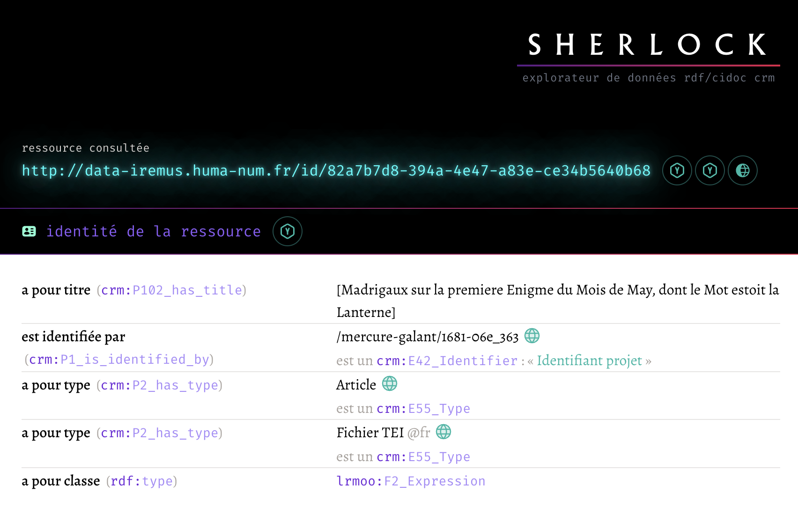
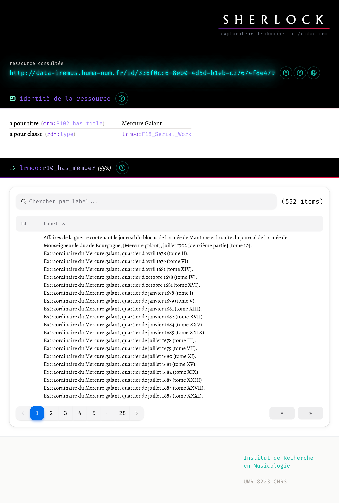
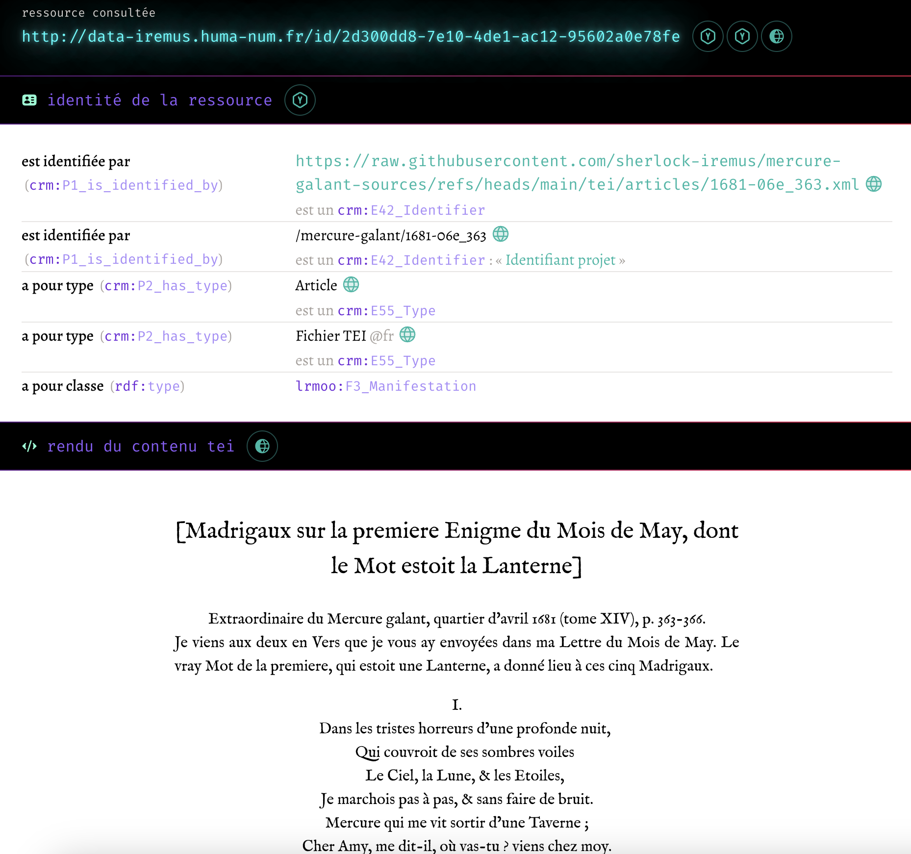

<!--∫ slide cover -->

    

        
‹Les Humanités numériques pour la recherche et la formation›

        
17 janvier 2025

    

    
Journée d'études organisée par l'UFR LAM, IDHES Evry, les départements d'Histoire, de LEA et de Musicologie

    
modéliser, saisir, explorer

     
    
retour sur la mise en œuvre du CIDOC CRM dans un système d'information pour la recherche

<pre style="color: gray; font-size: 50%;">
https://github.com/Amleth/communications/tree/main/out/2025.01.17_evry_hn
</pre>

    

        
‹thomas.bottini@cnrs.fr›

        
‹I›nstitut de ‹Re›cherche en ‹Mus›icologie — ‹IReMus›, UMR 8223 CNRS

    

    

        

        
Consortium ‹Musica2› IR* Huma-Num

    

<!-- ############################################################################################################### -->
<!-- ############################################################################################################### -->

<!--∫ slide cv -->

# Plan

1. Modéliser
1. Saisir
1. Explorer

<!-- ############################################################################################################### -->
<!-- ############################################################################################################### -->

<!--∫ slide cv -->

# Modéliser

*Le CIDOC CRM au service de la musicologie*

<!--∫ slide -->

## Cas d'usage à l'IReMus

- Référentiel des personnes, lieux et institution de l'Ancien Régime (charges).
- Édition critique du Mercure Galant (1672-1724), structuration logique et matérielle des corpus original et TEI avec LRMoo.
- Indexation sémantique (avec des thésaurus) et description analytique de collections iconographiques.
- Annotation collaborative de partitions MEI avec structuration logique des annotations (cadences et leur structure interne) et articulation fine à la partition.
- Divers entreprises de catalogages de sources anciennes.
- Modèle Antony : sauvegarde et partage du patrimoine musical utilisant des technologies numériques.

<!-- ############################################################################################################### -->
<!-- ############################################################################################################### -->

<!--∫ slide cv -->

# Saisir

*Ça se complique*

<!--∫ slide -->

## Les problèmes émanant du RDF/CIDOC CRM

- Un graphe de données ouvert est plus difficile à éditer que des données relationnelles (données tabulaires s'éditant naturellement avec des formulaires contraints).
———
- Le CRM est expressif, mais :
  ———
  - Il existe parfois plusieurs manières de modéliser une situation avec les classes de base.
  ———
  - Ses *patterns* fondamentaux (pour nommer, type, dater, annoter…) induisent beaucoup de des sous-entités.
  ———
  - Son caractère ‹abstrait et générique› fait écran avec la compréhension naturelle que le chercheur pourrait avoir de ses données.
———
- En conséquence, ‹une interface d'édition générique de données CRM n'a pas de sens›, car chaque collectif construit sa manière d'utiliser l'ontologie.
———
- Je préconise le recours à un outil de saisie de données ‹existant›, libre et ergonomique. Par exemple, un candidat de la constellation *« No-code »*.

<!--∫ slide ch cv -->

## NocoDB

<!--∫ slide -->

## Du relationnel au RDF

- Le modèle relationnel doit être créé pour répondre aux attendus ergonomiques du projet. Sa structure doit permettre de générer des données CIDOC CRM par la suite, mais il n'est qu'un ‹modèle de saisie›. Il représente la manière dont un collectif se saisit du CRM dans un contexte précis (classes et propriétés utilisées, idiomes de modélisation).
———
- Des scripts doivent être écrits pour récupérer les données via l'‹API› offerte par le système et les ‹convertir› en données RDF modélisées avec le CIDOC CRM (un couple efficace pour ce genre de tâches : python/rdflib).
———
- Tous les moyens sont bons pour obtenir des données en CRM.

<!-- ############################################################################################################### -->
<!-- ############################################################################################################### -->

<!--∫ slide cv -->

# Explorer

*L'intérêt d'exposer des données RDF/CRM avec SPARQL*

<!--∫ slide -->

## Contexte

- Contexte :
    - Programme de recherche SHERLOCK à l'IReMus :
        - « Comment et pourquoi modéliser les données musicologiques avec le CIDOC CRM ?»
        - « Comment faire interagir les données sémantiques et les sources ? »
        - « Comment publier et manipuler les données sémantiques ? »
    - Pas ou peu d'apport financier.
    - Développeur (presque) unique.
    - Recourir à un modèle unique dans les différents projets permet de ne concevoir, développer et maintenir qu'une unique application pour présenter et exploiter les données.
- Technologies :
    - Front : TypeScript, React, Next UI, Tailwind CSS
    - Back : Apache Jena Fuseki

<!--∫ slide -->

## Objectifs fonctionnels (1/2)

- Une interface de navigation hypertexte générique portant sur la totalité des graphes RDF d'un Triplestore accessible via un SPARQL Endpoint.
———
- L'utilisateur devrait avoir le sentiment de naviguer dans des fiches, dont la structure l'affichage des métadonnées seraient clairs, sans être exposé à la technicité inhérente aux triplets RDF et aux noms abstraits des classes et des propriétés des ontologies convoquées…
———
- … mais la teneur des sujets/prédicats/objets RDF devrait toujours être clairement indiquée, pour raisons pédagogique et technique. Toutes les requêtes SPARQL utilisées devraient être exposées.
———
- Exploitation des *patterns* spécifiques du CRM ou de LRMoo pour proposer des interfaces spécifiques :
    - Triplets décrivant l'[identité d'une ressource](https://data-iremus.huma-num.fr/sherlock/?resource=http://data-iremus.huma-num.fr/id/82a7b7d8-394a-4e47-a83e-ce34b5640b68)
    ———
    - Dates
    ———
    - Place dans une structure : sociale, bibliographique ([lrmoo:F18](https://data-iremus.huma-num.fr/sherlock/?resource=http://data-iremus.huma-num.fr/id/336f0cc6-8eb0-4d5d-b1eb-c27674f8e479)), logique, matérielle…
    ———
    - Annotations (qui ? qui ? quand ? pourquoi ?)
    ———
    - Annotations (multiplicité des points de vue)

<!--∫ slide ch cv -->

## Identité d'une ressource

<!--∫ slide ch cv -->

## Affichage des ressources liées

<!--∫ slide ch cv -->

## Liste des articles d'un périodique

<!--∫ slide -->

## Objectifs fonctionnels (2/2)

- Proposer l'éventuel contenu associé à la ressource en cours de consultation ([rendu HTML d'un fragment TEI](https://data-iremus.huma-num.fr/sherlock/?resource=http://data-iremus.huma-num.fr/id/2d300dd8-7e10-4de1-ac12-95602a0e78fe), image IIIF, fichier MEI s'ouvrant dans l'interface d'annotation collaborative [Tonalities…](https://polifonia-project.eu/pilots/tonalities/)).
———
- Moteur de recherche plein texte dans l'ensemble des valeurs littérales textuelles.
———
- Moteur de recherche par concepts issus de thésaurus.
———
- Paramétrer l'interface en fonction du profil de tâche de l'utilisateur.

<!--∫ slide ch cv -->

## Rendu html d'un fragment TEI associé à la ressource

<!-- ############################################################################################################### -->
<!-- ############################################################################################################### -->

<!--∫ slide ch cv -->

# Conclusion

Il manque la quatrième volet : *exploiter*.

🌴 merci 🌴