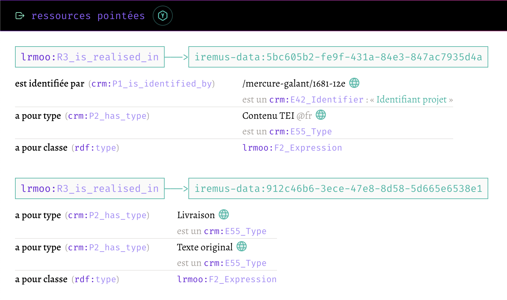

<style>
.context {
    border: 1px solid gray;
    color: gray;
    font-family: FiraCode;
    font-size: 18px;
}
.context > div { margin: 1em; }
</style>

<!--∫ slide cover -->

<div class="context">
    <div style="display: flex; justify-content: space-between;">
        <div>‹Les Humanités numériques pour la recherche et la formation›</div>
        <div>17 janvier 2025</div>
    </div>
    <div style="text-align: right;">Journée d'études organisée par l'UFR LAM, IDHES Evry,<br/>les départements d'Histoire, de LEA et de Musicologie</div>
</div>

<div style="
    align-items: center;
    display: flex;
    flex-direction: column;
    font-family: FiraCode;
    justify-content: center;
    text-transform: lowercase;
">
    <div style="color: #FF0092">modéliser, saisir, explorer</div>
    <br/>
    <div style="font-size: 75%;">retour sur la mise en œuvre du CIDOC CRM<br/>dans des BDD en musicologie</div>
</div>

<div>
<pre style="color: gray; font-size: 50%;">
https://github.com/Amleth/communications/blob/main/out/2025.01.17_evry_hn/index.pdf
</pre>
</div>

<div class="context">
    <div style="display: flex; justify-content: space-between;">
        <div>‹thomas.bottini@cnrs.fr›</div>
        <div>‹I›nstitut de ‹Re›cherche en ‹Mus›icologie — ‹IReMus›, UMR 8223 CNRS</div>
    </div>
    <div style="display: flex; justify-content: space-between;">
        <div></div>
        <div>Consortium ‹Musica2› IR* Huma-Num</div>
    </div>
</div>

<!-- ############################################################################################################### -->
<!-- ############################################################################################################### -->

<!--∫ slide cv -->

# Plan

1. Modéliser
1. Saisir
1. Explorer

<!-- ############################################################################################################### -->
<!-- ############################################################################################################### -->

<!--∫ slide cv -->

# Modéliser

<div>
Comment faire tenir les données de la recherche dans le temps (!) ?
<br/>
‹technologies› + ‹traditions interprétatives› + ‹moyens de dev limités›
</div>

<!--∫ slide -->

## Le web sémantique :<br/>milieu technique idéal pour les BDD HN

- Promesse d'une base de données à l'échelle du Web. Le Web initial (Tim Berners Lee, 1991) était un Web de documents liés (hypertexte), le Web sémantique est un Web de ‹données liées›, chacune étant identifiée par une ‹URI›.
———
- Toute information s'exprime sous la forme d'un ‹triplet› (sujet/prédicat/objet) dans un langage de description qui est le RDF.
———
- La connexion de ces triplets RDF forme un ‹graphe›.
———
- Chaque prédicat est également identifié par une URL.

```dot fd6722af-2ae4-4abf-a011-883dbe4b30db 26
layout=dot
node [color=cyan,fontcolor=white]
edge [color=cyan,fontcolor=white]
"https://data.bnf.fr/13962206/morton_feldman_for_philip_guston/" -> "https://data.bnf.fr/fr/13928795/morton_feldman/" [label="http://purl.org/dc/terms/creator"]
```

———
- C'est le milieu technique idéal pour des données ‹FAIR›, pour l'expression et la diffusion des données de la recherche (publication + nouveaux usages).

<!--∫ slide -->

## Une ontologie : quoi, pourquoi, laquelle ?

- Formalisation d'un modèle conceptuel pour un domaine donné, contenant des ‹classes› et des ‹propriétés›.
———
- Utiliser les classes et les propriétés d’une ontologie confère ainsi une ‹sémantique partagée aux données› (partage d'individus, partage de prédicats).
———
- Permet de capitaliser des connaissances de modélisation d'un projet à l'autre (démarche KM).
———
- Le CIDOC CRM en bref :
    - Ontologie qui documente le patrimoine matériel et immatériel ainsi que les ‹processus de production de connaissances› à son propos (sources, connaissances, faits sociaux, concepts, objets matériels, objets sémiotiques dénotés ou connotés, contexte de production des connaissances, etc.).
    ———
    - Communauté ‹large› et ‹établie›. Venant du monde des musées, elle est désormais utilisée dans tous les domaines des HN.
    ———
    - Elle est extrêmement ‹abstraite et générique›.
    ———
    - Ontologie centrée événement.
    ———
    - ‹Informations bibliographiques› avec LRMoo (œuvres, expressions, manifestation, item).

<!--∫ slide ch cv -->

## Hiérarchie des classes CRM


<!--∫ slide -->

## Le CIDOC CRM au service de la musicologie

- Référentiel des personnes, lieux et institution de l'Ancien Régime (charges).
- Édition critique du Mercure Galant (1672-1724), structuration logique et matérielle des corpus original et TEI, indexation sémantique des articles avec des thésaurus et référentiels.
- Indexation sémantique (avec des thésaurus) et description analytique de collections iconographiques.
- Annotation collaborative de partitions MEI avec structuration logique des annotations (cadences et leur structure interne) et articulation fine à la partition (EUH2020 Polifonia).
- Divers entreprises de catalogage de sources anciennes.
- Modèle Antony : sauvegarde et partage du patrimoine musical utilisant des technologies numériques.

<!-- ############################################################################################################### -->
<!-- ############################################################################################################### -->

<!--∫ slide cv -->

# Saisir

*Ça se complique*

<!--∫ slide -->

## Les problèmes émanant du RDF/CIDOC CRM

- Un graphe de données ouvert est plus difficile à éditer que des données relationnelles (données tabulaires s'éditant naturellement avec des formulaires contraints).
———
- Le CRM est expressif, mais :
  ———
  - Il existe parfois ‹plusieurs manières› de modéliser une situation avec les classes de base.
  ———
  - Ses *patterns* fondamentaux (pour nommer, type, dater, annoter…) induisent beaucoup de des ‹sous-entités›.
  ———
  - Son caractère ‹abstrait et générique› fait écran avec la compréhension naturelle que l'on pourrait avoir de nos données.
———
- En conséquence, ‹une interface d'édition générique de données CRM n'a pas de sens›, car chaque collectif construit sa manière d'utiliser l'ontologie.
———
- Je préconise le recours à un outil de saisie de données ‹existant›, libre et ergonomique. Par exemple, un candidat de la constellation *« No-code »*.

<!--∫ slide ch cv -->

## NocoDB


<!--∫ slide -->

## Du relationnel au RDF

- Le modèle relationnel doit être créé pour répondre aux attendus ergonomiques du projet. Sa structure doit permettre de générer des données CIDOC CRM par la suite, mais il n'est qu'un ‹modèle de saisie›. Il représente la manière dont un collectif se saisit du CRM dans un contexte précis (classes et propriétés utilisées + idiomes de modélisation).
———
- Du code doit être écrit pour récupérer les données via l'‹API› offerte par le système et les ‹convertir› en données RDF modélisées avec le CIDOC CRM (un couple efficace pour ce genre de tâches : python/rdflib).
———
- Tous les moyens sont bons pour obtenir des données en CRM.

<!-- ############################################################################################################### -->
<!-- ############################################################################################################### -->

<!--∫ slide cv -->

# Explorer

*De l'intérêt d'exposer des données RDF/CRM avec SPARQL*


<!--∫ slide -->

## Contexte

- Contexte :
    - Programme de recherche SHERLOCK à l'IReMus :
        - « Comment et pourquoi modéliser les données musicologiques avec le CIDOC CRM ?»
        - « Comment faire interagir les données sémantiques et les sources ? »
        - « Comment publier et manipuler les données sémantiques ? »
    - Pas ou peu d'apport financier.
    - Développeur (presque) unique.
    - Recourir à un modèle unique dans les différents projets permet de ne concevoir, développer et maintenir qu'une unique application pour présenter et exploiter les données.
- Technologies :
    - Front : TypeScript, React, Next UI, Tailwind CSS
    - Back : Apache Jena Fuseki

<!--∫ slide -->

## Objectifs fonctionnels (1/2)

- Une interface de navigation hypertexte générique portant sur la totalité des graphes RDF d'un *triplestore* accessible via un SPARQL *endpoint*.
———
- L'utilisateur devrait avoir le sentiment de naviguer dans des fiches, dont la structure et l'affichage des métadonnées seraient clairs, sans être exposé à la technicité inhérente aux triplets RDF et aux noms abstraits des classes et des propriétés des ontologies convoquées…
———
- … mais la teneur des sujets/prédicats/objets RDF devrait toujours être clairement indiquée, pour raisons pédagogique et technique. Toutes les requêtes SPARQL utilisées devraient être exposées.
———
- Exploitation des *patterns* spécifiques du CRM ou de LRMoo pour proposer des interfaces spécifiques :
    - Triplets décrivant l'[identité d'une ressource](https://data-iremus.huma-num.fr/sherlock/?resource=http://data-iremus.huma-num.fr/id/82a7b7d8-394a-4e47-a83e-ce34b5640b68)
    ———
    - Dates
    ———
    - Place dans une structure : sociale, bibliographique ([lrmoo:F18](https://data-iremus.huma-num.fr/sherlock/?resource=http://data-iremus.huma-num.fr/id/336f0cc6-8eb0-4d5d-b1eb-c27674f8e479)), logique, matérielle…
    ———
    - Annotations (qui ? qui ? quand ? pourquoi ?)
    ———
    - Annotations (multiplicité des points de vue)

<!--∫ slide ch cv -->

## Identité d'une ressource


<!--∫ slide ch cv -->

## Affichage des ressources liées



<!--∫ slide ch cv -->

## Liste des articles d'un périodique


<!--∫ slide -->

## Objectifs fonctionnels (2/2)

- Proposer l'éventuel contenu associé à la ressource en cours de consultation ([rendu HTML d'un fragment TEI](https://data-iremus.huma-num.fr/sherlock/?resource=http://data-iremus.huma-num.fr/id/2d300dd8-7e10-4de1-ac12-95602a0e78fe), image IIIF, fichier MEI s'ouvrant dans l'interface d'annotation collaborative [Tonalities…](https://polifonia-project.eu/pilots/tonalities/)).
———
- Moteur de recherche plein texte dans l'ensemble des valeurs littérales textuelles.
———
- Moteur de recherche par concepts issus de thésaurus.
———
- Paramétrer l'interface en fonction du profil de tâche de l'utilisateur.

<!--∫ slide ch cv -->

## Rendu html d'un fragment TEI associé à la ressource


<!-- ############################################################################################################### -->
<!-- ############################################################################################################### -->

<!--∫ slide ch cv -->

# Conclusion

Démarche d'ingénierie : rendre techniquement indépendants les phases de modélisation, saisie et exploration (il manque le quatrième volet : l'*exploitation*).

Le CRM comme ciment permettant cette indépendance.

🌴 merci 🌴