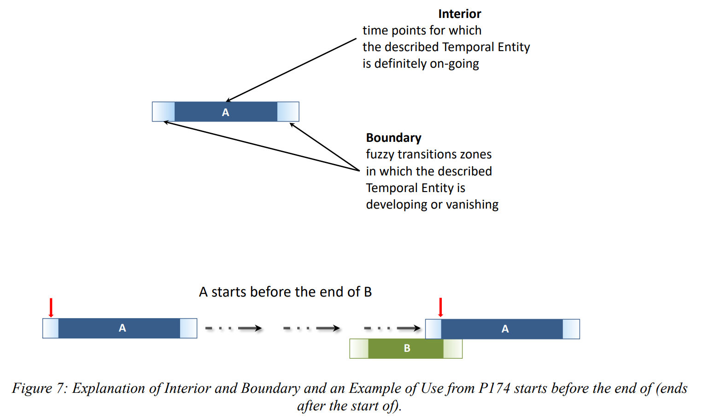
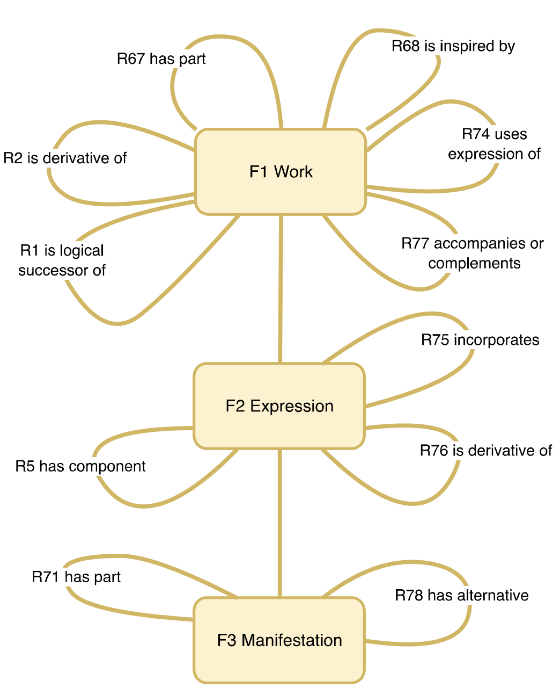

<style>
.context {
    border: 1px solid gray;
    color: gray;
    font-family: FiraCode;
    font-size: 18px;
}
.context > div { margin: 1em; }
</style>

<!--∫ slide cover -->

<div class="context">
    <div style="display: flex; justify-content: space-between;">
        <div>‹Les Humanités numériques pour la recherche et la formation›</div>
        <div>17 janvier 2025</div>
    </div>
    <div style="text-align: right;">Journée d'études organisée par l'UFR LAM, IDHES Evry,<br/>les départements d'Histoire, de LEA et de Musicologie</div>
</div>

<div style="
    align-items: center;
    display: flex;
    flex-direction: column;
    font-family: FiraCode;
    justify-content: center;
    text-transform: lowercase;
">
    <div style="color: #FF0092">modéliser, saisir, publier, exploiter</div>
    <br/>
    <div style="font-size: 75%;">apport des ontologies sémantiques à la conception<br/>des systèmes d'information pour la recherche</div>
</div>

<div>
<pre style="color: gray; font-size: 50%;">
https://github.com/Amleth/communications/tree/main/out/2025.01.17_evry_hn
</pre>
</div>

<div class="context">
    <div style="display: flex; justify-content: space-between;">
        <div>‹thomas.bottini@cnrs.fr›</div>
        <div>‹I›nstitut de ‹Re›cherche en ‹Mus›icologie — ‹IReMus›, UMR 8223 CNRS</div>
    </div>
    <div style="display: flex; justify-content: space-between;">
        <div></div>
        <div>Consortium ‹Musica2› IR* Huma-Num</div>
    </div>
</div>

<!--∫ slide -->

# PLAN

1. Problèmes récurrents lors de la conception d'un SIR & CIDOC CRM

<!--∫ slide title -->

# Problèmes récurrents lors de la conception d'un SIR & CIDOC CRM

<!--∫ slide -->

## Le Web sémantique, en une slide

- Promesse d'une base de données à l'échelle du Web. Le Web initial (Tim Berners Lee, 1991) était un Web de documents liés (hypertexte), le Web sémantique est un Web de données liées.
§§§
- Chaque donnée est identifiée par une URL.
§§§
- Toute information s'exprime sous la forme d'un triplet (sujet/prédicat/objet) dans un langage de description, le RDF.
§§§
- La connexion de ces triplets RDF forme un graphe.
§§§
- Chaque prédicat est également identifié par une URL (sens partagé des propriétés).

```dot fd6722af-2ae4-4abf-a011-883dbe4b30db 26
layout=dot
node [color=cyan,fontcolor=white]
edge [color=cyan,fontcolor=white]
"https://data.bnf.fr/13962206/morton_feldman_for_philip_guston/" -> "« For Philip Guston »" [label="http://www.cidoc-crm.org/cidoc-crm/P102_has_title"]
```

§§§
- Milieu technique idéal pour des données scientifiques FAIR.

<!--∫ slide ch -->

## Données relationnelles vs graphe RDF


*Corago in LOD - Seminar by Angelo Pompilio and Paolo Bonora, Digital Humanities and Digital Knowledge, Università di Bologna, 2017.*

<!--∫ slide -->

# Qu'est ce qu'une ontologie ?

- Formalisation d'un modèle conceptuel pour un domaine identifié proposant des :
    - ‹Classes :› types d'entités peuplant le domaine, possiblement organisées selon des relations d'héritage (spécificité). On appelle ‹individu› une ressource qui est du type d'une classe.
    - ‹Propriétés :› aspects, caractéristiques, attributs possibles de ces classes, qui peuvent soit pointer vers une valeur, soit vers un individu.
- Utiliser les classes et les propriétés d'une ontologie confère ainsi une sémantique partagée aux données RDF (les individus identifiés par des URL seront des sujets ou des objets, les propriétés des classes seront des prédicats).
- Vous connaissez peut-être déjà une ontologie : SKOS (pour construire des thésauri).

<!--∫ slide title -->

# III. Introduction à l'ontologie CIDOC-CRM

<!--∫ slide -->

# Le CIDOC-CRM en bref

- Le CIDOC-CRM est une ontologie qui documente le patrimoine matériel et immatériel ainsi que les processus de production de connaissances à son propos.
- [https://www.cidoc-crm.org/](https://www.cidoc-crm.org/)
- Venant du monde des musées, elle est désormais utilisée dans tous les domaines des HN.
- Elle est extrêmement abstraite et générique.
- Ontologie centrée événement (nous y reviendrons dans les exemples…)
- Classes et propriétés : [https://cidoc-crm.org/html/cidoc_crm_v7.1.2.html](https://cidoc-crm.org/html/cidoc_crm_v7.1.2.html)

<!--∫ slide ch cv -->

## Hiérarchie des classes


<!--∫ slide -->

Opinion : En dépit du nombre de classes centrées sur les usages de musées, le CIDOC-CRM propose des classes génériques permettant de rendre compte de l'ensemble des problématiques de modélisation de la structure et du contenu des sources, ainsi que des processus analytiques qui les prennent pour cible.

<!--∫ slide ch -->

# Le temps dans le CRM



<!--∫ slide title -->

# De quelques ontologies filles bien utiles

<!--∫ slide -->

## LRMoo

- Convergence du monde des musées (CIDOC-CRM) et du monde des bibliothèques ([IFLA LRM](https://www.transition-bibliographique.fr/enjeux/definition-ifla-lrm/), anciennement FRBR) : l'ontologie LRMoo spécialise certaines classes du CIDOC-CRM (qui sert donc d'ontologie de base).
- Quatre entités fondamentales — Work, Expression, Manifestation, Item (WEMI) — représentant les quatre modes d'existence des sources (conceptuel, sémiotique, éditorial, matériel).

<!--∫ slide ch -->

## LRMoo : Des relations riches entre les entités



<!--∫ slide -->

## DOREMUS 

- Des vocabulaires utiles pour la musique : [data.doremus.org/vocabularies](https://data.doremus.org/vocabularies) + [github.com/DOREMUS-ANR/knowledge-base/tree/master/vocabularies](https://github.com/DOREMUS-ANR/knowledge-base/tree/master/vocabularies)
- Une ontologie sans équivalent pour la modélisation des effectifs prévus dans l'œuvre, des concerts, et des effectifs réalisés durant les performances : [https://data.doremus.org/ontology/](data.doremus.org/ontology)
- Un parti prix (désormais techniquement obsolète) sur la manière dont on peut modéliser une situation de composition : [data.doremus.org/ontology](https://data.doremus.org/ontology/)
- Un énorme dataset (BNF + Radio France + Philharmonie) d'œuvres, partitions, concerts… [data.doremus.org](https://data.doremus.org/)

<!--∫ slide ch -->

# Une application Web pour explorer des données CRM

<div>
<h3>Motivation</h3>
<div style="color: gray; font-style: italic;">
Recourir à un unique modèles dans les différents projets permet de ne concevoir, développer et maintenir qu'une unique application pour présenter et exploiter les données.
</div>
<h3>Contexte</h3>
<div style="color: gray; font-style: italic;">
Pas ou peu d'apport financier. Programme de recherche SHERLOCK à l'IReMus (Comment et pourquoi modéliser les données musicologiques avec le CIDOC CRM ? Comment les publier et les manipuler ?).
</div>
</div>

<!--∫ slide -->

## Objectifs fonctionnels de la « SHERLOCK app » (I/II)

- Une interface de navigation hypertexte générique dans la totalité des graphes RDF d'un Triplestore accessible via un SPARQL Endpoint.
§§§
- L'utilisateur devrait avoir le sentiment de naviguer dans des fiches, dont la structure serait claire et où les métadonnées y seraient affichées clairement, sans être exposé à la technicité inhérente aux triplets RDF et aux noms abstraits des classes et des propriétés des ontologies convoquées…
§§§
- … mais la teneur des sujets/prédicats/objets RDF devrait toujours être clairement indiquée, pour raisons pédagogique et technique.
§§§
- Exploitation des *patterns* spécifiques du CRM ou de LRMoo pour proposer des interfaces spécifiques ([lrmoo:F18](https://data-iremus.huma-num.fr/sherlock/?resource=http://data-iremus.huma-num.fr/id/336f0cc6-8eb0-4d5d-b1eb-c27674f8e479)).
    - Triplets décrivant l'identité d'une ressource
    - Dates
    - Place dans une structure (sociale, bibliothécaire, logique, matérielle…)
    - Annotations (qui ? qui ? quand ? pourquoi ?)
    - Annotations (multiplicité des points de vue)

<!--∫ slide center -->


<!--∫ slide -->

## Objectifs fonctionnels de la « SHERLOCK app » (II/II)

- Proposer l'éventuel contenu associé à la ressource en cours de consultation ([rendu HTML d'un fragment TEI](https://data-iremus.huma-num.fr/sherlock/?resource=http://data-iremus.huma-num.fr/id/2d300dd8-7e10-4de1-ac12-95602a0e78fe), image, fichier MEI s'ouvrant dans l'interface d'annotation collaborative [Tonalities…](https://polifonia-project.eu/pilots/tonalities/)) 
- Moteur de recherche plein texte dans l'ensemble des valeurs littérales textuelles.
- Moteur de recherche par concepts issus de thésaurus.