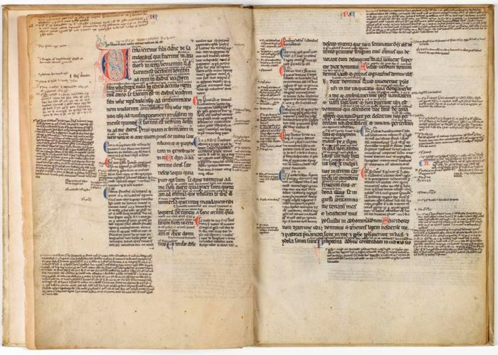

<!--∫ slide title -->

<div>

*Rencontres musicologiques de Valenciennes — Vendredi 24 mai 2019*

</div>

<div class="wto" style="font-size:200%;"></div>

# L'édition critique du livre<br/>de chœur de Beauvais

## de la numérisation à l'informatisation

<div class="wto" style="font-size:200%;"></div>

<div>

*Thomas Bottini*

*‹I›nstitut de ‹Re›cherche en ‹Mus›icologie*

*IReMus — UMR 8223 CNRS*

</div>

<!--∫ slide -->

# Plan

1. La ‹matérialité› des sources documentaires physiques & numériques
2. Une interface de ‹lecture « augmentée »›
3. Une plateforme d'‹annotation multimédia›

<!--∫ slide parttitle -->

# Introduction : objectifs de l'édition

<!--∫ slide -->

# Diversité des publics & des thèmes

- Chercheurs & chercheuses
- Musiciens & musiciennes
- Grand public & scolaires :


<!--∫ slide -->

# Diversité des publics & des thèmes

- Chercheurs & chercheuses
- Musiciens & musiciennes
- Grand public & scolaires :
  - *‹Aider à comprendre la source avec un environnement hypermédia :›*
    - voir, lire, écouter, manipuler (*multi‹média›*)
    - accéder à des ressources complémentaires liées (*‹hyper›texte*)


<!--∫ slide -->

# Diversité des publics & des thèmes

- Chercheurs & chercheuses
- Musiciens & musiciennes
- Grand public & scolaires :
  - *‹Aider à comprendre la source avec un environnement hypermédia :›*
    - voir, lire, écouter, manipuler (*multi‹média›*)
    - accéder à des ressources complémentaires liées (*‹hyper›texte*)
  - *‹Expliquer & montrer la démarche scientifique :›* photos & textes détaillant les étapes du processus d'exploitation et de valorisation scientifique du livre de chœur, de sa découverte à la construction de l'édition numérique.


<!--∫ slide -->

# Diversité des publics & des thèmes

- Chercheurs & chercheuses
- Musiciens & musiciennes
- Grand public & scolaires :
  - *‹Aider à comprendre la source avec un environnement hypermédia :›*
    - voir, lire, écouter, manipuler (*multi‹média›*)
    - accéder à des ressources complémentaires liées (*‹hyper›texte*)
  - *‹Expliquer & montrer la démarche scientifique :›* photos & textes détaillant les étapes du processus d'exploitation et de valorisation scientifique du livre de chœur, de sa découverte à la construction de l'édition numérique.
- Thèmes : techniques de pochoir, analyse & théorie musicale, performance musicale, liturgie…

<!--∫ slide -->

# Objectif

<div style="border:1px solid white;padding:0.5em;margin-bottom:0.5cm;">

Diversités des publics & thèmes `=>` nécessité d'un ‹développement *ad-hoc*›.

</div>


<!--∫ slide -->

# Objectif

<div style="border:1px solid white;padding:0.5em;margin-bottom:0.5cm;">

Diversités des publics & thèmes `=>` nécessité d'un ‹développement *ad-hoc*›.

</div>


<div style="border:1px solid white;padding:0.5em;">

**Objet documentaire visé**

un ‹hyperdocument› collaboratif (sources + transcriptions + métadonnées + annotations) ‹ouvert à toutes les pratiques de lecture & contextes d'usage›.

</div>


<!--∫ slide -->

# Objectif

<div style="border:1px solid white;padding:0.5em;margin-bottom:0.5cm;">

Diversités des publics & thèmes `=>` nécessité d'un ‹développement *ad-hoc*›.

</div>


<div style="border:1px solid white;padding:0.5em;">

**Objet documentaire visé**

un ‹hyperdocument› collaboratif (sources + transcriptions + métadonnées + annotations) ‹ouvert à toutes les pratiques de lecture & contextes d'usage›.

</div>


- Faire émerger la ‹structure logique› ou la logique d'usage des documents (œuvres, liturgie) pour une ‹meilleure navigation›
- Organiser les annotations en ‹strates thématisées› (*« taggées »*)
- Proposer des fonctions de recherche & de ‹mise en série› des annotations
- Adapter l'interface graphique au ‹régime d'activité›

<!--∫ slide parttitle -->

# I.<br/><br/>La ‹matérialité› des sources documentaires physiques & numériques

<!--∫ slide -->

# D'une matérialité à l'autre

- Le support d'inscription numérique n'est pas « immatériel », mais relève d'une autre matérialité.
  <!-- - la forme sémiotique d'appropriation n'est pas la forme d'enregistrement -->
  <!-- - la forme physique de restitution n'est pas le support d'enregistrement -->


<!--∫ slide -->

# D'une matérialité à l'autre

- Le support d'inscription numérique n'est pas « immatériel », mais relève d'une autre matérialité.
  <!-- - la forme sémiotique d'appropriation n'est pas la forme d'enregistrement -->
  <!-- - la forme physique de restitution n'est pas le support d'enregistrement -->
- Cette matérialité impose des contraintes :
  - un *‹calcul›* transforme la forme d'enregistrement en forme sémiotique d'appropriation
  - absence de synoptique « spontanée » => ‹désorientation›


<!--∫ slide -->

# D'une matérialité à l'autre

- Le support d'inscription numérique n'est pas « immatériel », mais relève d'une autre matérialité.
  <!-- - la forme sémiotique d'appropriation n'est pas la forme d'enregistrement -->
  <!-- - la forme physique de restitution n'est pas le support d'enregistrement -->
- Cette matérialité impose des contraintes :
  - un *‹calcul›* transforme la forme d'enregistrement en forme sémiotique d'appropriation
  - absence de synoptique « spontanée » => ‹désorientation›
- Et présente certains bénéfices pour l'édition :


<!--∫ slide -->

# D'une matérialité à l'autre

- Le support d'inscription numérique n'est pas « immatériel », mais relève d'une autre matérialité.
  <!-- - la forme sémiotique d'appropriation n'est pas la forme d'enregistrement -->
  <!-- - la forme physique de restitution n'est pas le support d'enregistrement -->
- Cette matérialité impose des contraintes :
  - un *‹calcul›* transforme la forme d'enregistrement en forme sémiotique d'appropriation
  - absence de synoptique « spontanée » => ‹désorientation›
- Et présente certains bénéfices pour l'édition :
  - *Statim invenire* (trouver rapidement)


<!--∫ slide -->

# D'une matérialité à l'autre

- Le support d'inscription numérique n'est pas « immatériel », mais relève d'une autre matérialité.
  <!-- - la forme sémiotique d'appropriation n'est pas la forme d'enregistrement -->
  <!-- - la forme physique de restitution n'est pas le support d'enregistrement -->
- Cette matérialité impose des contraintes :
  - un *‹calcul›* transforme la forme d'enregistrement en forme sémiotique d'appropriation
  - absence de synoptique « spontanée » => ‹désorientation›
- Et présente certains bénéfices pour l'édition :
  - *Statim invenire* (trouver rapidement)
  - partage de ‹référentiels de connaissances› sur le Web


<!--∫ slide -->

# D'une matérialité à l'autre

- Le support d'inscription numérique n'est pas « immatériel », mais relève d'une autre matérialité.
  <!-- - la forme sémiotique d'appropriation n'est pas la forme d'enregistrement -->
  <!-- - la forme physique de restitution n'est pas le support d'enregistrement -->
- Cette matérialité impose des contraintes :
  - un *‹calcul›* transforme la forme d'enregistrement en forme sémiotique d'appropriation
  - absence de synoptique « spontanée » => ‹désorientation›
- Et présente certains bénéfices pour l'édition :
  - *Statim invenire* (trouver rapidement)
  - partage de ‹référentiels de connaissances› sur le Web
  - ‹localisation, qualification & mise en relation› très fine des fragments documentaires


<!--∫ slide -->

# D'une matérialité à l'autre

- Le support d'inscription numérique n'est pas « immatériel », mais relève d'une autre matérialité.
  <!-- - la forme sémiotique d'appropriation n'est pas la forme d'enregistrement -->
  <!-- - la forme physique de restitution n'est pas le support d'enregistrement -->
- Cette matérialité impose des contraintes :
  - un *‹calcul›* transforme la forme d'enregistrement en forme sémiotique d'appropriation
  - absence de synoptique « spontanée » => ‹désorientation›
- Et présente certains bénéfices pour l'édition :
  - *Statim invenire* (trouver rapidement)
  - partage de ‹référentiels de connaissances› sur le Web
  - ‹localisation, qualification & mise en relation› très fine des fragments documentaires
  - … technologie scolastique idéale


<!--∫ slide -->

# D'une matérialité à l'autre

- Le support d'inscription numérique n'est pas « immatériel », mais relève d'une autre matérialité.
  <!-- - la forme sémiotique d'appropriation n'est pas la forme d'enregistrement -->
  <!-- - la forme physique de restitution n'est pas le support d'enregistrement -->
- Cette matérialité impose des contraintes :
  - un *‹calcul›* transforme la forme d'enregistrement en forme sémiotique d'appropriation
  - absence de synoptique « spontanée » => ‹désorientation›
- Et présente certains bénéfices pour l'édition :
  - *Statim invenire* (trouver rapidement)
  - partage de ‹référentiels de connaissances› sur le Web
  - ‹localisation, qualification & mise en relation› très fine des fragments documentaires
  - … technologie scolastique idéale
  - mais aussi : formes sémiotiques graphiques & ‹temporelles›

<!--∫ slide -->

# 

<div style="position:absolute;left:0.5cm;top:0.5cm;">
{height=12cm}
</div>
<div style="position:absolute;right:0.5cm;top:2cm;">
{height=12cm}
</div>
<div style="position:absolute;bottom:1cm;left:4cm;">
{height=12cm}
</div>

<!--∫ slide -->

# Texte & musique

- *Text Encoding Initiative* (1987) & *Music Encoding Initiative* (1999)
- Standards pour la description des textes/de la musique
- HTML ne représente que la forme typodispositionnelle, et ne dit rien de la structure et de la sémantique du contenu
- [Exemple TEI](https://fr.wikipedia.org/wiki/Text_Encoding_Initiative#Exemple_introductif)
- Représentation des choix philologiques :

```xml
<choice>
  <orig>colour</orig>
  <reg>color</reg>
</choice>
```

<!--∫ slide -->

# Images

- Standard IIIF (*framework* international d'interopérabilité des images)
- [Historique](https://fr.wikipedia.org/wiki/International_Image_Interoperability_Framework#Historique)
- Gérer les aspects techniques liés aux images (2011) :
  - découpe & identification des fragments
  - génération de variantes dégradées
- Représenter & exposer des collections organisées et qualifiées d'images (2013)


<!--∫ slide -->

# Images

- Standard IIIF (*framework* international d'interopérabilité des images)
- [Historique](https://fr.wikipedia.org/wiki/International_Image_Interoperability_Framework#Historique)
- Gérer les aspects techniques liés aux images (2011) :
  - découpe & identification des fragments
  - génération de variantes dégradées
- Représenter & exposer des collections organisées et qualifiées d'images (2013)
- IIIF, pour ‹articuler des ressources complémentaires› (ex : transcriptions TEI & MEI, documents & références complémentaires) aux images.


<!--∫ slide -->

# Images

- Standard IIIF (*framework* international d'interopérabilité des images)
- [Historique](https://fr.wikipedia.org/wiki/International_Image_Interoperability_Framework#Historique)
- Gérer les aspects techniques liés aux images (2011) :
  - découpe & identification des fragments
  - génération de variantes dégradées
- Représenter & exposer des collections organisées et qualifiées d'images (2013)
- IIIF, pour ‹articuler des ressources complémentaires› (ex : transcriptions TEI & MEI, documents & références complémentaires) aux images.
- Moment pivot dans l'histoire des rapports entre TEI & IIIF.


<!--∫ slide parttitle -->

# II.<br/><br/>Une interface de ‹lecture « augmentée »›

<br/>
<br/>

(Démonstration)

<!--∫ slide -->

# Enjeux

- La disposition matérielle de éléments musicaux est signifiante.
- Quelle mise en espace numérique ?

<div style="text-align:center;">
{width=15cm}
</div>

<!--∫ slide parttitle -->

# III.<br/><br/>Une plateforme d'‹annotation multimédia›

<!--∫ slide -->

# Enjeux

- Annotation =
  - ‹localisation› (matérialité spécifique des images, textes & données musicales)
  - \+ ‹qualification› (technologies du Web sémantique)
  - \+ ‹structuration› (liens entre fragments documentaires & enrichissements)


<!--∫ slide -->

# Enjeux

- Annotation =
  - ‹localisation› (matérialité spécifique des images, textes & données musicales)
  - \+ ‹qualification› (technologies du Web sémantique)
  - \+ ‹structuration› (liens entre fragments documentaires & enrichissements)
- Enjeu épistémologique : l'identification de ‹catégories analytiques› (émergentes) venant « sémantiser » les annotations, et les ouvrant à une exploitation sérielle.


<!--∫ slide -->

# Enjeux

- Annotation =
  - ‹localisation› (matérialité spécifique des images, textes & données musicales)
  - \+ ‹qualification› (technologies du Web sémantique)
  - \+ ‹structuration› (liens entre fragments documentaires & enrichissements)
- Enjeu épistémologique : l'identification de ‹catégories analytiques› (émergentes) venant « sémantiser » les annotations, et les ouvrant à une exploitation sérielle.
- Enjeu technique & méthodoliguque : comment ‹localiser finement l'information musicale› dans le MEI affiché ?


<!--∫ slide -->

# Enjeux

- Annotation =
  - ‹localisation› (matérialité spécifique des images, textes & données musicales)
  - \+ ‹qualification› (technologies du Web sémantique)
  - \+ ‹structuration› (liens entre fragments documentaires & enrichissements)
- Enjeu épistémologique : l'identification de ‹catégories analytiques› (émergentes) venant « sémantiser » les annotations, et les ouvrant à une exploitation sérielle.
- Enjeu technique & méthodoliguque : comment ‹localiser finement l'information musicale› dans le MEI affiché ?
- Quelle ‹interface› pour un réseau documentaire critique ?


<!--∫ slide -->

# Enjeux

- Annotation =
  - ‹localisation› (matérialité spécifique des images, textes & données musicales)
  - \+ ‹qualification› (technologies du Web sémantique)
  - \+ ‹structuration› (liens entre fragments documentaires & enrichissements)
- Enjeu épistémologique : l'identification de ‹catégories analytiques› (émergentes) venant « sémantiser » les annotations, et les ouvrant à une exploitation sérielle.
- Enjeu technique & méthodoliguque : comment ‹localiser finement l'information musicale› dans le MEI affiché ?
- Quelle ‹interface› pour un réseau documentaire critique ?
- Gestion native du ‹multi-point de vue›, tant sur les sources que sur les catégories analytiques.