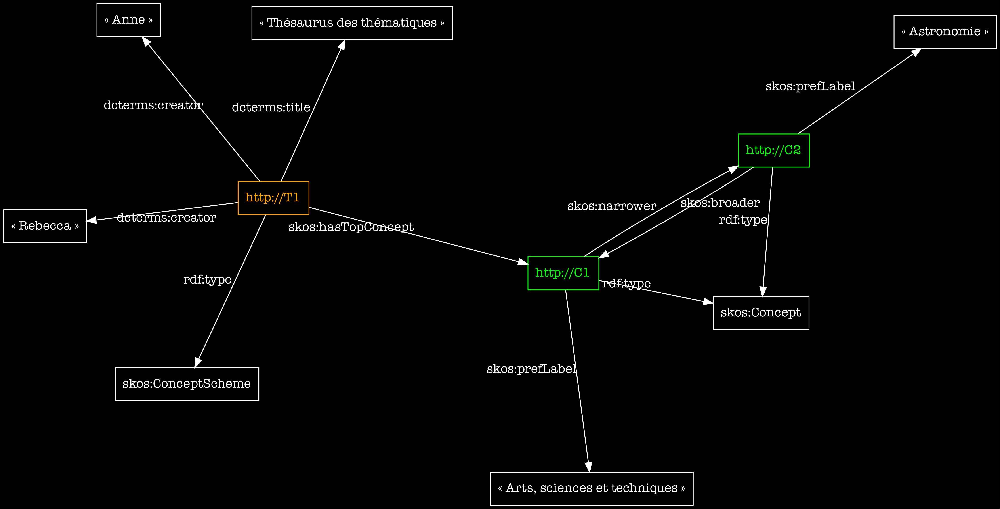

<!--📜-->
<!--∫ slide title -->

# Les substrats numériques de la recherche : <em>documents, données, thésaurii, ontologies</em>

Cours de méthodologie



Nathalie Berton–Blivet ‹› Thomas Bottini

`nathalie.berton-blivet@cnrs.fr | thomas.bottini@cnrs.fr`

_‹I›nstitut de ‹Re›cherche en ‹Mus›icologie_

IReMus, UMR 8223 CNRS  Sorbonne Université

î 

<!--📜-->
<!--∫ slide -->

# Plan

[TB]

1. Des idées aux données partagées
2. Recenser & structurer les termes & les concepts avec un thésaurus

[NBB]

3. Thésaurus & modélisation ontologique pour l'expression des connaissances historiques _(+ pause médiane quelque part…)_

[TB]

4. Modéliser l'objet d'étude avec une ontologie

<!--📜-->
<!--∫ slide title -->

# I — Des idées aux données partagées

<!--📜-->
<!--∫ slide -->

# Différence entre document et données

- Le vocable « données » dénote l'idée d'ensemble d'éléments de taille réduite structurés de manière similaire et prenant leur signification de la place qu'ils tiennent dans une série. Une donnée n'existe pas vraiment au singulier (_data/datum_).

<!--∫ slide -->

# Différence entre document et données

- Le vocable « données » dénote l'idée d'ensemble d'éléments de taille réduite structurés de manière similaire et prenant leur signification de la place qu'ils tiennent dans une série. Une donnée n'existe pas vraiment au singulier (_data/datum_).
- Le contenu d'un fichier Word ou PDF de type article ou mémoire ne relève pas de cette catégorie.

<!--∫ slide -->

# Différence entre document et données

- Le vocable « données » dénote l'idée d'ensemble d'éléments de taille réduite structurés de manière similaire et prenant leur signification de la place qu'ils tiennent dans une série. Une donnée n'existe pas vraiment au singulier (_data/datum_).
- Le contenu d'un fichier Word ou PDF de type article ou mémoire ne relève pas de cette catégorie.
- Un fichier Word ou PDF d'un catalogue pose question : il contient des données, mais celles-ci sont figées dans le texte, elles ne sont pas requêtables, appréhendables en sous-ensembles constitués par variation d'un paramètre de recherche. Autrement dit l'informatique ne sert à rien dans ce cas (ni dans sa capacité à formaliser, ni dans sa capacité à rechercher).

<!--∫ slide -->

# Différence entre document et données

- Le vocable « données » dénote l'idée d'ensemble d'éléments de taille réduite structurés de manière similaire et prenant leur signification de la place qu'ils tiennent dans une série. Une donnée n'existe pas vraiment au singulier (_data/datum_).
- Le contenu d'un fichier Word ou PDF de type article ou mémoire ne relève pas de cette catégorie.
- Un fichier Word ou PDF d'un catalogue pose question : il contient des données, mais celles-ci sont figées dans le texte, elles ne sont pas requêtables, appréhendables en sous-ensembles constitués par variation d'un paramètre de recherche. Autrement dit l'informatique ne sert à rien dans ce cas (ni dans sa capacité à formaliser, ni dans sa capacité à rechercher).
- [fr.wikipedia.org/wiki/Abdel_Halim_Hafez](https://fr.wikipedia.org/wiki/Abdel_Halim_Hafez) _versus_ [www.wikidata.org/wiki/Q307786](https://www.wikidata.org/wiki/Q307786)

<!--📜-->
<!--∫ slide -->

# Quand & pourquoi produire des données numériques ?

1. Quand vous avez le sentiment que vous allez devenir fou/folle en faisant des tableaux dans Word.

<!--∫ slide -->

# Quand & pourquoi produire des données numériques ?

1. Quand vous avez le sentiment que vous allez devenir fou/folle en faisant des tableaux dans Word.
2. Quand vous accumulez des informations en série sur des objets de votre terrain qu'il vous faut analyser (requêter des sous-ensembles, faire des statistiques, construire des visualisations…).

<!--∫ slide -->

# Quand & pourquoi produire des données numériques ?

1. Quand vous avez le sentiment que vous allez devenir fou/folle en faisant des tableaux dans Word.
2. Quand vous accumulez des informations en série sur des objets de votre terrain qu'il vous faut analyser (requêter des sous-ensembles, faire des statistiques, construire des visualisations…).
3. Quand vous sentez que l'effort de rédaction est distinct de l'effort de collecte, que les jeux de données constitués _ici et maintenant_ pourraient répondre à de nouvelles questions de recherche _là bas et plus tard_.

<!--📜-->
<!--∫ slide -->

# Fréquentons un cas concret…

- La musique au théâtre, dépouillement des archives de la Comédie-Française (1680-1793)
  - Première approche sous Word
  - Étudions la modélisation dans la feuilles XLSX. ‹Les données sont structurées suivant un modèle, il faut identifier les types d'entités, leurs propriétés et les relations qu'elles entretiennent.› Et rendre le tout explicite dans une structure informatique.
  - Une première « interface » : le catalogue édité.
  - Projet de publication Web, à partir du même fichier de données.

<!--∫ slide -->

# Fréquentons un cas concret…

- La musique au théâtre, dépouillement des archives de la Comédie-Française (1680-1793)
  - Première approche sous Word
  - Étudions la modélisation dans la feuilles XLSX. ‹Les données sont structurées suivant un modèle, il faut identifier les types d'entités, leurs propriétés et les relations qu'elles entretiennent.› Et rendre le tout explicite dans une structure informatique.
  - Une première « interface » : le catalogue édité.
  - Projet de publication Web, à partir du même fichier de données.

<!--📜-->
<!--∫ slide -->

# Problèmes épistémologiques

- Les données sont-elles vraiment données ? Les données ne sont-elles pas plutôt ‹construites› ?

<!--∫ slide -->

# Problèmes épistémologiques

- Les données sont-elles vraiment données ? Les données ne sont-elles pas plutôt ‹construites› ?
- Un jeu de données est-il réellement ‹signifiant hors d'un contexte interprétatif donné› ?

<!--∫ slide -->

# Problèmes épistémologiques

- Les données sont-elles vraiment données ? Les données ne sont-elles pas plutôt ‹construites› ?
- Un jeu de données est-il réellement ‹signifiant hors d'un contexte interprétatif donné› ?
- Le cas que nous venons d'étudier repose sur une ‹myriade d'implicites› : seul l'auteur de ce travail connaît le sens qu'il faut conférer aux colonnes et aux données de sa feuilles XLSX.

<table>
<thead>
<tr><th>ID</th><th>Attribution</th></tr>
</thead>
<tbody>
<tr><td>0001</td><td>Josquin</td></tr>
</tbody>
</table>

&nbsp;&nbsp;&nbsp;&nbsp;➡&nbsp;&nbsp;&nbsp;&nbsp;

– Ne dit rien de l'activité de collecte de la donnée, du rapport à la source (aussi important que la donnée en elle-même si on parle de science).
 
– Ne dit rien du contexte argumentatif et du degré de certitude.
 
– Dans 10 ans, comment s'assurer que les chaînes de caractères correspondent bien à ce que l'auteur ou l'autrice avait en tête ?

<!--📜-->
<!--∫ slide -->

# Comment partager des données (Web)

- Contexte socio-technique : les ‹données ouvertes et liées›.
  - [Échelle de qualité des données ouvertes de Tim Berners-Lee (Wikipedia)](https://fr.wikipedia.org/wiki/Donn%C3%A9es_ouvertes#%C3%89chelle_de_qualit%C3%A9_des_donn%C3%A9es_ouvertes_de_Tim_Berners-Lee)
  - [https://5stardata.info/fr/](https://5stardata.info/fr/) (rappel : projet Doremus).

<!--∫ slide -->

# Comment partager des données (Web)

- Contexte socio-technique : les ‹données ouvertes et liées›.
  - [Échelle de qualité des données ouvertes de Tim Berners-Lee (Wikipedia)](https://fr.wikipedia.org/wiki/Donn%C3%A9es_ouvertes#%C3%89chelle_de_qualit%C3%A9_des_donn%C3%A9es_ouvertes_de_Tim_Berners-Lee)
  - [https://5stardata.info/fr/](https://5stardata.info/fr/) (rappel : projet Doremus).
- Les trois grandes opérations informationnelles à réaliser pour passer d'un fichier Excel personnel à un jeu de données « compréhensible » sur le Web :
  - Transformer les identifiants en ‹URI›.
  - ‹Aligner les entités identifiées› (personnes, lieux, notions…) sur des ‹référentiels› et des ‹thésaurii›, principalement pour des raisons de désambiguïsation.
  - Feuilles & colonnes (modèle) => choisir une ‹ontologie› adéquate au corpus, autour de laquelle existe une ‹communauté de pratiques qui réfléchit et formalise des invariants› dans la manière de considérer leurs objets d'étude.

<!--📜-->
<!--∫ slide title -->

# II – Thésaurii

<!--📜-->
<!--∫ slide -->

# Constituer un thésaurus

- Présentation d'un projet concret en cours : indexation du corpus d'estampes du Mercure galant 1678—1710 (IReMus/ObTIC).

<!--∫ slide -->

# Constituer un thésaurus

- Présentation d'un projet concret en cours : indexation du corpus d'estampes du Mercure galant 1678—1710 (IReMus/ObTIC).
- Organisation, description et indexation du corpus.

<!--∫ slide -->

# Constituer un thésaurus

- Présentation d'un projet concret en cours : indexation du corpus d'estampes du Mercure galant 1678—1710 (IReMus/ObTIC).
- Organisation, description et indexation du corpus.
- Organisation du thésaurus.

<!--∫ slide -->

# Constituer un thésaurus

- Présentation d'un projet concret en cours : indexation du corpus d'estampes du Mercure galant 1678—1710 (IReMus/ObTIC).
- Organisation, description et indexation du corpus.
- Organisation du thésaurus.
- Alignement sur des thésaurii mondiaux

  - Patrimoine, en général : [Getty AAT](http://www.getty.edu/vow/AATServlet?english=N&find=music+notation&logic=AND&page=1&note=)
  - Histoire de l'art : [Iconclass](http://iconclass.org/rkd/42E361/?q=music+notation&q_s=1)

<!--∫ slide -->

# Constituer un thésaurus

- Présentation d'un projet concret en cours : indexation du corpus d'estampes du Mercure galant 1678—1710 (IReMus/ObTIC).
- Organisation, description et indexation du corpus.
- Organisation du thésaurus.
- Alignement sur des thésaurii mondiaux

  - Patrimoine, en général : [Getty AAT](http://www.getty.edu/vow/AATServlet?english=N&find=music+notation&logic=AND&page=1&note=)
  - Histoire de l'art : [Iconclass](http://iconclass.org/rkd/42E361/?q=music+notation&q_s=1)

- Synergie scientifique ([une idée : le projet Emblematica](http://emblematica.library.illinois.edu/search/emblems?query.keywords=obelisk))

<!--∫ slide -->

# Constituer un thésaurus

- Présentation d'un projet concret en cours : indexation du corpus d'estampes du Mercure galant 1678—1710 (IReMus/ObTIC).
- Organisation, description et indexation du corpus.
- Organisation du thésaurus.
- Alignement sur des thésaurii mondiaux

  - Patrimoine, en général : [Getty AAT](http://www.getty.edu/vow/AATServlet?english=N&find=music+notation&logic=AND&page=1&note=)
  - Histoire de l'art : [Iconclass](http://iconclass.org/rkd/42E361/?q=music+notation&q_s=1)

- Synergie scientifique ([une idée : le projet Emblematica](http://emblematica.library.illinois.edu/search/emblems?query.keywords=obelisk))
- Écueil épistémologique potentiel : confrontation entre approche _bottom-up_ (localisée + située) et _top-down_ (globalisée + détachée des pratiques effectives).

<!--∫ slide -->

# Constituer un thésaurus

- Présentation d'un projet concret en cours : indexation du corpus d'estampes du Mercure galant 1678—1710 (IReMus/ObTIC).
- Organisation, description et indexation du corpus.
- Organisation du thésaurus.
- Alignement sur des thésaurii mondiaux

  - Patrimoine, en général : [Getty AAT](http://www.getty.edu/vow/AATServlet?english=N&find=music+notation&logic=AND&page=1&note=)
  - Histoire de l'art : [Iconclass](http://iconclass.org/rkd/42E361/?q=music+notation&q_s=1)

- Synergie scientifique ([une idée : le projet Emblematica](http://emblematica.library.illinois.edu/search/emblems?query.keywords=obelisk))
- Écueil épistémologique potentiel : confrontation entre approche _bottom-up_ (localisée + située) et _top-down_ (globalisée + détachée des pratiques effectives).
- Formaliser un thésaurus avec SKOS (_Simple Knowledge Organization System_).

<!--📜-->
<!--∫ slide -->

# 1 thésaurus & 2 concepts en SKOS

<!--📜-->
<!--∫ slide title -->

# Thésaurus & modélisation ontologique pour l'expression des connaissances historiques

<!--📜-->
<!--∫ slide title -->

# Modéliser l'objet d'étude avec une ontologie

<!--📜-->
<!--∫ slide -->

# Sémantique des connaissances historiques

- **Personnes**
  - Représenter les propriétés d'un individu historique (patronyme, pseudonyme, dates, relations de parenté…).

<!--∫ slide -->

# Sémantique des connaissances historiques

- **Personnes**
  - Représenter les propriétés d'un individu historique (patronyme, pseudonyme, dates, relations de parenté…).
  - Représenter ses activités & relations sociales.

<!--∫ slide -->

# Sémantique des connaissances historiques

- **Personnes**
  - Représenter les propriétés d'un individu historique (patronyme, pseudonyme, dates, relations de parenté…).
  - Représenter ses activités & relations sociales.
- **Lieux**
  - Inclusion administrative ≠ inclusion géographique ≠ inclusion temporelle

<!--∫ slide -->

# Sémantique des connaissances historiques

- **Personnes**
  - Représenter les propriétés d'un individu historique (patronyme, pseudonyme, dates, relations de parenté…).
  - Représenter ses activités & relations sociales.
- **Lieux**
  - Inclusion administrative ≠ inclusion géographique ≠ inclusion temporelle
  - Représenter la diachronie (ex : Ris + Orangis = Ris-Orangis (1793)).

<!--∫ slide -->

# Sémantique des connaissances historiques

- **Personnes**
  - Représenter les propriétés d'un individu historique (patronyme, pseudonyme, dates, relations de parenté…).
  - Représenter ses activités & relations sociales.
- **Lieux**
  - Inclusion administrative ≠ inclusion géographique ≠ inclusion temporelle
  - Représenter la diachronie (ex : Ris + Orangis = Ris-Orangis (1793)).
- **Institutions**
  - Les sémantiques de la relation unissant « Académie » et « Académie de Besançon » et de la relation unissant « Académie de Besançon » et « Associé-résident de l'Académie de Besançon » diffèrent.

<!--∫ slide -->

# Sémantique des connaissances historiques

- **Personnes**
  - Représenter les propriétés d'un individu historique (patronyme, pseudonyme, dates, relations de parenté…).
  - Représenter ses activités & relations sociales.
- **Lieux**
  - Inclusion administrative ≠ inclusion géographique ≠ inclusion temporelle
  - Représenter la diachronie (ex : Ris + Orangis = Ris-Orangis (1793)).
- **Institutions**
  - Les sémantiques de la relation unissant « Académie » et « Académie de Besançon » et de la relation unissant « Académie de Besançon » et « Associé-résident de l'Académie de Besançon » diffèrent.
  - Représenter le fait que « Pierre Beauchamp était membre de l'Académie royale de Danse en 1680 » ?

<!--📜-->
<!--∫ slide -->

# Une question, une ontologie

- L'ontologie SKOS concerne la définition des concepts (`skos:definition`, `skos:prefLabel`…) et des rapports qu'ils entretiennent (`skos:narrower`, `skos:broader`, `skos:related`…). Les entités historiques ne sont pas vraiment des concepts.

<!--∫ slide -->

# Une question, une ontologie

- L'ontologie SKOS concerne la définition des concepts (`skos:definition`, `skos:prefLabel`…) et des rapports qu'ils entretiennent (`skos:narrower`, `skos:broader`, `skos:related`…). Les entités historiques ne sont pas vraiment des concepts.
- Ontologie adaptée à l'expression de connaissances historiques (par exemple, le [CIDOC-CRM](http://www.cidoc-crm.org/)). Quelques exemples…

<!--📜-->
<!--∫ slide -->

# Lieux historiques avec le CRM

<!--📜-->
<!--∫ slide -->

# Personnes historiques avec le CRM

<!--📜-->
<!--∫ slide -->

# Groupes historiques avec le CRM

