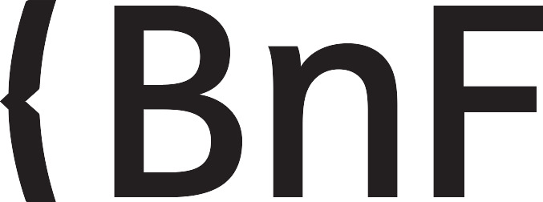

<!--📜-->
<!--∫ slide title -->

Consortium Musica2 
Rencontres de la musicologie numérique, 1ère édition, 15/12/2022

Quelle infrastructure pour l'annotation sémantique collaborative de partitions MEI ?

Thomas BOTTINI 
IReMus — Institut de Recherche en Musicologie, UMR 8223

<!--📜-->
<!--∫ slide -->

# Titre

A

<!--∫ slide -->

# Titre

A

B