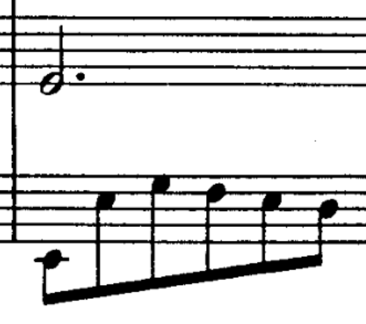
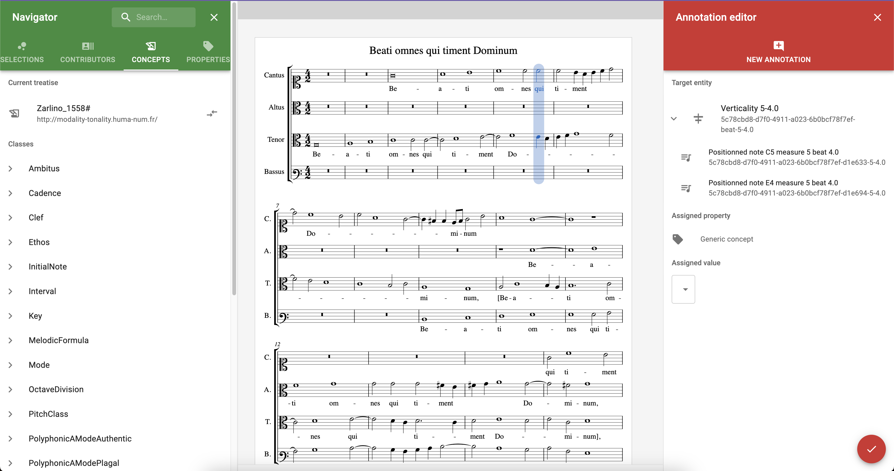

<!--📜-->
<!--∫ slide title -->

Consortium Musica2 
Rencontres de la musicologie numérique, 1ère édition, 15/12/2022

Quelle infrastructure pour l'annotation sémantique collaborative de partitions MEI ?

Thomas BOTTINI 
IReMus — Institut de Recherche en Musicologie, UMR 8223

<!--📜-->
<!--∫ slide c -->
# Plan

1. Problématique musicologique
2. Réponse conceptuelle & technique
3. Pérennisation de l'infrastructure & réflexions sur le futur

<!--📜-->
<!--∫ slide title -->
# Problématique musicologique

<!--📜-->
<!--∫ slide -->
# Contexte

- 💶 Projet européen H2020 POLIFONIA (*« Playing the soundtrack of our history »*)
    - [https://polifonia-project.eu/](https://polifonia-project.eu/)
    - [https://polifonia-project.eu/pilots/tonalities/](https://polifonia-project.eu/pilots/tonalities/)
        - Annoter collaborativement de grands corpus de partitions avec des traités théoriques historiques (Prætorius, Zarlino…).
        - Comparer les interprétations.

<!--∫ slide -->
# Contexte

- 💶 Projet européen H2020 POLIFONIA (*« Playing the soundtrack of our history »*)
    - [https://polifonia-project.eu/](https://polifonia-project.eu/)
    - [https://polifonia-project.eu/pilots/tonalities/](https://polifonia-project.eu/pilots/tonalities/)
        - Annoter collaborativement de grands corpus de partitions avec des traités théoriques historiques (Prætorius, Zarlino…).
        - Comparer les interprétations.
- 🎼 Équipe 3.1 de l'IReMus, « Théorie musicale, méthodes et pratiques analytiques ».

<!--∫ slide -->
# Contexte

- 💶 Projet européen H2020 POLIFONIA (*« Playing the soundtrack of our history »*)
    - [https://polifonia-project.eu/](https://polifonia-project.eu/)
    - [https://polifonia-project.eu/pilots/tonalities/](https://polifonia-project.eu/pilots/tonalities/)
        - Annoter collaborativement de grands corpus de partitions avec des traités théoriques historiques (Prætorius, Zarlino…).
        - Comparer les interprétations.
- 🎼 Équipe 3.1 de l'IReMus, « Théorie musicale, méthodes et pratiques analytiques ».
- 🏫 Projet Émergence Sorbonne-Université SHERLOCK porté par l'IReMus : mettre le Web sémantique en pratique pour la musicologie.

<!--📜-->
<!--∫ slide -->
# Au-delà de l'encodage

- 🎵 Les analystes veulent pouvoir annoter des partitions encodées en MEI : identification et qualification des dissonances, identification de fondamentales sur des verticalités, identification de cadences, annotation libre… Pour pouvoir ainsi librement définir des observables, il faut être en mesure…

<!--∫ slide -->
# Au-delà de l'encodage

- 🎵 Les analystes veulent pouvoir annoter des partitions encodées en MEI : identification et qualification des dissonances, identification de fondamentales sur des verticalités, identification de cadences, annotation libre… Pour pouvoir ainsi librement définir des observables, il faut être en mesure…
    - 👻 … d'adresser des entités qui ne sont pas matérialisées par des signes dans l'encodage MEI (telles que des verticalités ou une note à un moment/offset précis au sein du temps où elle se fait entendre) ;

<!--∫ slide -->
# Au-delà de l'encodage

- 🎵 Les analystes veulent pouvoir annoter des partitions encodées en MEI : identification et qualification des dissonances, identification de fondamentales sur des verticalités, identification de cadences, annotation libre… Pour pouvoir ainsi librement définir des observables, il faut être en mesure…
    - 👻 … d'adresser des entités qui ne sont pas matérialisées par des signes dans l'encodage MEI (telles que des verticalités ou une note à un moment/offset précis au sein du temps où elle se fait entendre) ;
    - 🧺 … d'adresser des ensemble arbitraires d'éléments MEI qui ne suivent pas nécessairement la structure logique du document XML.

<!--∫ slide -->
# Au-delà de l'encodage

- 🎵 Les analystes veulent pouvoir annoter des partitions encodées en MEI : identification et qualification des dissonances, identification de fondamentales sur des verticalités, identification de cadences, annotation libre… Pour pouvoir ainsi librement définir des observables, il faut être en mesure…
    - 👻 … d'adresser des entités qui ne sont pas matérialisées par des signes dans l'encodage MEI (telles que des verticalités ou une note à un moment/offset précis au sein du temps où elle se fait entendre) ;
    - 🧺 … d'adresser des ensemble arbitraires d'éléments MEI qui ne suivent pas nécessairement la structure logique du document XML.

<!--∫ slide -->
# Au-delà de l'encodage

- 🎵 Les analystes veulent pouvoir annoter des partitions encodées en MEI : identification et qualification des dissonances, identification de fondamentales sur des verticalités, identification de cadences, annotation libre… Pour pouvoir ainsi librement définir des observables, il faut être en mesure…
    - 👻 … d'adresser des entités qui ne sont pas matérialisées par des signes dans l'encodage MEI (telles que des verticalités ou une note à un moment/offset précis au sein du temps où elle se fait entendre) ;
    - 🧺 … d'adresser des ensemble arbitraires d'éléments MEI qui ne suivent pas nécessairement la structure logique du document XML.

!

!

!

!

!

•

•

•

•

•

•

<!--∫ slide -->
# Au-delà de l'encodage

- 🎵 Les analystes veulent pouvoir annoter des partitions encodées en MEI : identification et qualification des dissonances, identification de fondamentales sur des verticalités, identification de cadences, annotation libre… Pour pouvoir ainsi librement définir des observables, il faut être en mesure…
    - 👻 … d'adresser des entités qui ne sont pas matérialisées par des signes dans l'encodage MEI (telles que des verticalités ou une note à un moment/offset précis au sein du temps où elle se fait entendre) ;
    - 🧺 … d'adresser des ensemble arbitraires d'éléments MEI qui ne suivent pas nécessairement la structure logique du document XML.

!

!

!

!

!

•

•

•

•

•

•

Il faudrait, sur ce fragment, 19 éléments adressables comme cibles potentielles d'annotations (7 notes + 6 verticalités + 6 offsets possibles pour la blanche pointée).

<!--📜-->
<!--∫ slide -->
# Une infrastructure pour l'annotation collaborative

- 💾 Un système d'information supplémentant l'encodage MEI et reposant sur un système d'adressage sur le Web :
    - de l'ensemble des éléments MEI et « MEI étendu » ;
    - de n'importe quel élément ou groupe d'éléments MEI et « MEI étendu ».

<!--∫ slide -->
# Une infrastructure pour l'annotation collaborative

- 💾 Un système d'information supplémentant l'encodage MEI et reposant sur un système d'adressage sur le Web :
    - de l'ensemble des éléments MEI et « MEI étendu » ;
    - de n'importe quel élément ou groupe d'éléments MEI et « MEI étendu ».
- Au niveau de l'infrastructure :
    - 👩 Système d'authentification pour signer les annotations.
    - 🎼 Catalogue des partitions offertes à l'analyse avec des métadonnées sur leurs contextes de production.
    - 📚 Concepts et propriétés analytiques formalisés ailleurs (thésauri, ontologies).
    - 🐁 Interface d'annotation ergonomique.

<!--📜-->
<!--∫ slide title -->
# 2. Réponse conceptuelle & technique

<!--📜-->
<!--∫ slide -->
# Quel paradigme informationnel ?

- 🎼 Nécessairement extérieur à l'encodage MEI (collaboration sur le Web + prise en compte d'éléments non MEI).

<!--∫ slide -->
# Quel paradigme informationnel ?

- 🎼 Nécessairement extérieur à l'encodage MEI (collaboration sur le Web + prise en compte d'éléments non MEI).
- 🌍 Le milieu technique et conceptuel du Web sémantique semble évident :
    - Adressabilité sur le Web.
    - Pérennité des données : encodage (RDF sérialisable en texte brut), logiciels (triple stores libres), requêtage (SPARQL).

<!--∫ slide -->
# Quel paradigme informationnel ?

- 🎼 Nécessairement extérieur à l'encodage MEI (collaboration sur le Web + prise en compte d'éléments non MEI).
- 🌍 Le milieu technique et conceptuel du Web sémantique semble évident :
    - Adressabilité sur le Web.
    - Pérennité des données : encodage (RDF sérialisable en texte brut), logiciels (triple stores libres), requêtage (SPARQL).
- 🌵 … mais vient avec d'épineux problèmes :
    - Le Web sémantique énonce des vérités et la structure même du triplet RDF rend difficile son commentaire (demain).
    - Chaque projet peuplé par au moins un•e informaticien•ne tend à créer un nouveau standard sous la forme d'une ontologie.
    - Comment rendre adressable le contenu d'un fichier MEI sur le Web (pour partager les analyses) ?

<!--📜-->
<!--∫ slide -->
# MEI2RDF

- 🐍 Développement d'un préprocesseur de fichiers MEI.

<!--∫ slide -->
# MEI2RDF

- 🐍 Développement d'un préprocesseur de fichiers MEI.
- 🕰️ Extraction des verticalités (avec Music21).

<!--∫ slide -->
# MEI2RDF

- 🐍 Développement d'un préprocesseur de fichiers MEI.
- 🕰️ Extraction des verticalités (avec Music21).
- 🆔 Attribution d'un identifiant unique à chaque élément MEI + stratégie de génération d'IRI déterministe :
  - `http://data-iremus.huma-num.fr/sherlock/id/ …`
  - `    … ec531913-04ad-4fa7-bd96-9659a6eceed7`
  - `    … ec531913-04ad-4fa7-bd96-9659a6eceed7_d1e545` (xml:id)
  - `    … ec531913-04ad-4fa7-bd96-9659a6eceed7-beat-3-3.0` (non MEI)

<!--∫ slide -->
# MEI2RDF

- 🐍 Développement d'un préprocesseur de fichiers MEI.
- 🕰️ Extraction des verticalités (avec Music21).
- 🆔 Attribution d'un identifiant unique à chaque élément MEI + stratégie de génération d'IRI déterministe :
  - `http://data-iremus.huma-num.fr/sherlock/id/ …`
  - `    … ec531913-04ad-4fa7-bd96-9659a6eceed7`
  - `    … ec531913-04ad-4fa7-bd96-9659a6eceed7_d1e545` (xml:id)
  - `    … ec531913-04ad-4fa7-bd96-9659a6eceed7-beat-3-3.0` (non MEI)
- 📜 Conversion de la totalité de la structure XML (éléments & attributs) en triplets RDF + mapping quasi-bijectif vers un namespace Web.
    - `@prefix sherlockmei: <http://data-iremus.huma-num.fr/ns/sherlockmei#> .`

<!--∫ slide -->
# MEI2RDF

- 🐍 Développement d'un préprocesseur de fichiers MEI.
- 🕰️ Extraction des verticalités (avec Music21).
- 🆔 Attribution d'un identifiant unique à chaque élément MEI + stratégie de génération d'IRI déterministe :
  - `http://data-iremus.huma-num.fr/sherlock/id/ …`
  - `    … ec531913-04ad-4fa7-bd96-9659a6eceed7`
  - `    … ec531913-04ad-4fa7-bd96-9659a6eceed7_d1e545` (xml:id)
  - `    … ec531913-04ad-4fa7-bd96-9659a6eceed7-beat-3-3.0` (non MEI)
- 📜 Conversion de la totalité de la structure XML (éléments & attributs) en triplets RDF + mapping quasi-bijectif vers un namespace Web.
    - `@prefix sherlockmei: <http://data-iremus.huma-num.fr/ns/sherlockmei#> .`
- 🎓 CIDOC-CRM/CRMdig pour les relations génériques (typage, nommage, inclusion). Évitons la « prolifération des standards ».

<!--∫ slide -->
# MEI2RDF

- 🐍 Développement d'un préprocesseur de fichiers MEI.
- 🕰️ Extraction des verticalités (avec Music21).
- 🆔 Attribution d'un identifiant unique à chaque élément MEI + stratégie de génération d'IRI déterministe :
  - `http://data-iremus.huma-num.fr/sherlock/id/ …`
  - `    … ec531913-04ad-4fa7-bd96-9659a6eceed7`
  - `    … ec531913-04ad-4fa7-bd96-9659a6eceed7_d1e545` (xml:id)
  - `    … ec531913-04ad-4fa7-bd96-9659a6eceed7-beat-3-3.0` (non MEI)
- 📜 Conversion de la totalité de la structure XML (éléments & attributs) en triplets RDF + mapping quasi-bijectif vers un namespace Web.
    - `@prefix sherlockmei: <http://data-iremus.huma-num.fr/ns/sherlockmei#> .`
- 🎓 CIDOC-CRM/CRMdig pour les relations génériques (typage, nommage, inclusion). Évitons la « prolifération des standards ».
- 😱 MEI2RDF => 4 951 958 triplets pour ~ 377 partitions.

<!--📜-->
<!--∫ slide c -->

+ l'API d'annotation SHERLOCK délègue l'identification à ORCiD

<!--📜-->
<!--∫ slide -->
# Gestion du corpus

- 📚 Catalogage des partitions (œuvres, compositeurs, genres, MD analytiques générales…).
    - Édition des (méta)données avec Directus.
    - Export intégral en RDF/CIDOC-CRM/LRMoo (🎉 DOREMUS 🥳).

<!--📜-->
<!--∫ slide title -->
# 3. Pérennisation de l'infrastructure & réflexions sur le futur

<!--📜-->
<!--∫ slide -->
# Qu'avons nous généré ?

- Des ‹programmes› : script Python de conversion MEI->RDF ; script Python d'export du catalogue Directus->RDF/CIDOC-CRM/LRMoo (+ divers scripts Python utilitaires).

<!--∫ slide -->
# Qu'avons nous généré ?

- Des ‹programmes› : script Python de conversion MEI->RDF ; script Python d'export du catalogue Directus->RDF/CIDOC-CRM/LRMoo (+ divers scripts Python utilitaires).
- Des ‹déploiements› (avec Docker) : Directus, applications React, Apache, service REST Java, triple Store Apache Jena Fuseki, reverse Proxy Traefik.

<!--∫ slide -->
# Qu'avons nous généré ?

- Des ‹programmes› : script Python de conversion MEI->RDF ; script Python d'export du catalogue Directus->RDF/CIDOC-CRM/LRMoo (+ divers scripts Python utilitaires).
- Des ‹déploiements› (avec Docker) : Directus, applications React, Apache, service REST Java, triple Store Apache Jena Fuseki, reverse Proxy Traefik.
- Du ‹libre› à tous les niveaux !

<!--∫ slide -->
# Qu'avons nous généré ?

- Des ‹programmes› : script Python de conversion MEI->RDF ; script Python d'export du catalogue Directus->RDF/CIDOC-CRM/LRMoo (+ divers scripts Python utilitaires).
- Des ‹déploiements› (avec Docker) : Directus, applications React, Apache, service REST Java, triple Store Apache Jena Fuseki, reverse Proxy Traefik.
- Du ‹libre› à tous les niveaux !
- Des ‹données› : données RDF issues des fichiers MEI, données RDF/CIDOC-CRM/LRMoo du catalogage, données RDF/CIDOC-CRM/SHERLOCK d'annotations, ontologies OWL modélisant des traités théoriques historiques, des pelletées de référentiels RDF/CIDOC-CRM/SKOS.

<!--∫ slide -->
# Qu'avons nous généré ?

- Des ‹programmes› : script Python de conversion MEI->RDF ; script Python d'export du catalogue Directus->RDF/CIDOC-CRM/LRMoo (+ divers scripts Python utilitaires).
- Des ‹déploiements› (avec Docker) : Directus, applications React, Apache, service REST Java, triple Store Apache Jena Fuseki, reverse Proxy Traefik.
- Du ‹libre› à tous les niveaux !
- Des ‹données› : données RDF issues des fichiers MEI, données RDF/CIDOC-CRM/LRMoo du catalogage, données RDF/CIDOC-CRM/SHERLOCK d'annotations, ontologies OWL modélisant des traités théoriques historiques, des pelletées de référentiels RDF/CIDOC-CRM/SKOS.
- Des ‹savoir-faire› :
    - Réfléchir sur l'intérieur et l'extérieur de la partition dans une perspective analytique.
    - Utiliser le CIDOC-CRM & ses ontologies dérivées pour des questions musicologiques.

<!--📜-->
<!--∫ slide -->
# Avec quels moyens ?

- Un poste d'IE fonctionnaire CNRS.
- Trois ans de CDD (humanités numériques + développement).
- Un stage ingénieur (pour se concentrer sur le front TONALITIES).
- Du temps de chercheur (pour les ontologies Zarlino, Prætorius…).

<!--∫ slide -->
# Avec quels moyens ?

- Un poste d'IE fonctionnaire CNRS.
- Trois ans de CDD (humanités numériques + développement).
- Un stage ingénieur (pour se concentrer sur le front TONALITIES).
- Du temps de chercheur (pour les ontologies Zarlino, Prætorius…).
- Aujourd'hui, tout cela est très lié à des approches, savoirs et savoir-faire personnels et à une « alchimie » difficilement transposable. Ici, conjonction d'une ligne scientifique (les questions musicologiques derrières TONALITIES) et d'une ligne technique (SHERLOCK) autonomes mais en harmonie.

<!--∫ slide -->
# Avec quels moyens ?

- Un poste d'IE fonctionnaire CNRS.
- Trois ans de CDD (humanités numériques + développement).
- Un stage ingénieur (pour se concentrer sur le front TONALITIES).
- Du temps de chercheur (pour les ontologies Zarlino, Prætorius…).
- Aujourd'hui, tout cela est très lié à des approches, savoirs et savoir-faire personnels et à une « alchimie » difficilement transposable. Ici, conjonction d'une ligne scientifique (les questions musicologiques derrières TONALITIES) et d'une ligne technique (SHERLOCK) autonomes mais en harmonie.
- Problème récurrent dans les humanités numériques. Et le mythe de la reproductibilité en sciences 😁.