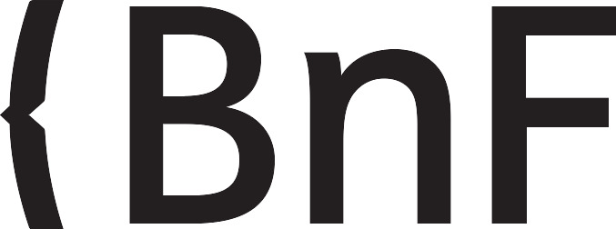
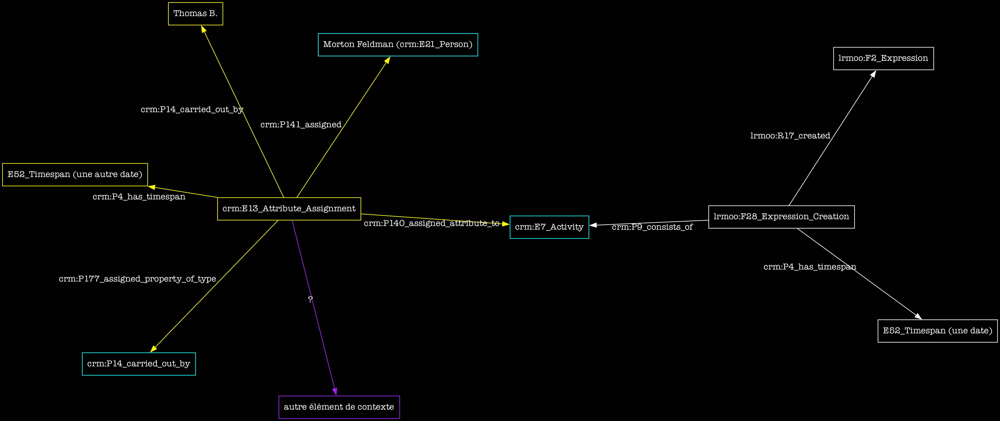
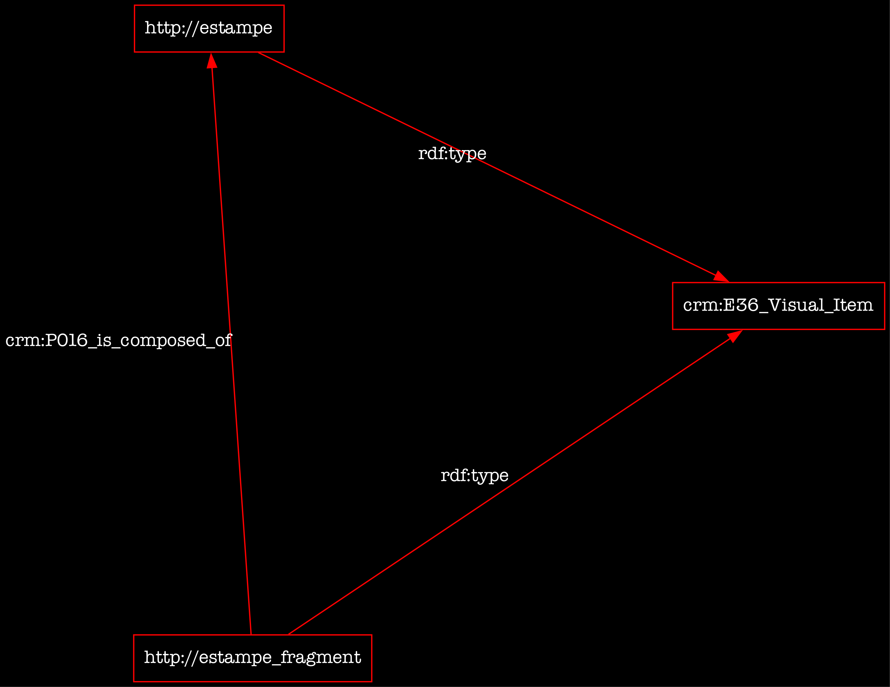
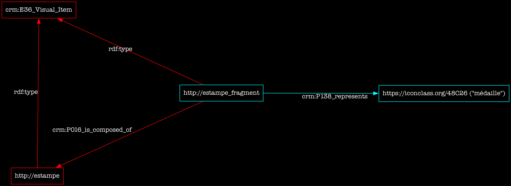
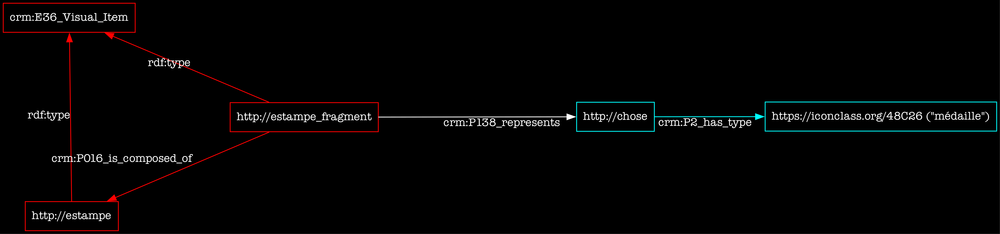
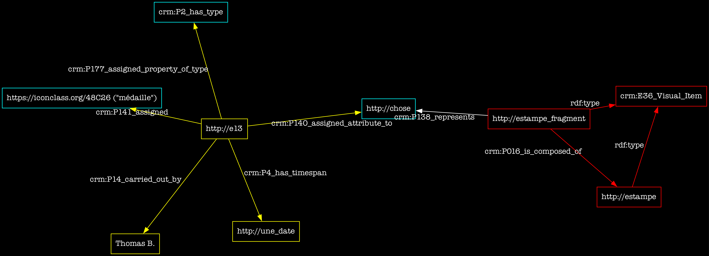

<!--📜-->
<!--∫ slide title -->

Consortium Musica2 
Rencontres de la musicologie numérique, 1ère édition, 16/12/2022

Le CIDOC–CRM pour capter l'activité critique sur les sources en musicologie

Thomas BOTTINI 
IReMus — Institut de Recherche en Musicologie, UMR 8223

<!--📜-->
<!--∫ slide c -->
# Plan

1. Contexte scientifique et milieu technique
2. Le CIDOC-CRM : dimension heuristique & questions

<!--📜-->
<!--∫ slide title -->
# 1. Contexte scientifique et milieu technique

<!--📜-->
<!--∫ slide -->
# Le projet SHERLOCK

- Émergence Sorbonne Université 2019-2022. Projet d'ingénierie-recherche.

<!--∫ slide -->
# Le projet SHERLOCK

- Émergence Sorbonne Université 2019-2022. Projet d'ingénierie-recherche.
- Objectif : développer un écosystème d'outils & méthodes facilitant la production de savoirs sur des sources reposant sur le CIDOC-CRM.

<!--∫ slide -->
# Le projet SHERLOCK

- Émergence Sorbonne Université 2019-2022. Projet d'ingénierie-recherche.
- Objectif : développer un écosystème d'outils & méthodes facilitant la production de savoirs sur des sources reposant sur le CIDOC-CRM.
- Aspects :
    - 📜 Modéliser la ‹structure de sources› textuelles, musicales et iconographiques ‹complexes› en vue de les rendre ‹adressables› sur le Web (cf. hier TONALITIES).
    - ⌨️ Mettre en œuvre des ‹outils de saisie ergonomiques› et écrire des scripts de conversion en données sémantiques (saisir nativement en CIDOC-CRM semble illusoire).
    - 🔬 Formaliser des patterns d'utilisation du CIDOC-CRM pour représenter l'activité critique sur des sources complexes : ‹modèle d'annotation & explicitation du contexte›.
    - 🏷️ Développer des outils Web pour ‹annoter collaborativement› les sources et publier les données.

<!--📜-->
<!--∫ slide -->
# Terrains présents & futurs à l'IReMus

- modality-tonality (analyse musicale, cf. hier)
- référentiel des personnes, toponymes, congrégations et institutions de l'Ancien Régime
- édition critique TEI du Mercure Galant
- analyse des estampes du Mercure Galant (histoire de l'art)
- base Euterpe d'iconographie musicale
- bibliothèque de partitions MEI avec contexte de production (cf. hier)
- catalogue de livrets de motets pour la Chapelle Royale (1666—1792)
- modélisation et mise en données des archives de la Péniche Opéra
- étudiant•e•s du conservatoire 1795-1914 (ANR HEMEF)
- …

<!--📜-->
<!--∫ slide -->
# Expliciter le contexte & articuler finement glose et sources

- Pour assurer l'avenir des données scientifiques produites à propos des sources (données décrivant les sources + données matérialisant les hypothèses interprétatives), il faut penser :

<!--∫ slide -->
# Expliciter le contexte & articuler finement glose et sources

- Pour assurer l'avenir des données scientifiques produites à propos des sources (données décrivant les sources + données matérialisant les hypothèses interprétatives), il faut penser :
    - 🎓 la ‹structuration des connaissances tirées des sources› & l'expression des ‹ajouts critiques› -> thésauri, ontologies (*« que dit-on ? que pense t-on ? »*)

<!--∫ slide -->
# Expliciter le contexte & articuler finement glose et sources

- Pour assurer l'avenir des données scientifiques produites à propos des sources (données décrivant les sources + données matérialisant les hypothèses interprétatives), il faut penser :
    - 🎓 la ‹structuration des connaissances tirées des sources› & l'expression des ‹ajouts critiques› -> thésauri, ontologies (*« que dit-on ? que pense t-on ? »*)
    - 📜 l'‹adressabilité interne des sources› (*« de quoi parle t'on ? »*)
        - image -> IIIF
        - musique notée -> MEI + MEI "sherlockisé"
        - texte -> TEI (? adressabilité des fragments sur le Web)
        - données transcrites, pas de matérialité de la source -> RDF

<!--∫ slide -->
# Expliciter le contexte & articuler finement glose et sources

- Pour assurer l'avenir des données scientifiques produites à propos des sources (données décrivant les sources + données matérialisant les hypothèses interprétatives), il faut penser :
    - 🎓 la ‹structuration des connaissances tirées des sources› & l'expression des ‹ajouts critiques› -> thésauri, ontologies (*« que dit-on ? que pense t-on ? »*)
    - 📜 l'‹adressabilité interne des sources› (*« de quoi parle t'on ? »*)
        - image -> IIIF
        - musique notée -> MEI + MEI "sherlockisé"
        - texte -> TEI (? adressabilité des fragments sur le Web)
        - données transcrites, pas de matérialité de la source -> RDF
    - 🔬 le ‹contexte interprétatif› : « situation analytique », corpus, critères interprétatifs, structure des projets collaboratifs… (*« qui ? quand ? comment ? pourquoi ? »*)

<!--📜-->
<!--∫ slide -->
# Le Web sémantique & la recherche

- 🌍 Injonction du LOD (Linked Open Data).

<!--∫ slide -->
# Le Web sémantique & la recherche

- 🌍 Injonction du LOD (Linked Open Data).
- 🕸️ Le Web sémantique (en une phrase) permet d'établir des assertions dont le sens des éléments (sujet, prédicat, objet) est partagé sur le Web [🏞️](https://ceres.huma-num.fr/iiif/3/mercure-galant-estampes--1689-03a_170/full/max/0/default.jpg).

<!--∫ slide -->
# Le Web sémantique & la recherche

- 🌍 Injonction du LOD (Linked Open Data).
- 🕸️ Le Web sémantique (en une phrase) permet d'établir des assertions dont le sens des éléments (sujet, prédicat, objet) est partagé sur le Web [🏞️](https://ceres.huma-num.fr/iiif/3/mercure-galant-estampes--1689-03a_170/full/max/0/default.jpg).

- ⚗️ Un triplet n'a pas la forme d'un énoncé scientifique car il n'exprime pas le contexte.

<!--∫ slide -->
# Le Web sémantique & la recherche

- 🌍 Injonction du LOD (Linked Open Data).
- 🕸️ Le Web sémantique (en une phrase) permet d'établir des assertions dont le sens des éléments (sujet, prédicat, objet) est partagé sur le Web [🏞️](https://ceres.huma-num.fr/iiif/3/mercure-galant-estampes--1689-03a_170/full/max/0/default.jpg).

- ⚗️ Un triplet n'a pas la forme d'un énoncé scientifique car il n'exprime pas le contexte.
- 😱 Un sens partagé à l'échelle mondiale ? Origines néopositivistes du Web sémantique à questionner (F. Rastier). Paradigme inadéquat aux sciences de l'interprétation.

<!--∫ slide -->
# Le Web sémantique & la recherche

- 🌍 Injonction du LOD (Linked Open Data).
- 🕸️ Le Web sémantique (en une phrase) permet d'établir des assertions dont le sens des éléments (sujet, prédicat, objet) est partagé sur le Web [🏞️](https://ceres.huma-num.fr/iiif/3/mercure-galant-estampes--1689-03a_170/full/max/0/default.jpg).

- ⚗️ Un triplet n'a pas la forme d'un énoncé scientifique car il n'exprime pas le contexte.
- 😱 Un sens partagé à l'échelle mondiale ? Origines néopositivistes du Web sémantique à questionner (F. Rastier). Paradigme inadéquat aux sciences de l'interprétation.
- Mais : *« Wo aber Gefahr ist, wächst Das Rettende auch. »*. Et donc, SHERLOCK.

<!--📜-->
<!--∫ slide title -->
# 2. Le CIDOC-CRM : dimension heuristique & questions

<!--📜-->
<!--∫ slide -->
# Penser le temps d'abord

- Rappel : le CIDOC-CRM fait extrêmement bien certaines choses : nommer, typer, structurer des actions sous forme d'événements inscrits dans le temps.

<!--∫ slide -->
# Penser le temps d'abord

- Rappel : le CIDOC-CRM fait extrêmement bien certaines choses : nommer, typer, structurer des actions sous forme d'événements inscrits dans le temps.
- Le CIDOC-CRM nous encourage à mettre le temps au centre de notre appréhension du monde. On ne pense pas d'abord les choses telles qu'elles sont, mais plutôt les processus qui les ont amenées à être ce qu'elles sont.

<!--∫ slide -->
# Penser le temps d'abord

- Rappel : le CIDOC-CRM fait extrêmement bien certaines choses : nommer, typer, structurer des actions sous forme d'événements inscrits dans le temps.
- Le CIDOC-CRM nous encourage à mettre le temps au centre de notre appréhension du monde. On ne pense pas d'abord les choses telles qu'elles sont, mais plutôt les processus qui les ont amenées à être ce qu'elles sont.
- Ceci nous donne davantage d'ancres (IRI) pour localiser finement les connaissances scientifiques.

<!--∫ slide -->
# Penser le temps d'abord

- Rappel : le CIDOC-CRM fait extrêmement bien certaines choses : nommer, typer, structurer des actions sous forme d'événements inscrits dans le temps.
- Le CIDOC-CRM nous encourage à mettre le temps au centre de notre appréhension du monde. On ne pense pas d'abord les choses telles qu'elles sont, mais plutôt les processus qui les ont amenées à être ce qu'elles sont.
- Ceci nous donne davantage d'ancres (IRI) pour localiser finement les connaissances scientifiques.
- Ainsi, on ne dit pas :

mais :

<!--📜-->
<!--∫ slide c -->

<!--∫ slide c -->

Tout peut recevoir une IRI et ainsi être référencé, commenté, annoté. Fonction heuristique du CIDOC-CRM.

<!--∫ slide c -->

Tout peut recevoir une IRI et ainsi être référencé, commenté, annoté. Fonction heuristique du CIDOC-CRM.

Oui mais s'il y a un doute ?

<!--📜-->
<!--∫ slide -->
# E13 Attribute Assignment 1/3

- Documenté sous l'entrée "knowledge creation process".
- Signer, dater chaque contribution.

<!--📜-->
<!--∫ slide -->
# E13 Attribute Assignment 2/3

Hypothèse d'attribution 

<!--📜-->
<!--∫ slide -->
# E13 Attribute Assignment 3/3
- Articuler chaque « événement de création de connaissance » dans un contexte (le cadre des événements CIDOC-CRM est accueillant).

<!--∫ slide -->
# E13 Attribute Assignment 3/3
- Articuler chaque « événement de création de connaissance » dans un contexte (le cadre des événements CIDOC-CRM est accueillant).
- Ce type de patterns rend le Web sémantique plus conforme à l'expression de savoirs scientifiques (situés).

<!--∫ slide -->
# E13 Attribute Assignment 3/3
- Articuler chaque « événement de création de connaissance » dans un contexte (le cadre des événements CIDOC-CRM est accueillant).
- Ce type de patterns rend le Web sémantique plus conforme à l'expression de savoirs scientifiques (situés).
- Mais :
    - Explosion du nombre de triplets.
    - Complexité des interfaces de restitution.

<!--📜-->
<!--∫ slide c -->
# Structurer la source

<!--📜-->
<!--∫ slide c -->
# Indexer avec un concept

<!--📜-->
<!--∫ slide c -->
# Identifier & typer la chose dénotée

<!--📜-->
<!--∫ slide c -->
# Identifier & typer la chose dénotée (E13)
