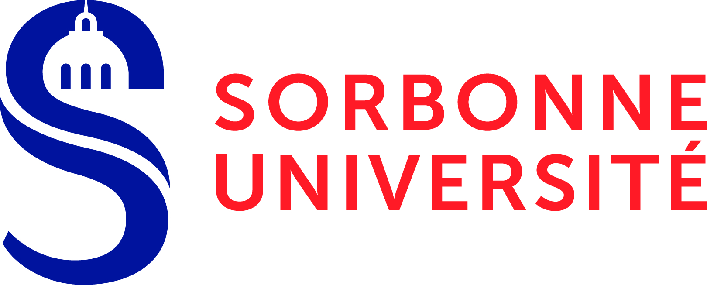
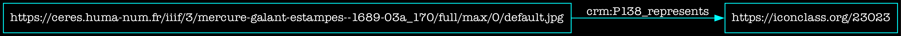

<!--📜-->
<!--∫ slide title -->

Consortium Musica2 
Rencontres de la musicologie numérique, 1ère édition, 16/12/2022

Le CIDOC–CRM pour capter l'activité critique sur les sources en musicologie

Thomas BOTTINI 
IReMus — Institut de Recherche en Musicologie, UMR 8223

<!--📜-->
<!--∫ slide -->
# Notes

<!--📜-->
<!--∫ slide c -->
# Plan

1. Contexte scientifique
2. Le CIDOC-CRM : apports & questions

<!--📜-->
<!--∫ slide title -->
# 1. Contexte scientifique

<!--📜-->
<!--∫ slide -->
# Le projet SHERLOCK

- Émergence Sorbonne Université 2019-2022. Projet d'ingénierie-recherche.

<!--∫ slide -->
# Le projet SHERLOCK

- Émergence Sorbonne Université 2019-2022. Projet d'ingénierie-recherche.
- Objectif : développer un écosystème d'outils facilitant la production de savoirs sur des sources reposant sur le CIDOC-CRM.

<!--∫ slide -->
# Le projet SHERLOCK

- Émergence Sorbonne Université 2019-2022. Projet d'ingénierie-recherche.
- Objectif : développer un écosystème d'outils facilitant la production de savoirs sur des sources reposant sur le CIDOC-CRM.
- Aspects :
    - Modéliser la structure de sources textuelles, musicales et iconographiques complexes en vue de les rendre adressables sur le Web (cf. hier TONALITIES).
    - Mettre en œuvre des outils de saisie de l'information ergonomiques et écrire des scripts de conversion en données sémantiques.
    - Formaliser des patterns d'utilisation du CIDOC-CRM pour représenter l'activité critique sur des sources complexes (, modèle d'annotation).
    - Développer des outils Web pour annoter collaborativement les sources et publier les données.

<!--∫ slide -->
# Le projet SHERLOCK

- Émergence Sorbonne Université 2019-2022. Projet d'ingénierie-recherche.
- Objectif : développer un écosystème d'outils facilitant la production de savoirs sur des sources reposant sur le CIDOC-CRM.
- Aspects :
    - Modéliser la structure de sources textuelles, musicales et iconographiques complexes en vue de les rendre adressables sur le Web (cf. hier TONALITIES).
    - Mettre en œuvre des outils de saisie de l'information ergonomiques et écrire des scripts de conversion en données sémantiques.
    - Formaliser des patterns d'utilisation du CIDOC-CRM pour représenter l'activité critique sur des sources complexes (, modèle d'annotation).
    - Développer des outils Web pour annoter collaborativement les sources et publier les données.
- *‹S›ocial sciences & ‹H›umanities corpora ‹E›xploration and active ‹R›eading with ‹L›inked, ‹O›pen & ‹C›ontributive ‹K›nowledge organisation systems*

<!--📜-->
<!--∫ slide -->
# Terrains présents & futurs à l'IReMus

- modality-tonality (analyse musicale, cf. hier)
- référentiel des personnes, toponymes, congrégations et institutions de l'Ancien Régime
- édition critique TEI du Mercure Galant
- analyse des estampes du Mercure Galant (histoire de l'art)
- base Euterpe d'iconographie musicale
- bibliothèque de partitions MEI avec contexte de production (cf. hier)
- catalogue de livrets de motets pour la Chapelle Royale (1666—1792)
- modélisation et mise en données des archives de la Péniche Opéra
- étudiant•e•s du conservatoire 1795-1914 (HEMEF)
- …

<!--📜-->
<!--∫ slide -->
# Le Web sémantique & la recherche

- Injonction du LOD (Linked Open Data).

<!--∫ slide -->
# Le Web sémantique & la recherche

- Injonction du LOD (Linked Open Data).
- 🌍 Le Web sémantique (en une phrase) permet d'établir des assertions dont le sens des éléments (sujet, prédicat, objet) est partagé sur le Web [🏞️](https://ceres.huma-num.fr/iiif/3/mercure-galant-estampes--1689-03a_170/full/max/0/default.jpg).

<!--∫ slide -->
# Le Web sémantique & la recherche

- Injonction du LOD (Linked Open Data).
- 🌍 Le Web sémantique (en une phrase) permet d'établir des assertions dont le sens des éléments (sujet, prédicat, objet) est partagé sur le Web [🏞️](https://ceres.huma-num.fr/iiif/3/mercure-galant-estampes--1689-03a_170/full/max/0/default.jpg).

- ⚗️ Un triplet n'a pas la forme d'un énoncé scientifique car il n'exprime pas le contexte.

<!--∫ slide -->
# Le Web sémantique & la recherche

- Injonction du LOD (Linked Open Data).
- 🌍 Le Web sémantique (en une phrase) permet d'établir des assertions dont le sens des éléments (sujet, prédicat, objet) est partagé sur le Web [🏞️](https://ceres.huma-num.fr/iiif/3/mercure-galant-estampes--1689-03a_170/full/max/0/default.jpg).

- ⚗️ Un triplet n'a pas la forme d'un énoncé scientifique car il n'exprime pas le contexte.
- 😱 Un sens partagé à l'échelle mondiale ? Origines néopositivistes du Web sémantique à questionner (F. Rastier). Paradigme inadéquat aux sciences de l'interprétation.

<!--∫ slide -->
# Le Web sémantique & la recherche

- Injonction du LOD (Linked Open Data).
- 🌍 Le Web sémantique (en une phrase) permet d'établir des assertions dont le sens des éléments (sujet, prédicat, objet) est partagé sur le Web [🏞️](https://ceres.huma-num.fr/iiif/3/mercure-galant-estampes--1689-03a_170/full/max/0/default.jpg).

- ⚗️ Un triplet n'a pas la forme d'un énoncé scientifique car il n'exprime pas le contexte.
- 😱 Un sens partagé à l'échelle mondiale ? Origines néopositivistes du Web sémantique à questionner (F. Rastier). Paradigme inadéquat aux sciences de l'interprétation.
- Mais : *« Wo aber Gefahr ist, wächst Das Rettende auch. »*. Et donc, SHERLOCK.

<!--📜-->
<!--∫ slide title -->
# 2. Le CIDOC-CRM : apports & questions

- Le CRM fait extrêmement bien certaines choses : nommer, typer, dater.
- Il nous encourage à penser en temps d'abord, ce qui nous donne davantage d'ancres (IRI) pour associer. Ainsi, on ne dit pas :

mais :

<!--📜-->
<!--∫ slide c -->

<!--📜-->
<!--∫ slide -->
# 

<!--
Marottes :
- adressabilité des sources
- de quoi on parle
- comment on en parle
-->
