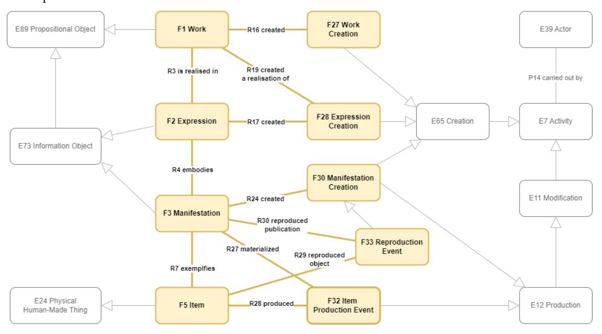

<!--∫ slide title -->

Outils numériques pour la musicologie, 6 mars 2023

Des sources aux connaissances formalisées :
  
thésaurii & ontologies



Nathalie Berton–Blivet ‹› Thomas Bottini

`nathalie.berton-blivet@cnrs.fr | thomas.bottini@cnrs.fr`

*‹I›nstitut de ‹Re›cherche en ‹Mus›icologie*

*IReMus, UMR 8223 CNRS — Sorbonne Université*

<!--∫ slide c -->

# Thésaurii

<!--∫ slide -->

# Qu'est ce que c'est ? À quoi ça sert ?

- [Sur Wikipedia](https://fr.wikipedia.org/wiki/Th%C3%A9saurus_documentaire)

<!--∫ slide -->

# Exemples célèbres de thésaurii

- [UNESCO](https://vocabularies.unesco.org/browser/thesaurus/fr/groups)
- [Iconclass](https://iconclass.org/fr/_) (histoire de l'art
- [Getty AAT](http://www.getty.edu/vow/AATServlet?english=N&find=music+notation&logic=AND&page=1&note=) (patrimoine, en général)
- [MIMO/Hornbostel Sachs](https://vocabulary.mimo-international.com/HornbostelAndSachs/en/)
- [MIMO/Thésaurus des noms d'instruments de musique](https://vocabulary.mimo-international.com/InstrumentsKeywords/fr/)

<!--∫ slide -->

# Exemples à l'IReMus

- Base d'iconographie musicale Euterpe.
•••
- Indexation des estamps du Mercure Galant.
•••
- Tout projet de recherche en musicologie qui a une existence sur le Web génère un ou plusieurs thésaurii.
•••
- Exemple improvisé ?

<!--∫ slide -->

# Le stantard SKOS

- [W3C SKOS Primer](https://www.w3.org/TR/skos-primer/) [fr](http://www.sparna.fr/skos/SKOS-traduction-francais.html)
- Il existe plusieurs outils pour constituer & partager des thésaurii SKOS, dont le très bon [OpenTheso](https://opentheso.huma-num.fr/opentheso/index.xhtml).

<!--∫ slide c -->

# Ontologies

<!--∫ slide -->

# Qu'est ce que c'est ? À quoi ça sert ?

- Ensemble de classes et de propriétés décrivant les choses telles qu'elles sont et les relations qu'elles entretiennent.
- Les thésaurii, quant à eux, organisent les manières de nommer les choses.

<!--∫ slide -->

# Le CIDOC-CRM

- [Diagramme de classes](https://cidoc-crm.org/sites/default/files/Slide1.JPG)
- [Classes & propriétés en HTML](https://cidoc-crm.org/html/cidoc_crm_v7.1.2.html)
- [Documentation PDF](https://www.cidoc-crm.org/sites/default/files/cidoc_crm_version_7.2.2%5B23%20Nov%5D%5BTRACK%20CHANGES%5D.pdf)

<!--∫ slide -->

# LRMoo, une application du CRM

<!--∫ slide -->

# DOREMUS, une application du CRM

- [https://data.doremus.org/ontology/](https://data.doremus.org/ontology/)
- [Musical composition](https://data.doremus.org/ontology/img/model.composition.png)
- [Concert programming](https://data.doremus.org/ontology/img/model.concert.png)
- [Music score publication](https://data.doremus.org/ontology/img/model.score.png)

<!--∫ slide -->

# Applications du CIDOC-CRM à l'IReMus