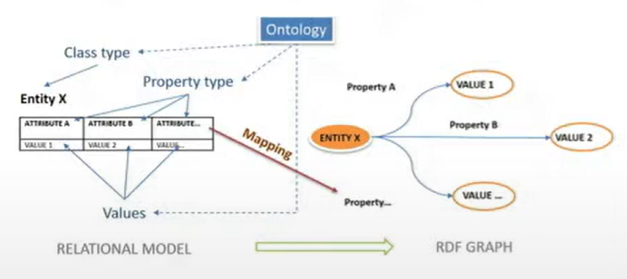
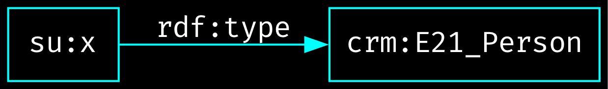
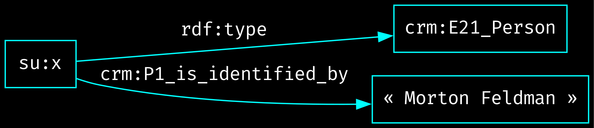
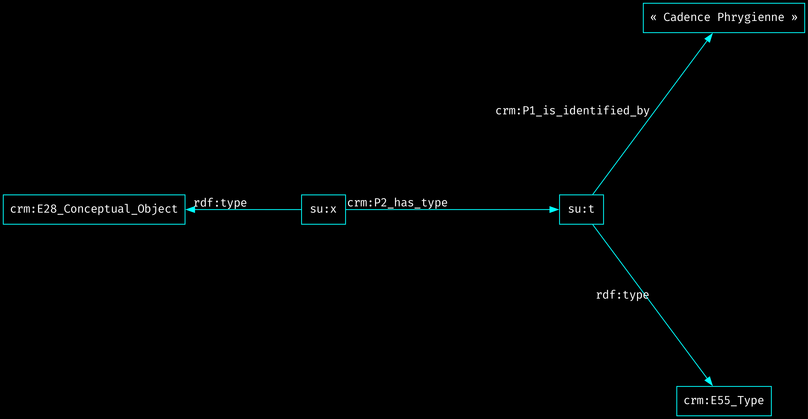
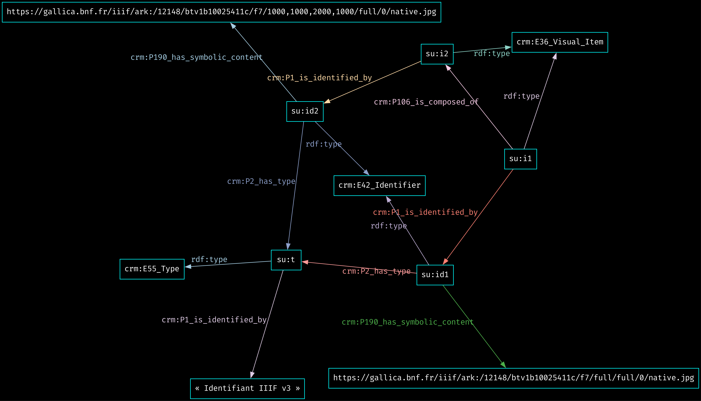
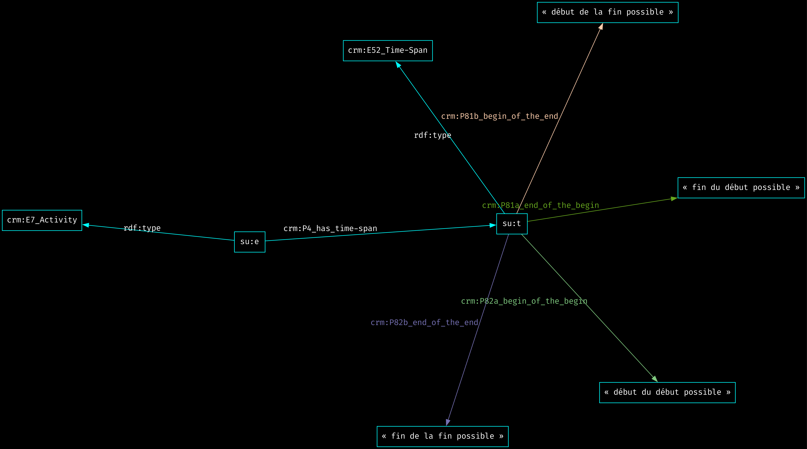
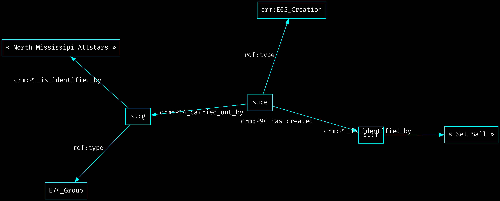
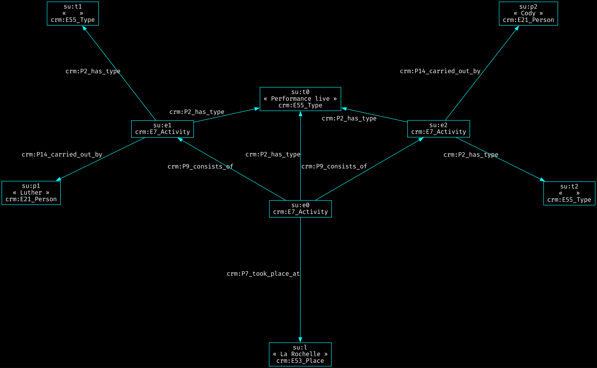
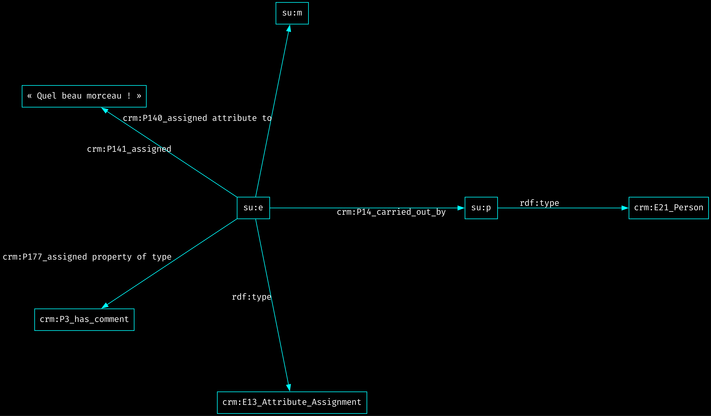

<style>
body { font-family: GoudyNoto; font-weight: 300; }
h1 { letter-spacing: 0.1em; font-family: "FuturaPT" !important; font-weight: 200; text-transform: uppercase; }
code { color: #16e7cf; }
.dim { color: #aaa; }
.center { text-align: center; }
.spring { display: flex; flex-direction: column; justify-content: space-between; padding-bottom: 3cm; }
</style>

<!--📜-->
<!--∫ slide title -->

<div class="dim">
Formations autour de la diffusion de la recherche et de la science ouverte
<br/>
Les humanités numériques en pratique
<br/>
23 mars 2023
</div>

<div style="
    border-bottom: 1px solid white;
    border-top: 1px solid white;
    font-family: FuturaPT;
    font-size: 111%;
    letter-spacing: 0.1em;
    padding: 0.5cm 0;
    text-transform: uppercase;
">
Modéliser les connaissances en SHS :
<br/>
pourquoi, comment, jusqu'où ?
<br/>
<br/>
<em style="color: gray; text-transform: lowercase;">… avec l'ontologie CIDOC-CRM !</em>
</div>

<div>

Thomas Bottini

`thomas.bottini@cnrs.fr`

*‹I›nstitut de ‹Re›cherche en ‹Mus›icologie — IReMus, UMR 8223 CNRS*

</div>

<!--📜-->
<!--∫ slide -->

# Plan

<dl>
<dt>✏️</dt>
<dd>La figure du modélisateur/de la modélisatrice dans un projet de SHS « FAIR »</dd>
<dt>🌐</dt>
<dd>Quelques mots sur le Web sémantique comme milieu technique adapté à l'expression et à la diffusion des données de la recherche</dd>
<dt>📚</dt>
<dd>Les fondements de l'ontologie CIDOC-CRM</dd>
<dt>🖼️</dt>
<dd>Cas concrets récurrents</dd>
</dl>

<!--📜-->
<!--∫ slide title -->

# De l'activité de recherche à la donnée

*Comment « l'ingénierie des données » intervient-elle aux différentes étapes d'un projet de recherche en SHS ?*

*Comment bien faire du FAIR ?*

<!--📜-->
<!--∫ slide -->

# Analyser

- Les chercheurs et chercheuses en situation de production de connaissances ont des degrés de réflexivité différents sur leurs pratiques de génération de données informatiques structurées. Le premier rôle de l'ingénieur est d'ordre maïeutique.
- Il faut poser des questions (entretiens d'explicitation), confronter le chercheur ou la chercheuse à des cas limites pour l'amener à mieux comprendre ses objets d'étude, et parfois même ses manières de les questionner.
- L'ingénieur aide donc à révéler la structure interne des sources et des phénomènes : une dimension heuristique s'ajoute.


<!--∫ slide -->

# Analyser

- Les chercheurs et chercheuses en situation de production de connaissances ont des degrés de réflexivité différents sur leurs pratiques de génération de données informatiques structurées. Le premier rôle de l'ingénieur est d'ordre maïeutique.
- Il faut poser des questions (entretiens d'explicitation), confronter le chercheur ou la chercheuse à des cas limites pour l'amener à mieux comprendre ses objets d'étude, et parfois même ses manières de les questionner.
- L'ingénieur aide donc à révéler la structure interne des sources et des phénomènes : une dimension heuristique s'ajoute.
- En SHS, ces connaissances peuvent résulter d'une activité descriptive (sources) ou interprétative (choses dites à propos des sources).
- Il faut analyser à la fois les objets et les produits de l'activité analytique (quoi ?), ainsi que la situation de celle-ci, son contexte, socio-technico-épistémologique (qui ? comment ? pourquoi ?).

<!--📜-->
<!--∫ slide -->

# Modéliser

- Quoi ?
    - Les connaissances nouvelles s'incarnant dans des « données scientifiques ».
    - Les sources auxquelles elles se rapportent.
    - Les faits sociaux, conceptuels, matériels & sémiotiques dénotés ou connotés par les sources et/ou observables sur le terrain.
    - Le contexte de production des connaissances (qu'est ce qui fait qu'une donnée est « scientifique » ?).


<!--∫ slide -->

# Modéliser

- Quoi ?
    - Les connaissances nouvelles s'incarnant dans des « données scientifiques ».
    - Les sources auxquelles elles se rapportent.
    - Les faits sociaux, conceptuels, matériels & sémiotiques dénotés ou connotés par les sources et/ou observables sur le terrain.
    - Le contexte de production des connaissances (qu'est ce qui fait qu'une donnée est « scientifique » ?).
- Dès lors, avoir un modèle conceptuel de type ontologique en tête en amont de la phase d'analyse, permet d'organiser l'écoute et l'analyse des pratiques de production de connaissances.


<!--∫ slide -->

# Modéliser

- Quoi ?
    - Les connaissances nouvelles s'incarnant dans des « données scientifiques ».
    - Les sources auxquelles elles se rapportent.
    - Les faits sociaux, conceptuels, matériels & sémiotiques dénotés ou connotés par les sources et/ou observables sur le terrain.
    - Le contexte de production des connaissances (qu'est ce qui fait qu'une donnée est « scientifique » ?).
- Dès lors, avoir un modèle conceptuel de type ontologique en tête en amont de la phase d'analyse, permet d'organiser l'écoute et l'analyse des pratiques de production de connaissances.
- Modéliser st une situation de travail typique des HN dans laquelle la technique n'a pas un rôle ancillaire (cf. *supra* fonction heuristique/épistémologique).

<!--📜-->
<!--∫ slide -->

# Générer, gérer & diffuser

Les challenges techniques sont de taille :

- L'idéal est de mettre en place des interfaces de saisie ergonomiques...
- ...mais c'est là où « le bât blesse » : les ontologies sont souples, riches, expressives (ce sont des graphes), mais pas instrumentées pour les humains (formulaires...) par rapport aux données relationnelles SQL, de nature plus « tabulaire ».


<!--∫ slide -->

# Générer, gérer & diffuser

Les challenges techniques sont de taille :

- L'idéal est de mettre en place des interfaces de saisie ergonomiques...
- ...mais c'est là où « le bât blesse » : les ontologies sont souples, riches, expressives (ce sont des graphes), mais pas instrumentées pour les humains (formulaires...) par rapport aux données relationnelles SQL, de nature plus « tabulaire ».
- Reprendre les données existantes, les rendre conformes à l'ontologie retenue.


<!--∫ slide -->

# Générer, gérer & diffuser

Les challenges techniques sont de taille :

- L'idéal est de mettre en place des interfaces de saisie ergonomiques...
- ...mais c'est là où « le bât blesse » : les ontologies sont souples, riches, expressives (ce sont des graphes), mais pas instrumentées pour les humains (formulaires...) par rapport aux données relationnelles SQL, de nature plus « tabulaire ».
- Reprendre les données existantes, les rendre conformes à l'ontologie retenue.
- Créer un accès pour les machines (API, SPARQL endpoint).


<!--∫ slide -->

# Générer, gérer & diffuser

Les challenges techniques sont de taille :

- L'idéal est de mettre en place des interfaces de saisie ergonomiques...
- ...mais c'est là où « le bât blesse » : les ontologies sont souples, riches, expressives (ce sont des graphes), mais pas instrumentées pour les humains (formulaires...) par rapport aux données relationnelles SQL, de nature plus « tabulaire ».
- Reprendre les données existantes, les rendre conformes à l'ontologie retenue.
- Créer un accès pour les machines (API, SPARQL endpoint).
- Créer des interfaces de consultation pour les humains (sites Web).

<!--📜-->
<!--∫ slide title -->

# Vocabulaire de base

<!--📜-->
<!--∫ slide -->

# Le Web sémantique, en une slide

- Promesse d'une base de données à l'échelle du Web. Le Web initial (Tim Berners Lee, 1991) était un Web de documents liés (hypertexte), le Web sémantique est une Web de données liées.


<!--∫ slide -->

# Le Web sémantique, en une slide

- Promesse d'une base de données à l'échelle du Web. Le Web initial (Tim Berners Lee, 1991) était un Web de documents liés (hypertexte), le Web sémantique est une Web de données liées.
- Chaque donnée est identifiée par une URL.


<!--∫ slide -->

# Le Web sémantique, en une slide

- Promesse d'une base de données à l'échelle du Web. Le Web initial (Tim Berners Lee, 1991) était un Web de documents liés (hypertexte), le Web sémantique est une Web de données liées.
- Chaque donnée est identifiée par une URL.
- Toute information s'exprime sous la forme d'un triplet (sujet/prédicat/objet) dans un langage de description, le RDF.


<!--∫ slide -->

# Le Web sémantique, en une slide

- Promesse d'une base de données à l'échelle du Web. Le Web initial (Tim Berners Lee, 1991) était un Web de documents liés (hypertexte), le Web sémantique est une Web de données liées.
- Chaque donnée est identifiée par une URL.
- Toute information s'exprime sous la forme d'un triplet (sujet/prédicat/objet) dans un langage de description, le RDF.
- La connexion de ces triplets RDF forme un graphe.


<!--∫ slide -->

# Le Web sémantique, en une slide

- Promesse d'une base de données à l'échelle du Web. Le Web initial (Tim Berners Lee, 1991) était un Web de documents liés (hypertexte), le Web sémantique est une Web de données liées.
- Chaque donnée est identifiée par une URL.
- Toute information s'exprime sous la forme d'un triplet (sujet/prédicat/objet) dans un langage de description, le RDF.
- La connexion de ces triplets RDF forme un graphe.
- Chaque prédicat est également identifié par une URL.


<!--∫ slide -->

# Le Web sémantique, en une slide

- Promesse d'une base de données à l'échelle du Web. Le Web initial (Tim Berners Lee, 1991) était un Web de documents liés (hypertexte), le Web sémantique est une Web de données liées.
- Chaque donnée est identifiée par une URL.
- Toute information s'exprime sous la forme d'un triplet (sujet/prédicat/objet) dans un langage de description, le RDF.
- La connexion de ces triplets RDF forme un graphe.
- Chaque prédicat est également identifié par une URL.
- Le milieu technique idéal pour des données FAIR.

<!--📜-->
<!--∫ slide center -->

# Données relationnelles vs graphe RDF



*Corago in LOD - Seminar by Angelo Pompilio and Paolo Bonora, Digital Humanities and Digital Knowledge, Università di Bologna, 2017.*

<!--📜-->
<!--∫ slide -->

# Qu'est ce qu'une ontologie ?

- Formalisation d'un modèle conceptuel pour un domaine identifié proposant des :
    - ‹Classes :› types d'entités peuplant dans le domaine, possiblement organisées selon des relations d'héritage. On appelle ‹individu› une ressource qui est du type d'une classe.
    - ‹Propriétés :› aspects, caractéristiques, attributs possibles de ces classes, qui peuvent soit pointer vers une valeur, soit vers un individu.
- Utiliser les classes et les propriétés d'une ontologie confère ainsi une sémantique partagée aux données RDF (les propriétés des classes seront des prédicats).
- Vous connaissez peut-être déjà une ontologie : SKOS.

<!--📜-->
<!--∫ slide title -->

# Le CIDOC-CRM

<!--📜-->
<!--∫ slide -->

# Le CIDOC-CRM en bref

- Le CIDOC-CRM est une ontologie qui documente le patrimoine matériel et immatériel ainsi que les processus de production de connaissances à son propos.
- [https://www.cidoc-crm.org/](https://www.cidoc-crm.org/)
- Venant du monde des musées, elle est désormais utilisée dans tous les domaines des HN.
- Elle est extrêmement abstraite et générique.
- Ontologie centrée événement (nous y reviendrons dans les exemples...)
- Classes et propriétés : [https://cidoc-crm.org/html/cidoc_crm_v7.1.2.html](https://cidoc-crm.org/html/cidoc_crm_v7.1.2.html)

<!--📜-->
<!--∫ slide center -->

# Hiérarchie des classes


<!--📜-->
<!--∫ slide center -->

# Le temps dans le CRM


<!--📜-->
<!--∫ slide title -->

# Cas concrets récurrents

<!--📜-->
<!--∫ slide -->

# Conventions

Dans les exemples, on utilisera les préfixes suivants pour les URL :

```
PREFIX crm: <http://www.cidoc-crm.org/cidoc-crm/>
PREFIX rdf: <http://www.w3.org/1999/02/22-rdf-syntax-ns#>
PREFIX su:  <http://www.sorbonne-universite.fr/id/>
```

Ainsi, l'URL :

```
http://www.sorbonne-universite.fr/id/tralala
```

sera notée :

```
su:tralala
```

... ce qui évitera d'avoir des exemples illisibles, mais il ne faudra pas perdre de vue que toute ressource (en incluant les classes et les propriétés du CRM) est identifiée par une URI sur le Web.

<!--📜-->
<!--∫ slide spring -->

- ‹Typer une personne :›


<hr/>
- ‹Nommer une personne avec une simple chaîne de caractère :›



<!--📜-->
<!--∫ slide -->

- ‹Nommer une personne avec une entité appellation :›


<!--📜-->
<!--∫ slide -->

- ‹Typer quelque chose :›




<!--∫ slide -->

- ‹Typer quelque chose :›


<div style="position: absolute ; bottom: 1cm; left: 1cm; z-index: 999; width: 18cm;">
- `rdf:type` : pour donner à votre entité un type technique au sein de l'ontologie CRM.
- `crm:P2_has_type` : pour donner à votre entité un type métier (défini par vous et en rapport avec les catégories convoquées par l'activité de recherche).
</div>

<!--📜-->
<!--∫ slide -->

- ‹Typer un identifiant :›


<!--📜-->
<!--∫ slide -->

- ‹Organisation interne d'un contenu (ici, d'une image) :›



<!--📜-->
<!--∫ slide -->

- ‹Dater un événement :›


On retrouve la possibilité de définir des incertitudes aux bornes.

<!--📜-->
<!--∫ slide -->

- ‹Exprimer un événement de création simple :›



<!--📜-->
<!--∫ slide -->

- ‹Exprimer un événement de création complexe :›




<!--∫ slide -->

- ‹Exprimer un événement de création complexe :›


<div style="position: absolute; top: 4cm; right: 1cm; width: 9cm; z-index: 666;">
Remarquez la finesse de l'adressage...<br/>Chaque élément constituant le phénomène a son URL et son identité.
</div>

<!--📜-->
<!--∫ slide -->

- ‹Exprimer une annotation :›

