<style>
body { font-family: GoudyNoto; font-weight: 300; }
h1 { letter-spacing: 0.1em; font-family: "FuturaPT" !important; font-weight: 200; text-transform: uppercase; }
h2 { color: #FF03CE; letter-spacing: 0.075em; font-weight: 180; text-transform: uppercase; }
code { color: #16e7cf; }
.dim { color: #aaa; }
.center { text-align: center; }
.spring { display: flex; flex-direction: column; justify-content: space-between; padding-bottom: 3cm; }
</style>

<!--📜-->
<!--∫ slide title -->

<div class="dim">
Consortium MUSICA2
<br/>
GT2 — Ontologies, thésauri & catalogage
<br/>
4 juillet 2023, CESR, Université de Tours
</div>

<div style="
    border-bottom: 1px solid white;
    border-top: 1px solid white;
    font-family: FuturaPT;
    font-size: 111%;
    letter-spacing: 0.1em;
    padding: 0.5cm 0;
    text-transform: uppercase;
">
Objectifs du GT2
<br/>
&
<br/>
Introduction à l'ontologie CIDOC-CRM
</div>

<div>

<div style="font-size: 69%;">
```{ thomas.bottini • augustin.braud • achille.davy-rigaux • marco.gurrieri } @cnrs.fr```
</div>
<br/>
*‹I›nstitut de ‹Re›cherche en ‹Mus›icologie — IReMus, UMR 8223 CNRS*

</div>

<pre style="color: #16e7cf; font-size: 50% !important;">
https://github.com/Amleth/consortium-musica2-gt2-ontologies/
</pre>

<!--📜-->
<!--∫ slide -->

# Plan

I) Énonciation des objectifs du GT2
    - Problèmes identifiés
    - Réponses visées
II) Généralités sur le Web sémantique
III) Introduction à l'ontologie CIDOC-CRM
IV) Cas concrets récurrents
V) Deux mots sur LRMoo et Doremus
VI) Une étude de cas : modélisation des partitions encodées

<!--📜-->
<!--∫ slide title -->

# I. Énonciation des objectifs du GT2

## Problèmes identifiés

<!--📜-->
<!--∫ slide -->

## FAIR, recherche & ingénierie

- L'époque est au [FAIR](https://www.go-fair.org/fair-principles/) et au [LOD](https://fr.wikipedia.org/wiki/Linked_open_data). Afin que l'‹ouverture des données de la recherche›, leur ‹interopérabilité› et leur ‹mise en relation avec des sources de données tierces› soient correctement traitées, il faut que ces questions soient pensées très en ‹amont des projets de recherche›, et finement ‹articulées aux questions méthodologiques›, voire scientifique.


<!--∫ slide -->

## FAIR, recherche & ingénierie

- L'époque est au [FAIR](https://www.go-fair.org/fair-principles/) et au [LOD](https://fr.wikipedia.org/wiki/Linked_open_data). Afin que l'‹ouverture des données de la recherche›, leur ‹interopérabilité› et leur ‹mise en relation avec des sources de données tierces› soient correctement traitées, il faut que ces questions soient pensées très en ‹amont des projets de recherche›, et finement ‹articulées aux questions méthodologiques›, voire scientifique.
- Il faut alors des ingénieurs et ingénieures qui « pensent » les données conjointement avec les chercheurs et chercheuses, dans des situations de travail où la technique ne joue pas un rôle ancillaire :
    - Ces ingénieurs et ingénieures doivent jouer un rôle ‹maïeutique› (savoir poser les questions, confronter le chercheur ou la chercheuse à des cas limites pour l'amener à mieux comprendre ses objets d'étude).
    - Le travail d'explicitation, de modélisation, des données doit avoir une fonction ‹heuristique› : aider à révéler la structure interne des sources et des phénomènes étudiés.


<!--∫ slide -->

## FAIR, recherche & ingénierie

- L'époque est au [FAIR](https://www.go-fair.org/fair-principles/) et au [LOD](https://fr.wikipedia.org/wiki/Linked_open_data). Afin que l'‹ouverture des données de la recherche›, leur ‹interopérabilité› et leur ‹mise en relation avec des sources de données tierces› soient correctement traitées, il faut que ces questions soient pensées très en ‹amont des projets de recherche›, et finement ‹articulées aux questions méthodologiques›, voire scientifique.
- Il faut alors des ingénieurs et ingénieures qui « pensent » les données conjointement avec les chercheurs et chercheuses, dans des situations de travail où la technique ne joue pas un rôle ancillaire :
    - Ces ingénieurs et ingénieures doivent jouer un rôle ‹maïeutique› (savoir poser les questions, confronter le chercheur ou la chercheuse à des cas limites pour l'amener à mieux comprendre ses objets d'étude).
    - Le travail d'explicitation, de modélisation, des données doit avoir une fonction ‹heuristique› : aider à révéler la structure interne des sources et des phénomènes étudiés.
- 🚨 Les ressources d'ingénierie sont trop maigres, ce niveau dialogue est rare.

<!--📜-->
<!--∫ slide -->

## Capitalisation des connaissances techno-méthodologiques

- La FAIRisation des données musicologiques suppose une ‹dynamique informationnelle intellectuelle et technique entre les projets de BDD›.


<!--∫ slide -->

## Capitalisation des connaissances techno-méthodologiques

- La FAIRisation des données musicologiques suppose une ‹dynamique informationnelle intellectuelle et technique entre les projets de BDD›.
- Pour la bâtir, un réseau d'acteurs et d'actrices est nécessaire, mais :
    - Il faut une complémentarité recherche/ingénierie/SIB car ces ‹connaissances sont très abstraites› et difficiles à saisir.


<!--∫ slide -->

## Capitalisation des connaissances techno-méthodologiques

- La FAIRisation des données musicologiques suppose une ‹dynamique informationnelle intellectuelle et technique entre les projets de BDD›.
- Pour la bâtir, un réseau d'acteurs et d'actrices est nécessaire, mais :
    - Il faut une complémentarité recherche/ingénierie/SIB car ces ‹connaissances sont très abstraites› et difficiles à saisir.
    - Les musicologues devant piloter de tels projet manquent d'informations claires sur les ‹enjeux scientifiques des méthodes et technologies disponibles› pour correctement modéliser les informations scientifiques. Ceci peut conduire à des choix techniques inadaptés qui obèrent les possibilités scientifiques.


<!--∫ slide -->

## Capitalisation des connaissances techno-méthodologiques

- La FAIRisation des données musicologiques suppose une ‹dynamique informationnelle intellectuelle et technique entre les projets de BDD›.
- Pour la bâtir, un réseau d'acteurs et d'actrices est nécessaire, mais :
    - Il faut une complémentarité recherche/ingénierie/SIB car ces ‹connaissances sont très abstraites› et difficiles à saisir.
    - Les musicologues devant piloter de tels projet manquent d'informations claires sur les ‹enjeux scientifiques des méthodes et technologies disponibles› pour correctement modéliser les informations scientifiques. Ceci peut conduire à des choix techniques inadaptés qui obèrent les possibilités scientifiques.
    - Les profils techniques sont recrutés sur des contrats courts.


<!--∫ slide -->

## Capitalisation des connaissances techno-méthodologiques

- La FAIRisation des données musicologiques suppose une ‹dynamique informationnelle intellectuelle et technique entre les projets de BDD›.
- Pour la bâtir, un réseau d'acteurs et d'actrices est nécessaire, mais :
    - Il faut une complémentarité recherche/ingénierie/SIB car ces ‹connaissances sont très abstraites› et difficiles à saisir.
    - Les musicologues devant piloter de tels projet manquent d'informations claires sur les ‹enjeux scientifiques des méthodes et technologies disponibles› pour correctement modéliser les informations scientifiques. Ceci peut conduire à des choix techniques inadaptés qui obèrent les possibilités scientifiques.
    - Les profils techniques sont recrutés sur des contrats courts.
    - Les prestataires n'ont pas d'intérêt à s'inscrire dans les réseaux HN.


<!--∫ slide -->

## Capitalisation des connaissances techno-méthodologiques

- La FAIRisation des données musicologiques suppose une ‹dynamique informationnelle intellectuelle et technique entre les projets de BDD›.
- Pour la bâtir, un réseau d'acteurs et d'actrices est nécessaire, mais :
    - Il faut une complémentarité recherche/ingénierie/SIB car ces ‹connaissances sont très abstraites› et difficiles à saisir.
    - Les musicologues devant piloter de tels projet manquent d'informations claires sur les ‹enjeux scientifiques des méthodes et technologies disponibles› pour correctement modéliser les informations scientifiques. Ceci peut conduire à des choix techniques inadaptés qui obèrent les possibilités scientifiques.
    - Les profils techniques sont recrutés sur des contrats courts.
    - Les prestataires n'ont pas d'intérêt à s'inscrire dans les réseaux HN.
- 🚨 Conséquemment, les ‹connaissances d'ingénierie spécifiques à la modélisation des données de la discipline sont peu capitalisées› ; chaque nouveau développement peine à bénéficier de l'expérience méthodologique et conceptuelle acquise informellement au fil des projets passés.

<!--📜-->
<!--∫ slide -->

## Technicité du Web sémantique & des ontologies

- Les questions techniques soulevées par le FAIRisation des données de la recherche sont non-triviales, les profils techniques compétents sont rares, et notre attractivité est parfois faible :


<!--∫ slide -->

## Technicité du Web sémantique & des ontologies

- Les questions techniques soulevées par le FAIRisation des données de la recherche sont non-triviales, les profils techniques compétents sont rares, et notre attractivité est parfois faible :
    - 🚨 Les ontologies ‹standards› dans les mondes de la recherche, des bibliothèques et des musées (CIDOC-CRM, LRMoo : nous allons y revenir) sont ‹expressives› (elles aident à ne pas réduire ni trahir les productions analytiques des chercheurs et des chercheuses) et sont maintenues par des communautés fortes, mais ‹complexes à comprendre et mettre en œuvre›, et manquent d'exemples concrets qui permettraient aux musicologues de mieux saisir leur intérêt.


<!--∫ slide -->

## Technicité du Web sémantique & des ontologies

- Les questions techniques soulevées par le FAIRisation des données de la recherche sont non-triviales, les profils techniques compétents sont rares, et notre attractivité est parfois faible :
    - 🚨 Les ontologies ‹standards› dans les mondes de la recherche, des bibliothèques et des musées (CIDOC-CRM, LRMoo : nous allons y revenir) sont ‹expressives› (elles aident à ne pas réduire ni trahir les productions analytiques des chercheurs et des chercheuses) et sont maintenues par des communautés fortes, mais ‹complexes à comprendre et mettre en œuvre›, et manquent d'exemples concrets qui permettraient aux musicologues de mieux saisir leur intérêt.
    - 🚨 Le Web sémantique semble être ‹le meilleur milieu technique pour représenter des données scientifiques› (nous allons y revenir), mais il est difficile de construire des outils de saisie ergonomiques et génériques s'appuyant sur RDF et sur les ontologies citées infra.

<!--📜-->
<!--∫ slide title -->

# I. Énonciation des objectifs du GT2

## Réponses visées

<!--📜-->
<!--∫ slide -->

## Identifier et caractériser des situations de modélisation

- Il existe des ‹situations récurrentes de modélisation›, se présentant quels que soient les objets de recherche et quelles que soient les périodes étudiées.


<!--∫ slide -->

## Identifier et caractériser des situations de modélisation

- Il existe des ‹situations récurrentes de modélisation›, se présentant quels que soient les objets de recherche et quelles que soient les périodes étudiées.
- Dans le GT2, nous ambitionnons d'‹identifier› ces situations, de les ‹décrire›, et de les ‹formaliser› sous la forme de ‹fragments de graphes CIDOC-CRM›, afin d'aider les concepteurs et conceptrices bases de données musicologiques à prendre les bonnes décisions lors de l'établissement des modèles conceptuels et relationnels de leurs bases.


<!--∫ slide -->

## Identifier et caractériser des situations de modélisation

- Il existe des ‹situations récurrentes de modélisation›, se présentant quels que soient les objets de recherche et quelles que soient les périodes étudiées.
- Dans le GT2, nous ambitionnons d'‹identifier› ces situations, de les ‹décrire›, et de les ‹formaliser› sous la forme de ‹fragments de graphes CIDOC-CRM›, afin d'aider les concepteurs et conceptrices bases de données musicologiques à prendre les bonnes décisions lors de l'établissement des modèles conceptuels et relationnels de leurs bases.
- Chaque situation sera publiée sur le [dépôt Github du GT2 ](https://github.com/Amleth/consortium-musica2-gt2-ontologies/tree/main/modules), et proposera :
    - un fragment de graphe CIDOC-CRM illustrant concrètement la proposition de modélisation ;
    - une problématisation scientifique ;
    - un recensement des usages connus ;
    - une explicitation de l'usage qui est fait des classes et propriétés du CIDOC-CRM mises en jeu ;
    - une description des verrous et des limites éventuelles rencontrées.

<!--📜-->
<!--∫ slide -->

## Constituer une communauté de travail autour de ces situations de modélisation

- À court terme :
    - Organiser entre six et huit ateliers thématiques de modélisation collective en septembre, octobre, novembre et décembre 2023.
    - Chaque atelier sera consacré à l'exploration à fond d'une situation de modélisation, et convoquera des « experts » de cette question.


<!--∫ slide -->

## Constituer une communauté de travail autour de ces situations de modélisation

- À court terme :
    - Organiser entre six et huit ateliers thématiques de modélisation collective en septembre, octobre, novembre et décembre 2023.
    - Chaque atelier sera consacré à l'exploration à fond d'une situation de modélisation, et convoquera des « experts » de cette question.
- À long terme, nous maintiendrons ces ateliers de modélisation avec des séances tenues régulièrement, appuyés par des référents et référentes musicologues pour chaque situation de modélisation.


<!--∫ slide -->

## Constituer une communauté de travail autour de ces situations de modélisation

- À court terme :
    - Organiser entre six et huit ateliers thématiques de modélisation collective en septembre, octobre, novembre et décembre 2023.
    - Chaque atelier sera consacré à l'exploration à fond d'une situation de modélisation, et convoquera des « experts » de cette question.
- À long terme, nous maintiendrons ces ateliers de modélisation avec des séances tenues régulièrement, appuyés par des référents et référentes musicologues pour chaque situation de modélisation.
- Ces exemples d'utilisation du CIDOC-CRM autour de cas concrets immédiatement pertinents pour la musicologie constitueront une ressource de référence pédagogique, méthodologique, pratique et scientifique de premier plan, qu'il faudra maintenir.


<!--∫ slide -->

## Constituer une communauté de travail autour de ces situations de modélisation

- À court terme :
    - Organiser entre six et huit ateliers thématiques de modélisation collective en septembre, octobre, novembre et décembre 2023.
    - Chaque atelier sera consacré à l'exploration à fond d'une situation de modélisation, et convoquera des « experts » de cette question.
- À long terme, nous maintiendrons ces ateliers de modélisation avec des séances tenues régulièrement, appuyés par des référents et référentes musicologues pour chaque situation de modélisation.
- Ces exemples d'utilisation du CIDOC-CRM autour de cas concrets immédiatement pertinents pour la musicologie constitueront une ressource de référence pédagogique, méthodologique, pratique et scientifique de premier plan, qu'il faudra maintenir.
- Les caractérisations de ces situations formeront une partie du guide de bonnes pratiques du GT2. qui contiendra également un guide introductif à la modélisation des données musicologiques avec le CIDOC-CRM.

<!--📜-->
<!--∫ slide -->

## Identifier des solutions techniques pour la manipulation des données sémantiques

- Recenser l'ensembles des problèmes techniques et méthodologiques soulevés par la manipulation de données sémantiques :
    - Ergonomie de la saisie.
    - Conformation des données existantes au CIDOC-CRM.
    - Alignement avec des données tierces.
    - Création de points d'accès (SPARQL endpoint).
    - Définition d'une politique pour la publication des données représentant des concepts ou des termes dans des vocabulaires contrôlés/thésauri.
    - Création d'interfaces de consultation génériques.


<!--∫ slide -->

## Identifier des solutions techniques pour la manipulation des données sémantiques

- Recenser l'ensembles des problèmes techniques et méthodologiques soulevés par la manipulation de données sémantiques :
    - Ergonomie de la saisie.
    - Conformation des données existantes au CIDOC-CRM.
    - Alignement avec des données tierces.
    - Création de points d'accès (SPARQL endpoint).
    - Définition d'une politique pour la publication des données représentant des concepts ou des termes dans des vocabulaires contrôlés/thésauri.
    - Création d'interfaces de consultation génériques.
- Là aussi, nous formerons un groupe de réflexion technique pérenne.

<!--📜-->
<!--∫ slide -->

# Que modélise t-on ?

- Les savoirs nouveaux produits à propos des sources.
- Les sources, et leur organisation logique et matérielle.
- Les faits sociaux, les concepts, les objets matériels, les objets sémiotiques… dénotés ou connotés par les sources et/ou observables sur le terrain.
- Le contexte de production des savoirs (qu'est ce qui fait qu'une donnée est « scientifique » ? -> l'explicitation du qui, du comment, du pourquoi).


<!--∫ slide -->

# Que modélise t-on ?

- Les savoirs nouveaux produits à propos des sources.
- Les sources, et leur organisation logique et matérielle.
- Les faits sociaux, les concepts, les objets matériels, les objets sémiotiques… dénotés ou connotés par les sources et/ou observables sur le terrain.
- Le contexte de production des savoirs (qu'est ce qui fait qu'une donnée est « scientifique » ? -> l'explicitation du qui, du comment, du pourquoi).
- Dès lors, avoir un modèle conceptuel de type ontologique en tête en amont de la phase d'analyse permet d'organiser l'écoute et l'analyse des pratiques de production des informations scientifiques.

<!--📜-->
<!--∫ slide title -->

# II. Généralités sur le Web sémantique

<!--📜-->
<!--∫ slide -->

# Le Web sémantique, en une slide

- Promesse d'une base de données à l'échelle du Web. Le Web initial (Tim Berners Lee, 1991) était un Web de documents liés (hypertexte), le Web sémantique est un Web de données liées.


<!--∫ slide -->

# Le Web sémantique, en une slide

- Promesse d'une base de données à l'échelle du Web. Le Web initial (Tim Berners Lee, 1991) était un Web de documents liés (hypertexte), le Web sémantique est un Web de données liées.
- Chaque donnée est identifiée par une URL.


<!--∫ slide -->

# Le Web sémantique, en une slide

- Promesse d'une base de données à l'échelle du Web. Le Web initial (Tim Berners Lee, 1991) était un Web de documents liés (hypertexte), le Web sémantique est un Web de données liées.
- Chaque donnée est identifiée par une URL.
- Toute information s'exprime sous la forme d'un triplet (sujet/prédicat/objet) dans un langage de description, le RDF.


<!--∫ slide -->

# Le Web sémantique, en une slide

- Promesse d'une base de données à l'échelle du Web. Le Web initial (Tim Berners Lee, 1991) était un Web de documents liés (hypertexte), le Web sémantique est un Web de données liées.
- Chaque donnée est identifiée par une URL.
- Toute information s'exprime sous la forme d'un triplet (sujet/prédicat/objet) dans un langage de description, le RDF.
- La connexion de ces triplets RDF forme un graphe.


<!--∫ slide -->

# Le Web sémantique, en une slide

- Promesse d'une base de données à l'échelle du Web. Le Web initial (Tim Berners Lee, 1991) était un Web de documents liés (hypertexte), le Web sémantique est un Web de données liées.
- Chaque donnée est identifiée par une URL.
- Toute information s'exprime sous la forme d'un triplet (sujet/prédicat/objet) dans un langage de description, le RDF.
- La connexion de ces triplets RDF forme un graphe.
- Chaque prédicat est également identifié par une URL.

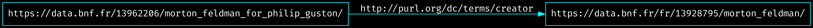


<!--∫ slide -->

# Le Web sémantique, en une slide

- Promesse d'une base de données à l'échelle du Web. Le Web initial (Tim Berners Lee, 1991) était un Web de documents liés (hypertexte), le Web sémantique est un Web de données liées.
- Chaque donnée est identifiée par une URL.
- Toute information s'exprime sous la forme d'un triplet (sujet/prédicat/objet) dans un langage de description, le RDF.
- La connexion de ces triplets RDF forme un graphe.
- Chaque prédicat est également identifié par une URL.


- C'est le milieu technique idéal pour des données FAIR, pour l'expression et à la diffusion des données de la recherche.

<!--📜-->
<!--∫ slide center -->

# Données relationnelles vs graphe RDF


*Corago in LOD - Seminar by Angelo Pompilio and Paolo Bonora, Digital Humanities and Digital Knowledge, Università di Bologna, 2017.*

<!--📜-->
<!--∫ slide -->

# Qu'est ce qu'une ontologie ?

- Formalisation d'un modèle conceptuel pour un domaine identifié proposant des :
    - ‹Classes :› types d'entités peuplant le domaine, possiblement organisées selon des relations d'héritage (spécificité). On appelle ‹individu› une ressource qui est du type d'une classe.
    - ‹Propriétés :› aspects, caractéristiques, attributs possibles de ces classes, qui peuvent soit pointer vers une valeur, soit vers un individu.
- Utiliser les classes et les propriétés d'une ontologie confère ainsi une sémantique partagée aux données RDF (les individus identifiés par des URL seront des sujets ou des objets, les propriétés des classes seront des prédicats).
- Vous connaissez peut-être déjà une ontologie : SKOS (pour construire des thésauri).

<!--📜-->
<!--∫ slide title -->

# III. Introduction à l'ontologie CIDOC-CRM

<!--📜-->
<!--∫ slide -->

# Le CIDOC-CRM en bref

- Le CIDOC-CRM est une ontologie qui documente le patrimoine matériel et immatériel ainsi que les processus de production de connaissances à son propos.
- [https://www.cidoc-crm.org/](https://www.cidoc-crm.org/)
- Venant du monde des musées, elle est désormais utilisée dans tous les domaines des HN.
- Elle est extrêmement abstraite et générique.
- Ontologie centrée événement (nous y reviendrons dans les exemples…)
- Classes et propriétés : [https://cidoc-crm.org/html/cidoc_crm_v7.1.2.html](https://cidoc-crm.org/html/cidoc_crm_v7.1.2.html)

<!--📜-->
<!--∫ slide center -->

# Hiérarchie des classes

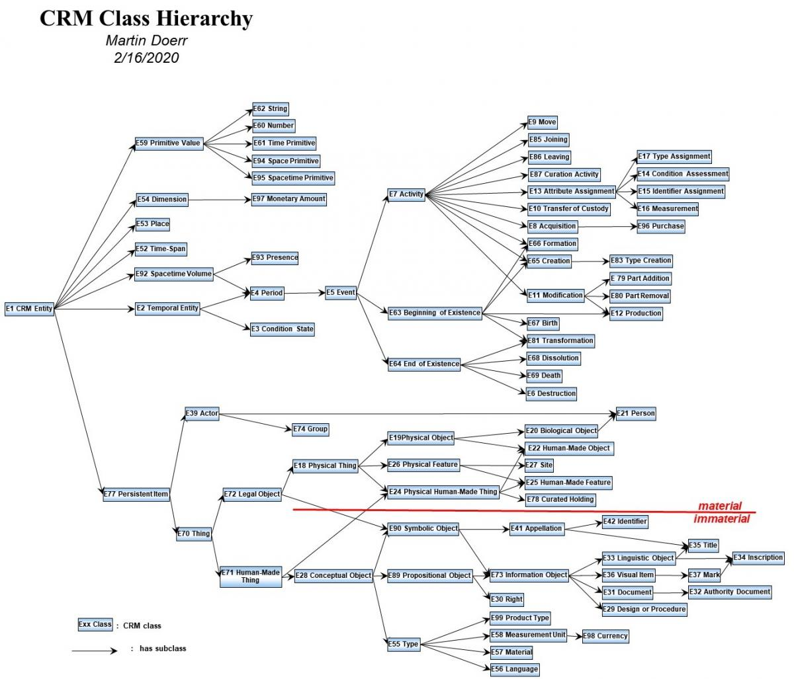

<!--📜-->
<!--∫ slide center -->

# Le temps dans le CRM


<!--📜-->
<!--∫ slide title -->

# IV. Cas concrets récurrents

<!--📜-->
<!--∫ slide -->

# Conventions

Dans les exemples, on utilisera les préfixes suivants pour les URL :

```
PREFIX crm: <http://www.cidoc-crm.org/cidoc-crm/>
PREFIX rdf: <http://www.w3.org/1999/02/22-rdf-syntax-ns#>
PREFIX m2:  <http://musica2.huma-num.fr/id/>
```

Ainsi, l'URL :

```
http://musica2.huma-num.fr/id/tralala
```

sera notée :

```
cm2:tralala
```

…ce qui évitera d'avoir des exemples illisibles, mais il ne faudra pas perdre de vue que toute ressource (en incluant les classes et les propriétés du CRM) est identifiée par une URI sur le Web.

<!--📜-->
<!--∫ slide spring -->

- ‹Typer une personne :›

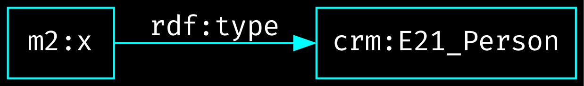
<hr/>
- ‹Nommer une personne avec une simple chaîne de caractère :›

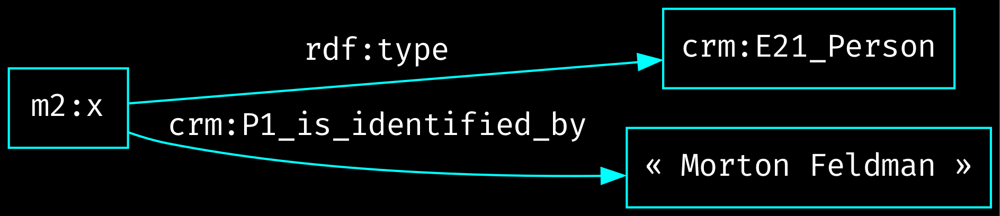

<!--📜-->
<!--∫ slide -->

- ‹Typer quelque chose :›

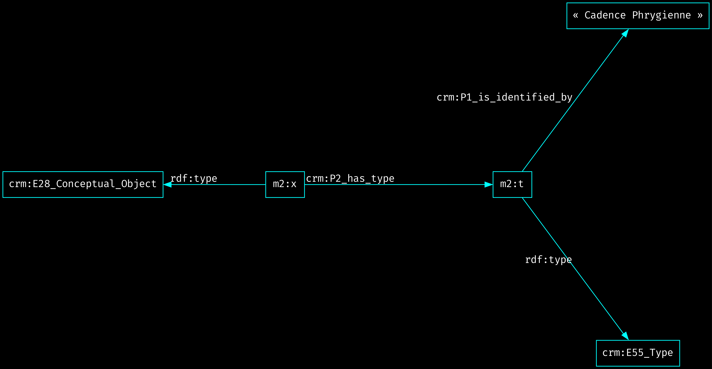


<!--∫ slide -->

- ‹Typer quelque chose :›


<div style="position: absolute ; bottom: 1cm; left: 1cm; z-index: 999; width: 18cm;">
💡
<br/>

- `rdf:type` : pour donner à votre entité un type technique au sein de l'ontologie CRM.
- `crm:P2_has_type` : pour donner à votre entité un type métier (défini par vous et en rapport avec les catégories convoquées par l'activité de recherche).
</div>

<!--📜-->
<!--∫ slide -->

- ‹Nommer une personne avec une entité appellation :›

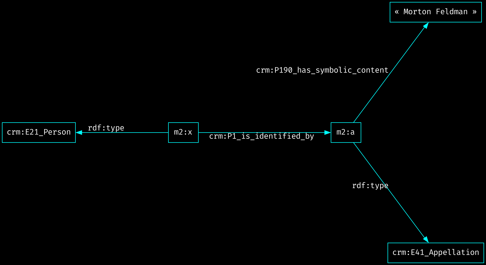

<!--📜-->
<!--∫ slide -->

- ‹Typer un identifiant :›

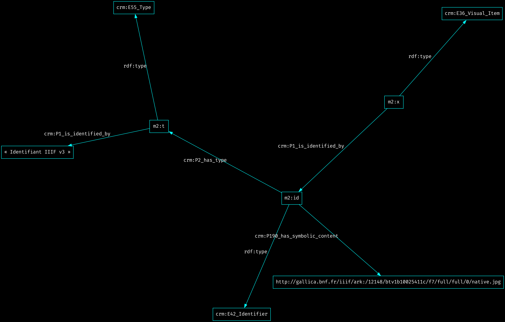

<!--📜-->
<!--∫ slide -->

- ‹Organisation interne d'un contenu (ici, d'une image) :›

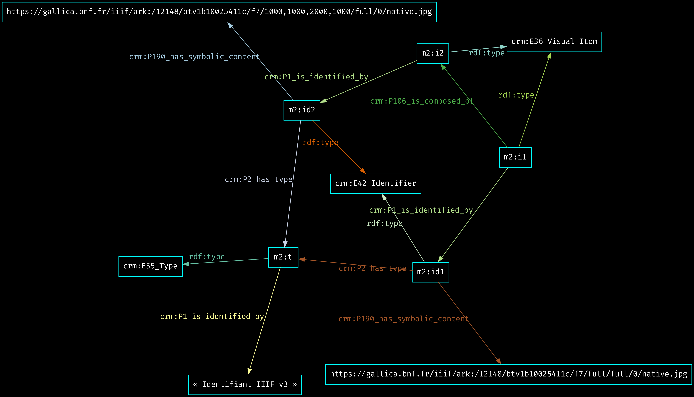

<!--📜-->
<!--∫ slide -->

- ‹Dater un événement :›
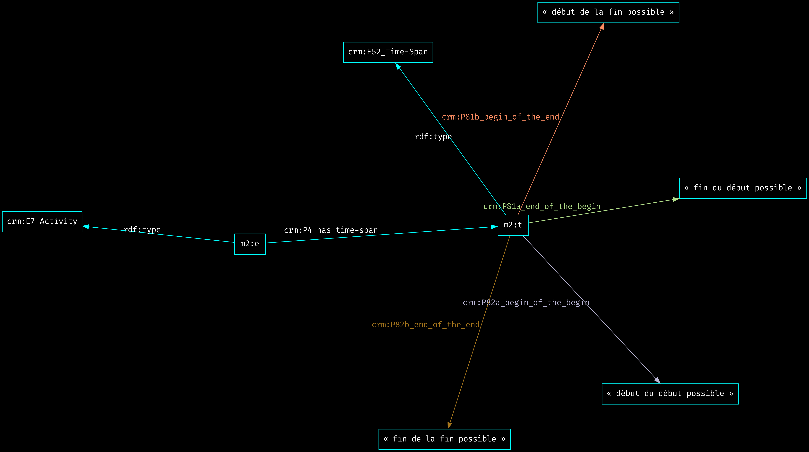

On retrouve la possibilité de définir des incertitudes aux bornes.

<!--📜-->
<!--∫ slide -->

- ‹Exprimer un événement de création simple :›

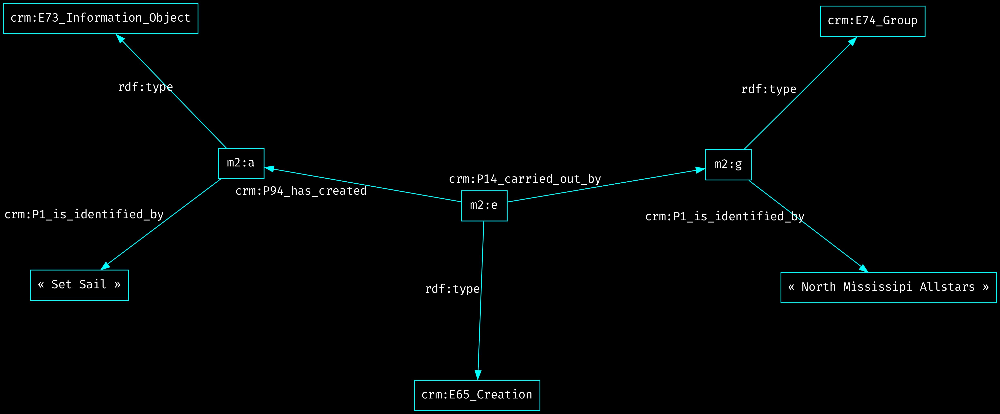

<!--📜-->
<!--∫ slide -->

- ‹Exprimer un événement de création complexe :›


<!--∫ slide -->

- ‹Exprimer un événement de création complexe :›


<div style="position: absolute; bottom: 2cm; right: 1cm; width: 9cm; z-index: 666;">
Remarquez la finesse de l'adressage…<br/>Chaque élément constituant le phénomène a son URL et son identité.
</div>

<!--📜-->
<!--∫ slide -->

- ‹Exprimer une annotation :›

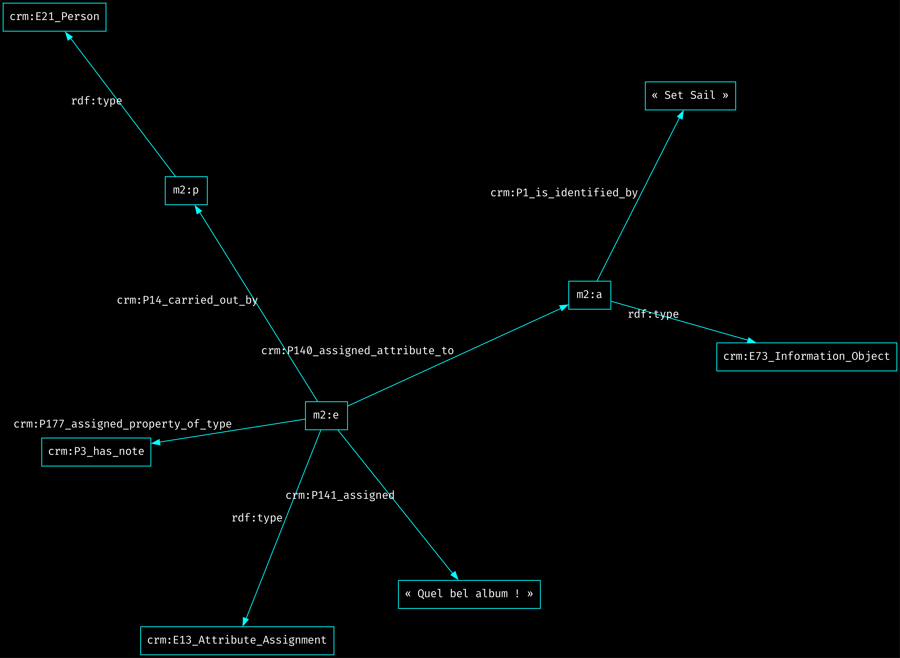

<!--📜-->
<!--∫ slide title -->

# V. Deux mots sur LRMoo et Doremus

<!--📜-->
<!--∫ slide -->

# LRMoo

- Basé sur l'[IFLA LRM](https://www.transition-bibliographique.fr/enjeux/definition-ifla-lrm/) (auparavant FRBR).
- Convergence du monde des musées (CIDOC-CRM) et du monde des bibliothèques (IFLA LRM) : l'ontologie LRMoo spécialise certaines classes du CIDOC-CRM (qui sert donc d'ontologie de base).
- Quatre entités fondamentales — Work, Expression, Manifestation, Item (WEMI) — représentant les quatre modes d'existence des sources (conceptuel, sémiotique, éditorial, matériel).
- [Documentation](https://www.cidoc-crm.org/frbroo/fm_releases)

<!--📜-->
<!--∫ slide -->


<!--📜-->
<!--∫ slide center -->

## Des relations riches entre les entités


<!--📜-->
<!--∫ slide -->

# DOREMUS : points saillants

- Des vocabulaires utiles pour la musique : [data.doremus.org/vocabularies](https://data.doremus.org/vocabularies) + [github.com/DOREMUS-ANR/knowledge-base/tree/master/vocabularies](https://github.com/DOREMUS-ANR/knowledge-base/tree/master/vocabularies)


<!--∫ slide -->

# DOREMUS : points saillants

- Des vocabulaires utiles pour la musique : [data.doremus.org/vocabularies](https://data.doremus.org/vocabularies) + [github.com/DOREMUS-ANR/knowledge-base/tree/master/vocabularies](https://github.com/DOREMUS-ANR/knowledge-base/tree/master/vocabularies)
- Une ontologie sans équivalent pour la modélisation des effectifs prévus dans l'œuvre, des concerts, et des effectifs réalisés durant les performances : [https://data.doremus.org/ontology/](data.doremus.org/ontology)


<!--∫ slide -->

# DOREMUS : points saillants

- Des vocabulaires utiles pour la musique : [data.doremus.org/vocabularies](https://data.doremus.org/vocabularies) + [github.com/DOREMUS-ANR/knowledge-base/tree/master/vocabularies](https://github.com/DOREMUS-ANR/knowledge-base/tree/master/vocabularies)
- Une ontologie sans équivalent pour la modélisation des effectifs prévus dans l'œuvre, des concerts, et des effectifs réalisés durant les performances : [https://data.doremus.org/ontology/](data.doremus.org/ontology)
- Un parti prix (désormais techniquement obsolète) sur la manière dont on peut modéliser une situation de composition : [data.doremus.org/ontology](https://data.doremus.org/ontology/)


<!--∫ slide -->

# DOREMUS : points saillants

- Des vocabulaires utiles pour la musique : [data.doremus.org/vocabularies](https://data.doremus.org/vocabularies) + [github.com/DOREMUS-ANR/knowledge-base/tree/master/vocabularies](https://github.com/DOREMUS-ANR/knowledge-base/tree/master/vocabularies)
- Une ontologie sans équivalent pour la modélisation des effectifs prévus dans l'œuvre, des concerts, et des effectifs réalisés durant les performances : [https://data.doremus.org/ontology/](data.doremus.org/ontology)
- Un parti prix (désormais techniquement obsolète) sur la manière dont on peut modéliser une situation de composition : [data.doremus.org/ontology](https://data.doremus.org/ontology/)
- Un énorme dataset (BNF + Radio France + Philharmonie) d'œuvres, partitions, concerts… [data.doremus.org](https://data.doremus.org/)

<!--📜-->
<!--∫ slide title -->

# VI. Une étude de cas : modélisation des partitions encodées

<!--📜-->
<!--∫ slide title -->

[🔗](https://lucid.app/lucidchart/c64a5745-23c5-4510-a750-9bdc769faa10/edit?viewport_loc=1141%2C384%2C1687%2C748%2C0_0&invitationId=inv_f25ce332-989a-40e0-be9e-7b3249b4d51c)